# Sparkle Product Requirements Document (PRD v2.0)

## Table of Contents

- [0. Executive Summary](#0-executive-summary)
- [1. Product Positioning](#1-product-positioning)
- [2. Core Concepts and Domain Model](#2-core-concepts-and-domain-model)
- [3. Product Architecture, Information Architecture, and Navigation Flows](#3-product-architecture-information-architecture-and-navigation-flows)
- [4. Three Commercial Workflows](#4-three-commercial-workflows)
- [5. Creative Module: Multi-Agent Ad Video Production Engine (Core)](#5-creative-module-multi-agent-ad-video-production-engine-core)
- [5A. Creative Module: Editable Projects and Informational Videos](#5a-creative-module-editable-projects-and-informational-videos)
- [6. Creative Module: Video Cloning](#6-creative-module-video-cloning)
- [7. Asset Module: Unified Asset Library](#7-asset-module-unified-asset-library)
- [8. Platform: Multi-Model Provider Integration](#8-platform-multi-model-provider-integration)
- [9. Commerce Module (I): Marketing Subject Center](#9-commerce-module-i-marketing-subject-center)
- [10. Commerce Module (II): Transactions and Monetization](#10-commerce-module-ii-transactions-and-monetization)
- [11. Page Features and Navigation](#11-page-features-and-navigation)
- [12. Technical Solution](#12-technical-solution)
- [13. Metrics](#13-metrics)
- [14. Release Roadmap](#14-release-roadmap)
- [15. Risks and Pending Issues](#15-risks-and-pending-issues)
- [Appendix](#appendix)

---

## 0. Executive Summary

1. **Positioning**: Sparkle is an AI-native infinite canvas. Starting from a marketing subject or an idea, nine specialist agents collaborate across strategy, scriptwriting, visual assets, storyboards, shots, sound, and final editing to produce advertising videos ready for distribution and commercial licensing.
2. **Core Entity**: `Subject` represents a product, campaign, service, IP, or brand. Projects, assets, templates, orders, and campaign results attach to the Subject, which also anchors ROI calculations.
3. **Core Engine**: Nine specialist agents work under a deterministic DAG scheduler. They exchange strongly typed artifacts: CreativeBrief, Script, ProductBible, CharacterSheets, SceneBibles, Storyboard, ShotRender, AudioPlan, and Timeline. Generation produces candidate versions that users can accept, reject, switch, or roll back.
4. **Three Commercial Workflows**:
   - **Workflow 1 — Demand-Driven**: Subject → one-click canvas generation → assets automatically linked to the Subject. This is the baseline capability already offered by competitors.
   - **Workflow 2 — Content-First**: Strong content → semantic matching → Subject. This is Sparkle's core differentiator and remains underserved by mainstream products.
   - **Workflow 3 — Template Distribution**: A working canvas becomes a template with variable slots. Buyers instantiate it with their own Subjects, and authors earn a revenue share.
5. **Monetization**: SaaS subscriptions, generation credits, transaction commissions on templates, asset licenses and creative bounties, and value-added services. Credits and cash use separate accounts; creator earnings settle through the cash account on a proposed T+7 schedule.
6. **Deliverables**: A finished video plus an editable project. Users can publish the video directly and later make precise local changes to the project without rebuilding the entire video.

---

## 1. Product Positioning

### 1.1 One-sentence positioning

**Sparkle: An AI creative canvas that uses marketing subjects as anchors, collaborates with multiple agents to produce advertising videos, and lets good content find business on its own.**

| Dimension | Description |
|---|---|
| Target Users | Brand advertisers, e-commerce and growth teams, agencies and creative studios, independent creators and content producers. |
| Core Value | Faster output, cross-shot consistency, product authenticity, directly commercially usable footage, monetizable content. |
| Key Differences | ① Ad-oriented 9-agent professional division of labor (not one prompt generates one video); ② Film analysis and replication; ③ **Content → Subject Reverse Matching**; ④ Workflow template is the product; ⑤ **Editable Project + Informational Video**(Document/Data → Parameterizable MG) |

### 1.2 Four Gaps to Address

| Gap | Current Status | Sparkle Solution |
|---|---|---|
| **Generation ≠ Advertisement** | The video model can only generate a single shot of 5-10 seconds at a time. It lacks strategy and shot segmentation, characters and products distort across shots, and text in the image appears as gibberish. | 9 Agent pipeline + identity anchoring system + text/logo post-production compositing, see Chapter 5. |
| **Material ≠ Business** | The ad creatives are scattered across various tools, it's unclear which product they were created for, and the campaign data is not being retrieved. | Marketing Subject Center: All products and data are listed under Subject, see Chapter 9. |
| **Good content ≠ income** | Creators have created viral ideas, but can't find buyers; good workflows aren't being implemented. | Content-to-subject matching + Template marketplace + Creative bounty, see Chapter 10. |
| **Finished video ≠ Editable project** | The AI tool delivers a dead MP4 file; changing a single subtitle, a single number, or a single rhythm requires re-rendering the entire file, or repeatedly trying your luck with random card draws. | Native multi-track timeline + parametric graphics + localized adjustment of landing points, delivering "finished product + engineering work," see Chapter 5A. |

### 1.3 Competitive Landscape and Differentiation

> Competitor information comes from preliminary research and must be verified before publication.

| Product | Main Link | Strengths | Relationship to Sparkle |
|---|---|---|---|
| Higgsfield | Product Profile / Brand Kit → Template → Product Shots / Ads / UGC / Motion; Supports importing products from web pages; Ads Studio can generate multiple ad variations at once using one Product + Brand Kit, categorized by selling angle. | Link 1 is mature | The link is a basic configuration in the industry; Sparkle must achieve a similar level, but it's not the key to success. |
| Creatify | Product URL → Ad, with competitor creative analysis, remix, batch variations, A/B testing, CTR/ROAS. | Deep coverage of asset-to-business performance | Performance feedback and variant testing need to be caught up |
| General video model (i.e., Jimeng/Kling/Vidu/Hailuo, etc.) | Prompt → Single video segment | Single-Shot Image Quality | , as a Sparkle Provider, does not constitute direct competition. |
| Fotor (Agent) | Requirements Planning → 4K MG Generation → Multi-track Editing; Focusing on "Editable Projects + Document/Data to MG Animation" | Native multitrack, editable MG parameters, and partial natural language editing. | aligns with the overall direction but needs to improve its "delivery engineering" capabilities; Sparkle's differences lie in its "target anchor + three commercial links". |
| **Sparkle** | Link 1+ **Link 2 `Content → Semantic Matching → Subject`** + Link Three Template Transaction | Multi-Agent Ad Structured Production, Ad Copying, Content Search, Template Revenue Sharing | **The differentiation is concentrated in link two and link three.** |

Workflow 1 establishes a usable baseline, Workflow 2 creates differentiation, and Workflow 3 builds network effects. Editable projects are an industry direction and a necessary capability; Sparkle differentiates through its Subject anchor and three commercial workflows.

### 1.4 Target Users and JTBD

| Role | Subject Type | Core Mission (JTBD) | Pain Points | Sparkle's key capabilities |
|---|---|---|---|---|
| Brand Advertiser | Campaign / Brand | "Make all materials look like my brand" | Inconsistent style, high review costs. | BrandKit style locking, Checkpoint audit, compliance report |
| E-commerce and Growth Team | Product | "One product generates dozens of testable materials per day" | Batch production and conversion | Variant Matrix (angle × hook × scale), Re-rendering only differences in camera angles, Performance feedback |
| Agency/Creative Studio | Client Brief | "Feed in the Brief, and it will directly generate the proposal canvas." | Delivery efficiency, multi-customer isolation | Brief is parsed into Subject, Workspace/Client isolation, image copying, and template accumulation. |
| Independent creator/material producer | Other people's needs | "My good content and good processes can make money." | No buyer found | Content-to-subject matching, template uploading, order fulfillment via bounty, and earnings settlement. |

### 1.5 Product Principles

1. **Subjects anchor commercial work**: Every commercial artifact must trace to a Subject or be available for matching to one.
2. **Structured contracts come first**: Agents exchange typed contracts; prose is only one field within a contract.
3. **Cheap stages precede expensive stages**: Review text and keyframes before rendering video.
4. **Candidates never overwrite accepted versions**: Regeneration creates candidates while preserving the accepted version.
5. **Human control remains available**: Support Autopilot, Checkpoint, and Manual modes.
6. **Reusable work can be licensed**: Finished videos, shots, characters, and templates can be reused and traded.

---

## 2. Core Concepts and Domain Model

### 2.1 Marketing Subject: Five Forms

| Form | type | Example | Typical User | Generation-side differences |
|---|---|---|---|---|
| Physical product | `product` | Nike sneakers, coffee | E-commerce and Growth Team | Product Visual Agent prioritizes "product authenticity" as its primary constraint. |
| Brand Activities | `campaign` | New Product Launch, 618 Shopping Festival, Brand Collaboration | Brand Advertiser | is a time-sensitive, countdown-type hook that highlights key benefits. |
| Service | `service` | Educational courses, SaaS subscriptions, in-store services, product descriptions/knowledge explanations/report interpretations (information videos) | Growth Team, Agency, Knowledge Creator | has no physical product; the visual anchors have been changed to UI screenshots, store locations, and instructor images. Informational videos use motion graphics (MG), and the data is editable. |
| Content/IP | `ip` | Game user acquisition, App new user acquisition, Film and television promotion | Growth Team | Character design agent must be based on the official character illustration and is not allowed to change the settings. |
| brand itself | `brand` | Brand Image Film and Value Communication | Brand Advertiser | Prioritize emotional and narrative angles, downplay promotional aspects. |

### 2.2 Perspectives of Four Audience Types

| Audience | target | Focus | The product must provide |
|---|---|---|---|
| Brand Advertiser | Campaign / Brand | Consistent Brand Image | Brand assets (Logo, standard colors, fonts, Tone of Voice, disabled elements), style is forcibly locked during generation. |
| E-commerce and Growth Team | Product | Batch production + conversion | A single product can generate dozens of variations, supporting A/B testing. |
| Agency and Studio | Client Brief | Delivery Efficiency | Brief document generates proposal canvas with one click, isolating multiple clients. |
| Independent Creator | Other people's needs | Monetization | Content matching target, template reuse revenue sharing |

### 2.3 Subject Data Structure

```ts
interface Subject {
  id: string;
  workspaceId: string;          // Workspace (individual/team)
  clientId?: string;            // Agency Scenario: Client Isolation
  ownerId: string;
  type: "product" | "campaign" | "service" | "ip" | "brand";
  name: string;                 // Subject name, such as "Nike Air Max Spring New Arrivals".
  brief: string;                // Subject description / Original client brief
  category: string;             // Category , such as "sports footwear/apparel/running shoes," is used for matching and compliance.
  sellingPoints: { id: string; text: string; priority: number }[]; // Selling Points/Promotional Points
  referenceAssets: { assetId: string; role: "product_main" | "product_angle" | "logo" | "ui" | "ip_art" | "mood" }[];
  targetAudience: { summary: string; ageRange?: string; scenarios?: string[]; painPoints?: string[] };
  brandKitId?: string;          // Brand style, reusable across subjects
  landingUrl?: string;          // Product or Event Landing Page
  visibility: "private" | "workspace" | "public_open_call"; // will be entered into the matchmaking pool after a public solicitation / Bounty
  status: "active" | "archived";
  embedding?: number[];         // Semantic Vector (Link 2 Matching)
}

interface BrandKit {
  id: string;
  name: string;
  logos: { assetId: string; variant: "primary" | "mono" | "icon" }[];
  colors: { hex: string; role: "primary" | "secondary" | "accent" }[];
  fonts: { family: string; usage: "title" | "body" }[];
  toneOfVoice: string;          // For example,, "passionate, youthful, street-style".
  forbidden: string[];          // Banned elements: competitor logos, specific colors, sensitive words, etc.
  voiceId?: string;             // Brand Voiceover Voice
  musicPreference?: string;     // Music Preferences
  endCardTemplateId?: string;   // End Credits CTA Template
  exemplarAssetIds: string[];   // Brand-approved sample material (style reference)
}
```

> Existing code `src/lib/db/index.ts` has already implemented the prototype of Subject (name / type / brief / sellingPoints / referenceAssets / targetAudience / brandKit). v2 needs to split brandKit into an independent entity and add fields such as workspace, category, visibility, and embedding.

### 2.4 Other Core Entities

| Entity | Description |
|---|---|
| Workspace / Client | Workspace is isolated from clients; an agency can have multiple clients under one workspace, and data between clients is not visible to each other. |
| Project | One creative project;`source ∈ {subject, clone, template, free, bounty}`, optional association `subjectId` / `templateId` / `cloneId` / `bountyId` |
| Canvas | A canvas snapshot, including nodes and edges; the canvas itself is also available in versions. |
| WorkflowRun | A single execution, including mode (autopilot / checkpoint / manual), budget, and status. |
| NodeRun | represents an execution of a certain node, with execution state `queued / running / completed / failed` |
| Artifact | The node artifact (structured JSON + media references) has a version chain and product status:`candidate / accepted / rejected / stale` |
| ProductionBible | is a project's "creative bible": a collection of currently accepted versions of briefs, scripts, product bibles, roles, scenarios, etc., serving as a shared context for all agents. |
| Asset | Standardized assets, including version, source (lineage), reference relationships, and licensing status. |
| ContentProfile | Content profile (tags + vectors), for use in Link 2 matching. |
| SubjectMatch | Matching record of materials and targets (score, reason, modification suggestion, status) |
| Template | Workflow Template with Variable Slots (Link 3) |
| Listing / Order / License | Listed products, orders, and authorization certificates |
| Bounty / Submission | Creative Bounty and Submissions |
| Wallet / LedgerEntry / Payout | Dual accounts for points and cash, double-entry bookkeeping, cash withdrawal |
| PerformanceMetric | Campaign Performance Data |

### 2.5 Entity Relationship Diagram

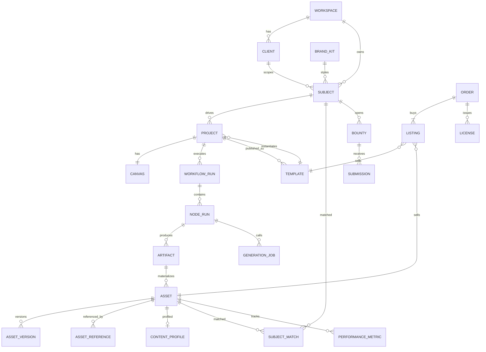

---

## 3. Product Architecture, Information Architecture, and Navigation Flows

### 3.1 Module Overview (Main Module Remains Unchanged)

Product capabilities remain organized into creation, assets, and commerce. The current interface in `src/components/studio/StudioShell.tsx` provides Workspace and **Marketspace** Sidebar; Marketspace only contains Templates, Bounties, and Orders. Content matching is located in the individual work operations within My templates. The image below shows the complete product capability plan, not the current delivered navigation list.

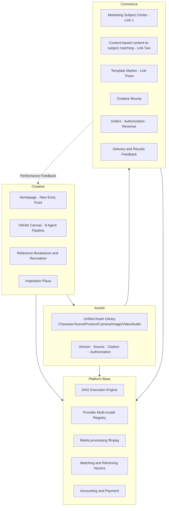

### 3.2 Site Map and Routing Table

Pages marked "Planning" or "Add" in the table do not necessarily mean they are currently implemented; the current entry point and old route redirection are as follows.

| Level 1 | Router | Page | Current Status |
|---|---|---|---|
| Creative | `/` | Homepage: Creative Input, New Project, Recent Projects | already exists |
| Creative | `/project/[id]` | Free canvas (editable cards + right-side Agent panel + bottom final cut timeline) | already has a prototype. |
| Creative | `/project/[id]/edit` | Final Cut Timeline Editor | (Added) |
| Creative | `/clone/new` | Film Upload | (Added) |
| Creative | `/clone/[id]` | Disassembly results of reference video, and replacement page of the structure. | (Added) |
| Creative | `/ideas` | Inspiration Square: Outstanding works, make the same style | is a placeholder and needs to be redone. |
| material | `/assets` | Asset Library (Category tabs: Characters, Scenes, Products, Lenses, Images, Videos, Audio, My Templates) | is a placeholder and needs to be redone. |
| material | `/assets/[id]` | Asset Details: Version Tree, Source Chain, References, Authorization, Product Sourcing, Product Listing | (Added) |
| Marketspace | `/commercial` | Default Entry | Redirect to `/commercial/market` |
| Marketspace | `/commercial/subjects` | Bounties: Merchant Label Brief List and New Pop-up Window | Local server-side storage, no paid reward. |
| Business | `/commercial/subjects/new` | Create a new target (Form/URL import/Brief parsing) | already has a pop-up window; it needs to be expanded. |
| Business | `/commercial/subjects/[id]` | Target Details: Project, Creative Materials, Templates, Campaign Targeting, ROI | (Added) |
| Business | `/commercial/brand-kits` | Brand Asset Management | (Added) |
| Marketspace | `/commercial/match` | Legacy Content Matching Entry | Redirect to `/commercial/market?view=own`will no longer be displayed independently. |
| Marketspace | `/commercial/market` | Templates / My templates; Each work can be content-matched. | Sample catalog and browser native template, supporting draft/publish/cancel publish, search and category filtering. |
| Business | `/commercial/market/[templateId]` | Template Details and Purchase | (Added) |
| Marketspace | `/commercial/bounties` | Old Bounty Entry | Redirect to `/commercial/subjects`, no longer displaying a fictional brief. |
| Business | `/commercial/bounties/[id]` | Bounty Details, Submissions, and Review | (Added) |
| Marketspace | `/commercial/orders` | Local Demo Order | has no actual charges or authorization certificate. |
| Business | `/commercial/earnings` | Creator Revenue, Settlement, and Withdrawal | (Added) |
| Business | `/commercial/performance` | Campaign Account Connection and Performance Dashboard | (Added) |
| (Personal) | `/me/wallet` | Points Top-up, Cash Balance | (Added) |
| Settings | `/settings/workspace` | Space, Member, and Customer Separation | (Added) |
| Settings | `/settings/providers` | Model Provider Configuration (Administrator) | (Added) |

### 3.3 Global Navigation Flows

The following is the complete product target chain; pages for details, authorization, and deployment that have not yet been implemented are not in the current navigation. Current Content matching can be opened by work in the personal template view.

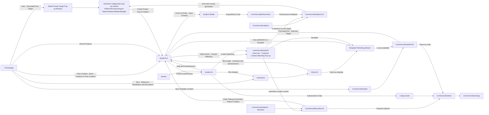

### 3.4 Three Creation Entry Points (`CreateProjectModal`)

After clicking "Start Creating," first select a starting point from the three levels. The three levels are parallel:**Reference breakdown and recreation is included in "Template Creation," where editing is not done at the entry level but within the canvas.**

| Entry | Description | Initial Canvas | Next Step |
|---|---|---|---|
| **Template Creation** | Starting with references or templates: Upload a reference ad for copying and analyzing it, or choose a ready-made template. | Jump to the template market, or `/clone/new` | Disassemble → or Slot Mapping → Enter Canvas |
| **Basic Creation** | Generate videos with a single sentence, animate uploaded images, or edit existing videos. | Enter the canvas and use the preset simple workflow (text-to-video, image-to-video, editing). | Directly generated |
| **Free Creation** | Enter a blank canvas and add text, images, videos, and audio yourself. | Enter blank canvas | Free creation; editing is done within the canvas, and a product search can be triggered after the final video is completed. |

> "Generate from target" remains in the center of marketing subjects (see 9.4 One-click generation): it essentially assigns a target to the canvas. `subject` The source is an entry point that bypasses the three tiers and is initiated directly from the target, and is not listed alongside the three tiers above.

---

## 4. Three Commercial Workflows

### 4.1 Workflow 1: Demand-Driven (Subject First → Asset Generation)

**User Story**: I am a brand owner, and I have a Nike sneaker that I want to advertise, and I need its advertising materials.

**Process**

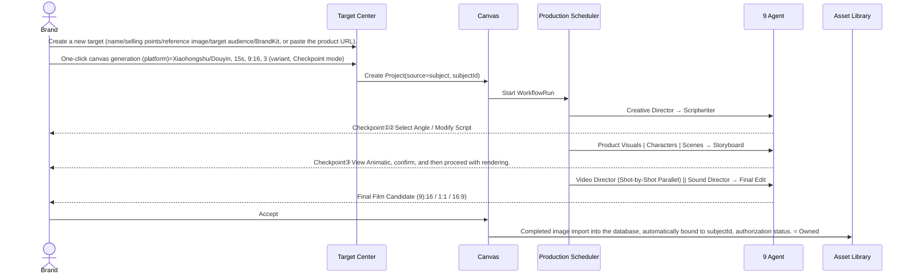

**Commercial Value**: The most essential requirement. The product profile is the anchor point for commercialization. Subsequent campaigns, data feedback, and ROI calculations are all tied to the target, not to isolated creative materials.

**Acceptance Points**
- From creating a new target to the first candidate for a completed film: P50 ≤ 15 minutes in Autopilot mode (target value, pending baseline calibration).
- All generated artifacts and assets include `subjectId`can be found on the target's details page.
- BrandKit's colors, fonts, logo, and disabled elements were verified item by item in the final cut compliance report.

### 4.2 Workflow 2: Content-First (Content First → Subject Matching)

**User Story**: I casually created a video of a dog wearing Nike shoes, and it turned out great. The platform reminded me that this content is a good fit for "sneakers/pet supplies".

**Process**

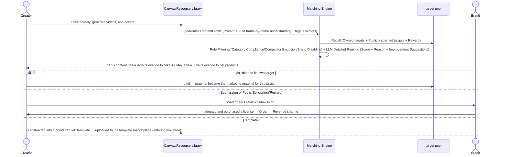

**Commercial Value**: This is Sparkle's most imaginative link. Good content itself is a scarce commodity, and "content finding goods" ensures that creativity is not wasted, while also driving the template trading market.

**Key Rules**
- If content contains third-party brands (e.g., a dog wearing "Nike"). You can only ① authorize the brand itself, or ② de-brand and make it into a template.a finished video containing brand A's identity **cannot be sold to brand B**
- After the match is accepted, the final video needs to undergo a "product authenticity replacement": the AI-generated product appearance is replaced with the genuine product image of the target, and the product visual agent and video director agent perform partial re-rendering.

### 4.3 Workflow 3: Template Distribution (Workflows as Products)

**User Story**: I packaged my entire working canvas (script + raw images + video node connection relationships and parameters) into a template and uploaded it. Others can use it for a fee, simply by changing the tag information to their own, and they can mass-produce materials of the same quality. I, as the template author, receive a share of the revenue.

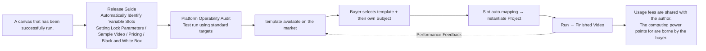

**Relationship to Subject**: When the template is instantiated, the information of the Subject (name, sellingPoints, referenceAssets, BrandKit, targetAudience) is filled into the variable slot.

### 4.4 Three-Workflow Flywheel

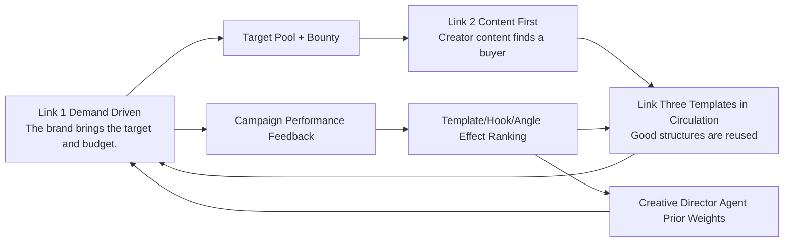

- The more brands → the larger the target pool → the easier it is for creators to monetize their content → the more creators → the more templates → the lower the brand production cost → the more brands.
- Performance data is the moat: rank templates by **actual campaign performance**, rather than likes.

---

## 5. Creative Module: Multi-Agent Ad Video Production Engine (Core)

### 5.1 Decisions regarding video generation: Why it must be split into multiple agents?

This section outlines the design premise of the entire engine. Each decision corresponds to an Agent or a mechanism.

| # | Reality Constraints in Video Generation | Design Conclusion | Landing Location |
|---|---|---|---|
| 1 | **The video model is a "single-shot renderer," not a "director."** A single generation takes 5-10 seconds and can generally only reliably complete one main action; advertisements require 15-60 seconds and 6-15 shots. | requires a script and storyboard first, then generates the action shot by shot; each shot should only have one main action. | Scriptwriter, Storyboard Designer, Video Director |
| 2 | **Cross-shot identity drift**: The same character, the same product, but the face and shoes change in different shots. | First, identify the "identity anchor point" (character three-view drawing, product multi-angle view, scene camera position), and all shots should originate from the anchor point. | Product visuals, character design, scene design + 5.6 |
| 3 | **Videos with text are uncontrollable, while videos with images are controllable.** The first frame determines the composition, subject, and lighting. | The pipeline uses the "first-frame locking method": first, keyframe images are generated and reviewed (cheap and controllable), then the video is generated from those images. | Storyboard (Keyframes) + Video Director (i2v) |
| 4 | **The model can't draw the text well.**: The text, logo, and price in the image often become garbled or distorted. | All text, logos, prices, and CTAs must be **Post-processing**, prohibit video model generation; avoid readable text during the scene design phase. | Scene design, storyboard overlay field, final cut |
| 5 | **Prompt is a model dialect.**: Different models have varying levels of support for camera movement words, duration, first and last frames, and the number of reference images. | The Agent outputs model-independent structured shot descriptions, which are compiled into the dialects of each model by the Provider Adapter. | Video Director + Chapter 8 |
| 6 | **Generation is probabilistic.**: The same input can produce inconsistent results. | Multiple candidates + automatic quality inspection + manual confirmation; candidates do not overwrite accepted versions. | 5.7 |
| 7 | **Ads have conversion constraints**: 3-second hook, product exposure duration, matching of selling points and visuals, CTA, platform safety zone, advertising law. | The creative director codified the constraints into a "constitution," with each agent undergoing quality checks and the final cut serving as the final compliance checkpoint. | Creative Director, Final Cut |
| 8 | **Video generation is expensive**: The cost of a 5-second shot is more than ten times that of a single image. | Cost Funnel: Text → Keyframes → Animatic → Video, each layer must be confirmed before moving to the next. | 5.9 |
| 9 | **Sound determines rhythm**: The editing points must match the BGM beat, the SFX must match the actions, and the narration must not overflow the screen. | The sound director produces a beat grid, which in turn provides editing point suggestions for the final cut; the length of the voice-over also indirectly constrains the scriptwriters. | Sound Director, Final Editor |
| 10 | **Control flow should not be delegated to LLM**: Letting LLM decide "who to adjust next" is unstable, unreproducible, and difficult to bill. | The scheduler is a deterministic DAG, while the LLM only makes creation decisions within the nodes. | Production Scheduler |

### 5.2 Overall Architecture

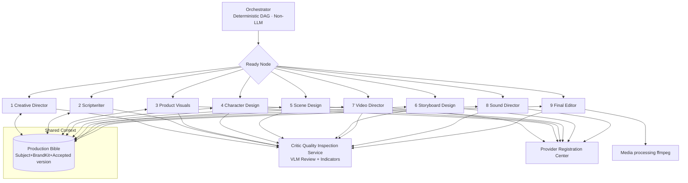

**Role Classification**

| Component | Is an LLM? | Responsibilities |
|---|---|---|
| Production Scheduler | No | Dependency resolution, parallel scheduling, budget control, checkpoint gate, failure propagation, retries and breakpoint resumption |
| 9 Specialist Agents | is a (LLM/VLM + generative model tool) | Node-specific professional creative decisions, outputting strongly typed contracts. |
| Critic Quality Inspection Service | is (VLM) + rules and indicators. | is invoked by the quality gates of each agent, returning a structured score and a list of issues; it does not become a standalone node. |
| Production Bible | No (Data) | A shared source of fact for all agents; agents only read the "accepted" version. |

**corresponds to the existing implementation of AdCraft.**
- `app/services/specialist_agents.py:22`  `SPECIALIST_BY_NODE_TYPE` currently routes six types of nodes—script, character, scene, storyboard, video, and background music—to different agents. v2 expands this to nine types: `creative_brief`, `product_visual`, `final_cut`, `bgm` upgraded to `audio`.
- Each Agent has independent `SKILL.md` system instructions (`agent/skills/video_agent_*`), unified output Pydantic contract `SpecialistResult`.
- `ad_workflow.py` defines a 9-stage pipeline;`workflow_graph.py` and `workflow_parallel_graph_runner.py` is responsible for the execution of persistent DAG.

### 5.3 Pipeline DAG and Stage Gates

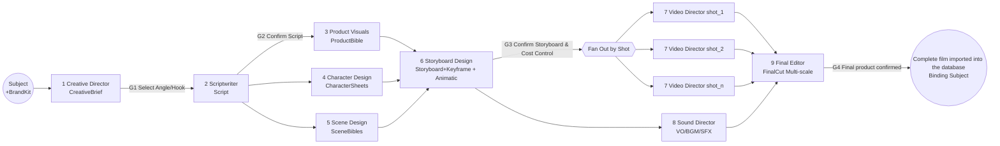

| gate | Location | What users decide here. | Why is set here? |
|---|---|---|---|
| G1 | After Creative Director | Select one or more angle × hooks (multiple selections will generate variations). | The direction was wrong; everything after that was a waste of time. |
| G2 | After the scriptwriter | Edit, lock, or rewrite the script segment by segment. | Characters, scenarios, and product requirements are all derived from the script. |
| G3 | After the storyboard | View the animatic (a dynamic preview with keyframes and temporary voiceover) and adjust the camera. | **The most important cost gate**: Next comes video rendering, which accounts for over 70% of the total cost. |
| G4 | After final cut | Select the final film candidate and proceed with timeline fine-tuning. | Final confirmation before delivery |

**Parallel Rules**
- Product visuals, character design, and scene design all rely on scripts and can be done in parallel.
- The storyboard depends on the "accepted" versions of the three.
- After the storyboard is confirmed, N shot nodes are dynamically fanned out and rendered in parallel according to the Provider's concurrent quota.
- The sound effects director can begin work after the storyboard is confirmed (BGM and VO do not depend on the final video), and works in parallel with video rendering; fine SFX alignment is performed once the video is completed.

### 5.4 Nine Agents Explained

Each Agent is described using the same structure:**Role / Input / Output Contract / Workflow / Quality Gate / User Controls / Model Capabilities**

#### Agent 1 · Creative Director

- **Positioning**: Translates "what to sell" into "how to communicate it". It is the only agent responsible for business objectives, and its output is the "constitution" that all downstream entities must abide by.
- **Input**: Subject (selling point, target audience, brief, category), BrandKit, campaign objective (platform, KPI type: new user acquisition/conversion/brand awareness), duration and proportion; optional: ad breakdown analysis results, historical performance data for this category.
- **Output Contract `CreativeBrief`**

| field | Description |
|---|---|
| `objective` | conversion / acquisition / awareness |
| `platformSpec` | Aspect Ratio, Duration, Safe Zone, Subtitle Zone, Platform Specification ID |
| `coreMessage` | One-sentence core information |
| `angles[]` | `{id, type, sellingPointIds, insight, rationale, priority}`; type ∈ Pain Point Solution / Scenario Immersion / Comparative Evaluation / Unboxing / User-Generated Testimonials / Plot Twist / Authoritative Data / Emotional Resonance |
| `hooks[]` | `{id, angleId, type, line, visualIdea}`; type ∈ Visual impact / Counterintuitive question / Result-oriented / Conflict / Suspense / Directly addressing pain points |
| `toneKeywords` | inherits from BrandKit and then refines it. |
| `mustHave` | Product exposure ≥ N seconds, initial exposure ≤ T seconds, end credits logo, CTA text. |
| `mustNot` | Banned elements, competitors, prohibited words under advertising law, and category-specific restrictions. |
| `variantPlan` | The combination matrix of angle × hook and the suggested number of variants |

- **Working Logic**
  1. **FAB Disassembly**: Features → Advantages → Benefits → Emotions. For example, "Full-length air cushion (F) → Shock absorption (A) → No fatigue from standing for long periods during commutes (B) → Ease (emotions)".
  2. **Audience Insights**: Expand targetAudience into specific scenarios and pain points.
  3. **Select Angle**: Select by KPI type (prioritize pain points/comparisons/testimonials for conversion-oriented; prioritize emotions/storylines for cognitive-oriented), overlay category priors, and then overlay performance feedback weight (increase the weight of hook types with high CTR in a certain category).
  4. **Generate Hooks**: Adhere to the "first 3 seconds rule"; each hook must be visually represented within 3 seconds.
  5. **Compilation Constraints**: Compile BrandKit + Advertising Law + Platform Specifications into `mustHave / mustNot`, each downstream agent must be verified.
- **Quality Gate**: Each angle is bound to at least one selling point; the hook is visualized in the Visual Idea; it does not conflict with BrandKit tone; there are no items in mustNot that contradict the selling points.
- **User Intervention**: G1 Check the angle and hook, modify coreMessage, and adjust the number of variants.
- **Model Capabilities**: `text.llm`(Strong inference); Use when a reference image is available. `vision.vlm`.

#### Agent 2 · Scriptwriter

- **Positioning**: Write your strategy like an ad script "calculated in seconds." Ad writers don't write stories, they write time.
- **Input**: CreativeBrief (selected angle + hook), Subject.
- **Output Contract `Script`**

| field | Description |
|---|---|
| `durationTotal` | Total Duration |
| `structure` | PAS / Hook-Demo-CTA / Before-After / Three-Act Plot |
| `beats[]` | `{beatId, tStart, tEnd, function(hook/problem/solution/demo/proof/cta), visualDescription, voText, onScreenText, sellingPointIds, characterIds, sceneId, productMoment(bool), emotion(0–1)}` |
| `characterList[]` | Role Requirements:`{id, role, appearanceNeeds, mirrorsAudience}` |
| `sceneList[]` | Scenario Requirements:`{id, description, timeOfDay}` |
| `productMoments[]` | Product : Display times and methods (handheld/on foot/close-up/in use) |
| `emotionCurve` | Mood curve, provided for sound effects directors to match background music. |

- **Working Logic**
  1. Select the structure template according to the angle type (use PAS for pain point type, and Hook-Demo-CTA for open box type).
  2. **Word Count Budget**: Chinese voiceover is approximately 4–5 characters per second and 55–65 characters per 15 seconds; subtitles can be shorter than spoken audio, but cannot be longer.
  3. **Shootable Rewriting**: The visual description must be footage that a camera can capture. "Feeling Freedom" should be rewritten as "A girl jogging down a street in the early morning, close-up of the soles of her shoes bouncing as they hit the ground."
  4. **Selling Point Mapping**: Each beat is labeled with its corresponding selling point; conversion ads require the product to be first displayed no later than 3-5 seconds.
  5. **Compliance Pre-inspection**: Advertising law superlative words ("most", "first", "national level"), efficacy promises (cosmetics, health products category), medical and financial qualifications and other categories.
  6. derives roles, scenarios, and product lists, driving Agents 3, 4, and 5 to execute in parallel.
- **Quality Gate**: Duration error ≤ 5%; 100% coverage of selected selling points; spoken word count does not exceed budget; zero prohibited-claim keyword matches.
- **User Intervention**: G2 Edit, lock, or rewrite individual beats (locked beats remain unchanged when regenerated).
- **Model Capabilities**: `text.llm`.

#### Agent 3 · Product Visual

- **Positioning**: The gatekeeper of product authenticity. Products in advertisements can have different scenes and lighting, but they cannot be "distorted".
- **Input**: Subject.referenceAssets (main image, multi-angle images), Script.productMoments, BrandKit.
- **Output Contract `ProductBible`**

| field | Description |
|---|---|
| `cutout` | PNG image of the main subject cut out (with transparent background) |
| `angleViews` | `{front, side, threeQuarter, back, details[]}`; Each view is marked `source: real / inferred` |
| `identityFeatures` | The logo's location, color scheme, materials, and unique structure (such as the air cushion window) are all important factors. |
| `invariantMasks` | Immutable area mask (Logo, key structures) |
| `heroShots[]` | corresponds to the scene-specific main visual image for each productMoment. |
| `descriptionToken` | Standardized product description text, for all downstream prompts to reference. |
| `fidelityScore` | Consistency score against the original image |

- **Working Logic**
  1. **Reference image quality inspection**: Check resolution, occlusion, and background clutter; if not up to standard, proceed with caution. `reference_requirements` prompts the user to provide additional images (e.g., "Missing side view image").
  2. **Image cutout + multi-view completion**: The viewpoint inferred by AI is labeled `inferred` and requires user confirmation when the confidence level is low.
  3. **Scenario-based**: Using "Product Image Editing/Reference Raw Image", the product pixels are from real photos. **Do not recreate the product from text alone.**
  4. **Authenticity Verification**: Visual embedding similarity + VLM checks logo, color, and structure; color deviation is measured by ΔE.
  5. **Non-physical item**: The service outputs UI screenshots and store visual anchors, the IP outputs official character illustration anchors, and the brand outputs logo and brand symbol anchors.
- **Quality Gate**: fidelityScore ≥ threshold (initially 0.85, calibrated after going live); Logo has no distortion; main color ΔE does not exceed the threshold.
- **User Intervention**: Use a paintbrush to circle the immutable area, select the main visual, and upload supplementary images.
- **Model Capabilities**: `image.edit`, `image.ref`, `vision.vlm`, background removal tool.

#### Agent 4 · Character Designer

- **Positioning**: Solving the number one problem in video generation: cross-shot "face swapping".
- **Input**: Script.characterList, Subject.targetAudience (the character design should resemble the target audience), BrandKit; optional: user-uploaded real or virtual character, official IP character illustration.
- **Output Contract `CharacterSheet[]`**

| field | Description |
|---|---|
| `characterId / name / role` | Character identifier (pets and animals are also characters, such as "Corgi wearing Nike") |
| `persona` | Age, temperament, and occupation correspond to the target audience. |
| `turnaround` | Three-view drawings (front/side/back), on the same sheet |
| `expressionSet` | Expression set generated according to script's emotional needs |
| `outfits[]` | Costumes (Multiple sets can be prepared according to the scene) |
| `identityPrompt` | Standardized appearance description token |
| `refImageIds / seed` | Reference image and seed |
| `rights` | Source: AI generated/Authorized model/IP; Portrait rights status |

- **Working Logic**
  1. First, write the text character profile → Generate 4 character appearance candidates → User or Critic selects.
  2. generates three-view drawings and an expression set based on the selected image (within the same reference chain to ensure consistency).
  3. All shot prompts reference the same `identityPrompt` + Reference image.
  4. Real-person uploads require a rights declaration; IP characters can only be based on the official settings and "redesign" is not allowed.
- **Quality Gate**: Facial and feature similarity between three views ≥ threshold; consistent clothing and hairstyle; detection of hand and limb abnormalities.
- **User Intervention**: Select face, change clothes, lock character; reuse existing characters directly from the character library (cross projects).
- **Model Capabilities**: `image.t2i`, `image.ref`, `vision.vlm`.

#### Agent 5 · Scene Designer

- **Positioning**: It builds a "world," rather than drawing a "background." It ensures spatial continuity across shots.
- **Input**: Script.sceneList, BrandKit (tone), CreativeBrief.toneKeywords, size references for characters and products.
- **Output Contract `SceneBible[]`**

| field | Description |
|---|---|
| `sceneId / description` | Scene Identifier and Description |
| `timeOfDay / lighting` | Time, Main Light Direction, Color Temperature |
| `colorPalette` | Ambient color aligned with BrandKit |
| `establishingShot` | Panoramic Design Concept |
| `coverage[]` | Multi-camera views derived from the concept art: wide shot/medium shot/close-up background/reverse shot |
| `spatialLayout` | Key item locations, character positioning areas, and product placement positions (to maintain axis alignment) |
| `scenePrompt` | Standardized Scenario Description Token |

- **Working Logic**
  1. first generates an establishing shot, and then derives a multi-camera view from it (keeping the lighting and color tone consistent).
  2. Each shot references the closest camera view as a background reference.
  3. The brand color is integrated into the environment (lighting, props, walls) rather than simply being a superimposed block of color.
  4. **Avoid readable text in the scene**(signboard, poster, screen), these will become garbled text; places where text is needed will be left for later patching.
- **Quality Gate**: The lighting and color tone are consistent between camera positions; there is no garbled text; no BrandKit disabled elements appear.
- **User Intervention**: Select a setting image, add camera positions, or reuse from the scene library.
- **Model Capabilities**: `image.t2i`, `image.ref`, `vision.vlm`.

#### Agent 6 · Storyboard Designer

- **Positioning**: Translates scripts into cinematic language and is responsible for whether the footage can be generated. It acts as a translator between creative ideas and model capabilities.
- **Input**: Script, ProductBible, CharacterSheets, SceneBibles, platformSpec, **Provider Capability Table**(Duration, first and last frames, and number of reference images supported by each model).
- **Output Contract `Storyboard`**

| field | Description |
|---|---|
| `shots[].shotId / beatId` | Shot and script paragraph correspondence |
| `tStart / duration` | Editing time |
| `shotSize` | Long shot/Full shot/Medium shot/Close-up/Extreme close-up |
| `angle` | Eye-level/Overhead/Upward/POV/Over-the-shoulder |
| `cameraMove` | enumeration: static / push_in / pull_out / pan / tilt / track / orbit / crane / handheld |
| `subjectAction` | **Single **Main Action Description |
| `characters[]` | `{characterId, expression, outfit}` |
| `product` | `{present, angleView, screenRatio, isHero}` |
| `scene` | `{sceneId, coverageView}` |
| `keyframeImageId / endFrameImageId?` | First frame (required) and last frame (optional) |
| `transitionIn` | cut / dissolve / match_cut / whip_pan / flash |
| `overlay` | `{onScreenText, logo, price, cta}`, composited in post-production |
| `voSegment / sfxHint` | Corresponding voiceover segment and sound-effect cues |
| `feasibilityScore / riskNotes` | generates feasibility score and risk statement. |
| `animatic` | Low-cost dynamic preview of keyframes + temporary TTS |

- **Working Logic**
  1. **Rhythm**: A 15-second ad typically has 6–10 shots, averaging 1.5–2.5 seconds; hook shots should not exceed 1.5 seconds and use quick cuts.
  2. **alternating shot**: Avoid using adjacent shots with the same framing and camera position, otherwise there will be a sense of jump cuts.
  3. **Alignment Model Duration**: The edit duration is rounded up to the generation duration supported by the model (e.g., a 2-second shot is generated as a 5-second shot). **Leave handles** so the Final Editor can choose the most stable interval.
  4. **Continuous Action Relay**: A continuous action across shots, using the last frame of the previous shot as the first frame of the next shot.
  5. **Feasibility Assessment**: Multi-person complex interaction, fine finger operation, rapid and large-scale movement, and text within the screen are all high-risk and need to be rewritten into a generateable solution (changing the scene size, changing to inserting a close-up, and changing the text to overlay).
  6. **Generate keyframes**: The first frame = scene camera position + character reference + product reference, which is then composited using raw images from multiple subject references. This is the core step of the "first frame locking method".
  7. **Product Exposure Statistics**: Cumulative exposure duration and first exposure time, compared with the Brief requirements.
  8. **Axis Rule**: Dialogue or eye contact shots within the same scene must adhere to the 180-degree rule.
- **Quality Gate**: Total duration matches the brief; product exposure meets standards; feasibility of each shot exceeds the threshold, or risk has been marked and confirmed by the user; keyframes pass identity and fidelity verification.
- **User Intervention**: G3 Drag and drop to sort, change shot size and camera movement, respawn keyframes, play animatic, view subsequent stages. **Estimated rendering cost**
- **Model Capabilities**: `text.llm`, `image.ref`(Multi-subject)`vision.vlm`, `audio.tts`(Animatic temporary voiceover).

#### Agent 7 · Video Director

- **Positioning**: "Start-up" for each shot: Selecting models, writing model dialects, drawing cards, quality inspection, and selecting shots.
- **Input**: Single Storyboard shot, keyframe/tail frame, identity anchor, provider capabilities and price list, remaining budget.
- **Output Contract `ShotRender`**

| field | Description |
|---|---|
| `generationMode` | i2v / first_last_frame / reference_to_video / t2v |
| `modelRef / routingReason` | Routing Results and Reasons |
| `compiledPrompt` | Compiled Model Dialect Prompt |
| `params` | duration, resolution, aspect, motionStrength, cameraControl, seed, negative |
| `candidates[]` | `{videoUrl, qa: {identity, productFidelity, motionQuality, temporalStability, promptAdherence, artifactFlags[]}, rank}` |
| `selectedCandidateId / attempts / cost` | Selected candidate, number of attempts, cost |

- **Working Logic**
  1. **Select Mode**: Default first frame i2v; use first and last frames when the start and end states are clear; use reference-to-video when multiple subjects are in the same frame; t2v can be used for pure atmospheric shots.
  2. **Model Routing**: Filter by capability → Score by shot characteristics (character performance, camera movement complexity, product close-up, cost-effectiveness, latency, current availability) → Default model + fallback model.
  3. **Compiling Prompt**: Compiles structured shots into "subject + action + camera movement + atmosphere + constraints"; cameraMove enumerates and maps to the camera control parameters or keywords of each model;**Only one action is written for each shot.**
  4. **Candidate Generation**: Default 2 candidates, 3 hook shots, 3 product close-up shots.
  5. **Automatic Quality Inspection (Critic)**: Compares identity consistency with CharacterSheet, verifies product authenticity with ProductBible, and detects deformation, flickering, clipping, and whether the action matches the description and duration.
  6. **Self-repair**: If it fails, first diagnose the cause → generate a prompt patch (reduce motion intensity, simplify actions, change models) → retry a maximum of 2 times → if it still fails, mark it for manual review and give suggestions for modifying the storyboard.
  7. **Content Security Interception**: If intercepted by the Provider, rewrite the sensitive description and retry; if still intercepted, report it.
- **Quality Gate**: Only candidates with a comprehensive score ≥ the threshold are pushed to the user; unqualified candidates are also retained, but ranked lower and the reason is noted.
- **User Intervention**: Compare candidates side-by-side, Accept / Reject, in natural language it means "change according to this", lock the seed.
- **Model Capabilities**: `video.i2v`, `video.first_last`, `video.ref2v`, `video.t2v`, `vision.vlm`.

#### Agent 8 · Sound Director

- **Positioning**: Sound determines rhythm and "completion"; half of the emotion in an advertisement is in the sound.
- **Input**: Script (voText, emotionCurve), Storyboard (camera timing, sfxHint, transitions), BrandKit (brand tone, music preference), platform specifications.
- **Output Contract `AudioPlan`**

| field | Description |
|---|---|
| `voiceover` | `{voiceId, style, speed, segments[{text, tStart, tEnd, audioUrl}]}` |
| `bgm` | `{source(generated/library), genre, bpm, mood, url, beatGrid[], downbeats[], sections[]}` |
| `sfx[]` | `{shotId, t, type(whoosh/impact/click/ambience/foley), url}` |
| `mix` | ducking rules, target loudness (configured according to platform, commonly around -14 LUFS) |
| `cutSuggestions[]` | Beat-based edit suggestions for the Final Editor. |

- **Working Logic**
  1. Sound production begins immediately after storyboard approval, running in parallel with video rendering.
  2. selects the style and BPM of the background music based on emotionCurve, aligning the emotional high points with the drop or chorus of the background music.
  3. **Timing Validation**: After TTS generates voiceover, verify its duration. When a certain narration exceeds the beat length, the script is sent back to the scriptwriter for compression (automatically triggering partial rewriting of the scriptwriter's nodes).
  4. Add whoosh sounds during transitions, add textured sounds (shoe sole landing, lid opening sound) during product close-ups, and automatically lower the background music during voiceover segments.
  5. After receiving the final video, the SFX was precisely aligned based on the actual motion timing.
- **Quality Gate**: No overflow during voiceover; loudness meets standards; music library has commercial authorization, and music source is generated with a tag.
- **User Intervention**: Change the timbre, change the background music (from the audio library or regenerate), and adjust the volume curve.
- **Model Capabilities**: `audio.tts`, `audio.music`, `audio.sfx`, beat detection tool.

#### Agent 9 · Final Editor

- **Positioning**: Assemble all the parts into a "ready-to-publish and editable" final product, and conduct final checks on platform specifications and compliance. What is delivered is not a static MP4, but a finished product plus multitrack engineering.
- **Input**: Selected ShotRender, AudioPlan, Storyboard overlay, BrandKit (Logo, Font, Standard Color, Ending Template), platformSpec.
- **Output Contract `FinalCut`**

| field | Description |
|---|---|
| `timeline` | OTIO-like JSON: Track `[video, overlay_text, logo, subtitles, vo, bgm, sfx]`, fragment `{src, in, out, t}` |
| `renders[]` | `{aspect(9:16/1:1/16:9), resolution, url, duration, sizeBytes}` |
| `subtitles` | SRT / ASS |
| `cover` | Cover frame + title |
| `complianceReport` | AIGC Identifier, Advertising Law, BrandKit Compatibility, Platform Specifications (Duration, Bitrate, File Size, Security Zone) |

- **Working Logic**
  1. selects the best interval from the remaining margin of each shot candidate (avoiding unstable frames at the beginning and end).
  2. **Beat Alignment**: Edit points snap to beat (within ±2 frames).
  3. executes the transitions specified in the storyboard.
  4. **Overlay**: Subtitles are placed within the platform's safe zone and use the brand font; selling point and price tags; logo corner; end credits CTA card (BrandKit template).
  5. **Multi-scale export**: Smart reframe is based on subject detection, instead of simple center cropping; background extension is performed separately for 1:1 or 16:9 when necessary.
  6. **AIGC identifier**: Explicit identifier on screen + implicit identifier in file metadata (in accordance with the "Methods for Identifying Artificial Intelligence Generated Synthetic Content").
  7. call `app/tools/ffmpeg.py`, `media_composition.py`, `media_subtitles.py` rendering.
- **Quality Gate**: Specification verification passed; no blocking items in the compliance report.
- **User Intervention**: The final cut remains an **editable project** In `/project/[id]/edit`, video, graphics, subtitles, voiceover, and music occupy separate tracks. Users can double-click to edit text or values, align clips, and replace segments. These changes require recompositing and **do not trigger shot regeneration**
- **Model Capabilities**: Subject detection, ASR subtitle proofreading,`vision.vlm` performs compliance checks; the rest are deterministic ffmpeg processes.

### 5.5 Structured Contracts Between Agents

All Agents Return the Same Result `SpecialistResult`. The downstream only reads the "accepted version" from the upstream. `artifact`.

```python
class QualityNote(BaseModel):
    level: Literal["info", "warn", "block"]
    code: str                 # Such as PRODUCT_LOGO_DISTORTED / VO_OVERFLOW / AD_LAW_SUPERLATIVE
    message: str
    target: str | None        # points to the specific beatId / shotId

class ReferenceRequirement(BaseModel):
    kind: Literal["product_angle", "character_ref", "scene_ref", "logo", "voice"]
    reason: str
    blocking: bool            # Does the missing block subsequent nodes?

class SpecialistResult(BaseModel):
    node_type: Literal["creative_brief", "script", "product_visual", "character",
                       "scene", "storyboard", "shot_video", "audio", "final_cut"]
    artifact: CreativeBrief | Script | ProductBible | list[CharacterSheet] | list[SceneBible] \
              | Storyboard | ShotRender | AudioPlan | FinalCut
    revised_prompt: str       # The actual, reproducible Prompt used in this instance.
    quality_notes: list[QualityNote]
    reference_requirements: list[ReferenceRequirement]
    confidence: float         # 0~1, forces manual confirmation in Checkpoint mode when the value is below the threshold.
    cost: CostBreakdown
    input_hash: str           # Input fingerprint, used for caching and invalidation detection.
```

**Type Synchronization**: Pydantic is the single source of truth. Export JSON Schema and generate frontend Zod schemas and TypeScript types, following the existing `schemas/*.ts` conventions to prevent contract drift.

### 5.6 Consistency Engineering: Three-Layer Identity Anchor Points

| layer | Anchor point | Producer | Consumers | Verification Method |
|---|---|---|---|---|
| Text Anchor | `descriptionToken` / `identityPrompt` / `scenePrompt` | 3 / 4 / 5 | All Prompts for 6 and 7 | Consistency lint: Descriptions of the same character in different shots must reference the same token. |
| Image Anchor | Product Multi-angle Views, Character Three-View Drawings, Scene Camera Positioning Diagram | 3 / 4 / 5 | Keyframe composition for 6, reference input for 7 | embedding similarity |
| Frame Anchor | Keyframe and End Frame Relay | 6 / 7 | i2v and first/last frame generation of 7 | Critic frame-by-frame inspection |

Additional rules:
- Once the anchor point is accepted, it is written into the Production Bible and added to the asset library (character library/scene library/product library), allowing it to be reused across projects.
- Modifying the anchor point (e.g., changing the character's face) will trigger invalidation propagation in version 5.7.

### 5.7 Candidate Versions, Rollback, and Invalidation Propagation

**Separation of execution state and product state**: The execution state of nodes in the DAG engine layer is strictly defined as follows: `Literal["queued","running","completed","failed"]`; The version status visible to the user is placed in the Artifact layer, and the two do not interfere with each other.

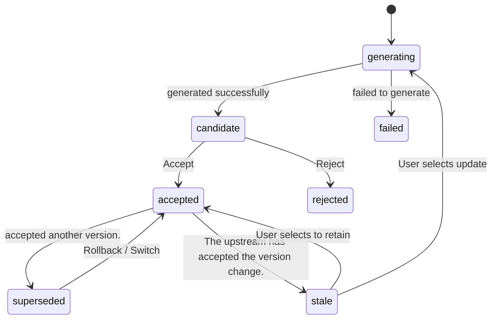

| Operation | behavior |
|---|---|
| Regenerated | Create a new candidate. **No impact **Current accepted version and downstream |
| Accept | candidate → accepted, original accepted → superseded; triggering downstream invalidation checks. |
| Switch | Switching between accepted and unaccepted within the same batch of candidates |
| Rollback | Any historical version becomes accepted again |
| Invalidation Propagation | downstream node `input_hash` When is inconsistent with the new upstream, it is marked as stale (displayed as a yellow badge on the canvas); users can choose "Update only affected footage" or "Keep the status quo". |
| Local Regeneration | For example, if only character A's outfit is changed, only shots featuring character A will be tagged as stale. |

### 5.8 Three Collaboration Modes

| mode | Suitable for: | behavior |
|---|---|---|
| **Autopilot Fully Automatic** | Growth Team Mass Production | Skip G1–G3, automatically accept the first place based on Critic ranking; only in `block` Pause when level issues or budget overruns occur. |
| **Checkpoint Key Node Confirmation**(Default) | Brand, Agent | paused in G1–G4 waiting for users. |
| **Manual Expert Manual** | Senior Creator | Each node must be run manually; free nodes (any text-to-image, image-to-video) can be inserted at any time and used in combination with Agent nodes. |

### 5.9 Cost Funnel and Budget Control

| stage | product | Relative cost (example, subject to actual pricing) | Confirmation Point |
|---|---|---|---|
| Strategy + Script | text | 1 | G1 / G2 |
| Anchor point + keyframe | 15–30 images | Approximately 10 | G3 front |
| animatic | Keyframes + Temporary TTS | Approximately 1 | **G3** |
| Shot Rendering | 8-shot × 2–3 candidates | Approximately 60–80 | — |
| Audio + Final Edit | Audio + Synthesis | Approximately 5 | G4 |
| MG Animated Graphics (Information Type) | Parametric rendering, 4K editable | Approximately 3–5 relative cost units (far less than video of the same duration). | G3 Front/Partial Modification Available Anytime |

- **Prediction**: Displays the estimated number of points before each node runs; G3 displays "Approximately X points will be consumed after confirmation".
- **Pre-deduction**: WorkflowRun starts with an estimated number of points deducted, and settles the accounts based on the actual number of points after completion, with refunds for overpayments and additional payments for underpayments; failed projects are automatically refunded.
- **Budget Limit**: User sets an upper limit; the scheduler will pause if the next call exceeds the upper limit.
- **Cache**: `input_hash` allows for the direct reuse of historical artifacts by the same node, without duplicate billing.
- **MG Exception**: Dynamic graphics are parametric rendering, not "video rendering". See 5A.8 for cost details. Changing text, values, colors, and rhythm only changes the parameters and does not trigger the media model to be regenerated.

### 5.10 Batch Variants and A/B

- **variant matrix**: G1 selects multiple angles × hooks × proportions × roles to generate variant plans, for example, 3 hooks × 2 roles = 6.
- **Shared Anchor Point**: All variants share the ProductBible, scenes, and accepted roles, generating new content only for the parts that differ.
- **Only focuses on rendering differences in camera angles**: Changing the hook only requires redoing the first 1-2 shots, and the rest can be reused directly, costing about 1/5 of the entire film.
- **variant tag**: Each strip of tape `{angleId, hookId, characterId, aspect}` The tag is . After the campaign is launched and the user feeds back, the results can be attributed by dimension (which hook had the highest CTR).

### 5.11 Canvas Design (Front-end): Free canvas + Right-side Agent panel

The canvas does not fix the 9 Agents into a linear pipeline, but **Connectable Free Canvas**: Users can add various content cards, freely arrange them, and edit directed dependencies; Agents and Skills are placed in the right panel and can be called as needed. Local content editing and graph structure editing coexist.

**Canvas Cards (All editable content blocks)**

| Card Type | nodeType | Description |
|---|---|---|
| text | `text` | Editable text blocks for scripts, copy, subtitles, etc. |
| Image | `image` | Keyframes, Main Visual, Reference Images |
| Video | `video` | footage clip, candidate |
| Audio | `audio` | Voiceover, background music, sound effects |
| Graphic | `motion_graphics` | Parametric Dynamic Graphics (Chapter 5A) |
| (quote) | `subject` `asset_ref` `reference_video` `document` | Target, materials, reference videos, documents |

**Three operations at the bottom of each card**(Guaranteed to be fully editable):
- **(Editor)**: Modify content on the spot—change text to words, change image composition, change audio track, and change graphic parameters.
- **Add material**: Add reference images or shots to this section, or replace the source material.
- **Ask AI**: Send this content to the dialog box on the right and hand it over to an Agent or Skill for processing. After modification, only update this one place.

**Right-side Agent panel (replaces the original) `?node=` Inspector)**:
- Top one **Drop-down Selector**, select "Which Agent or Skill to Hand Over": Creative Director, Writer, Product Visual, Character Designer, Scene Designer, Storyboard Designer, Video Director, Sound Director, Final Editing and Compositing, as well as Skills such as Motion Graphics, Reference Breakdown and Recreation, and Subtitle Proofreading.
- Message Flow: The Agent's product cards, candidate cards, gate confirmation cards, and question cards are all presented in the dialogue flow.
- When a canvas card is selected , the dialogue automatically focuses on the context of that card; right-clicking an asset allows you to "reference it to the AI dialogue".

**Explicitly Editable DAG**: Nodes establish directed connections through input/output ports, supporting the addition and disconnection of dependencies; saving, restoring, exporting, and template reuse must be preserved. `nodes` and `edges`. Rejects duplicate IDs, dangling edges, and loops. When generating a single node, it collects all upstream nodes from the current snapshot (including unsaved edits), providing text and image/video references in topological order, without introducing irrelevant nodes. Free layout does not change dependencies; users can still modify only one piece of text or replace materials without regenerating the entire image.

**Node-level generation and manual candidate selection**: Text, image, and video nodes can be edited with their respective Prompts and applicable model/scale/resolution/duration/candidate count options; the configured Provider is explicitly invoked, displaying the actual queuing, running, failure, or success status. Candidates must be selected by the user after being returned before being applied; existing content cannot be automatically overwritten. Audio nodes only support uploading and playback. Currently, it uses single-node generation and DAG context resolution, not nine-agent automatic scheduling; see [link to Provider] for complete Provider verification and protocol. [generation-providers.md](generation-providers.md).

**Canvas Top Bar**: Templates for generating, pausing, mode switching, budget progress bar, and publishing. Both the left sidebar and the right Agent panel can be collapsed.

### 5.12 Errors and Fallbacks

| Abnormal | processing |
|---|---|
| Provider timed out or crashed | switched to the fallback model after the circuit breaker was triggered; routingReason was recorded. |
| Content Security Interception | rewrites the Prompt and retryes once; if it still fails, it is marked as failed, prompting the user to modify it. |
| failed quality inspection repeatedly. | Maximum 2 retries → Manual review + storyboard modification suggestions |
| Reference image missing | `reference_requirements.blocking=true` When blocks the downstream, a prompt appears on the canvas indicating a need for additional image processing. |
| Service Restart | Resumes from persistent state; external asynchronous tasks pass through. `external_task_id` Continue polling (replacing the existing process) `setInterval`(see 12.1) |
| Insufficient balance | paused Run, prompted to recharge, then resumed the run after interruption. |

### 5.13 End-to-end example: Nike Air Max 15-second in-feed ad

| Steps | Key Product |
|---|---|
| target | Nike Air Max Spring New Arrival; Selling Points: Full-length Air cushioning/Breathable mesh/Lightweight; Target Audience: Urban athletes aged 18–30; Brand Kit: #FF2D55 + #111111, Passionate, Youthful, Streetwear, No competitor logos allowed. |
| 1 Creative Director | Target = Conversion; Angle A "Commuting without standing for long periods" (pain point type), Angle B "Urban night running" (scenario type); Hook A1 "How are your feet doing after the 10th hour of work?" (directly addresses the pain point); MustHave: Initial product exposure ≤ 3s, exposure ≥ 6s, end credits logo + "Buy Now" |
| 2 Scriptwriter | Structure PAS, 5 beats: 0–2s Close-up of tired feet → 2–5s Switching to Air Max → 5–10s Light running in the subway station, close-up of the air cushion → 10–13s Jumping and landing on a night street → 13–15s Logo + CTA; 58-character Chinese voiceover |
| 3 Product Visuals | cutout + 4 perspectives (side view is inferred, user confirmed); Swoosh and air cushion window are defined as immutable areas; 3 hero shots. |
| 4 Character Design | Lina, a 25-year-old urban office worker, selected from four appearance candidates; turnaround views and two expressions: tired and relaxed. |
| 5 Scene Design | Office workstations (warm evening light), subway station (cool white light), nighttime street scenes (brand neon pink); 3 cameras per scene. |
| 6 Storyboard Design | 8 shots; 1.2s hook shot close-up; track camera movement for running on the subway; "tying shoelaces" shot was not feasible → changed to "shoes landing" close-up; 8 keyframes + animatic |
| 7 Video Director | 8 shots rendered in parallel, 19 candidates; Shot 5 has a deformed air-cushion window, self-repair: passed after reducing motion intensity and retrying. |
| 8 Sound Director | Urban Electronic, BPM 120; Landing impact sound, transition whoosh; 4th segment of the voiceover overflowed by 0.4s → sent back to the scriptwriter to remove 3 Chinese characters. |
| 9 Final Cut | beat-sync editing; subtitles placed in the 9:16 safe zone; end credits CTA; export in 9:16 / 1:1 / 16:9; compliance report: passed. |
| Asset Library | Finished video bound to the Subject; the character "Urban White-Collar Worker Lina" has been added to the character library and can be reused. |

---

## 5A. Creative Module: Editable Projects and Informational Videos

### 5A.1 Pain Points and Positioning

Users have moved beyond the stage of "generating a stunning shot" and are now pursuing "completing a deliverable video that can be continuously modified." Traditional AI video is a single-track black box output: delivering a dead MP4, changing a subtitle, a number, or a rhythm requires re-rendering the entire video or repeatedly re-editing the clips.

Sparkle delivers a **finished video plus an editable project** After the visuals are generated, the sound, subtitles, charts, and rhythm are decoupled to independent tracks; when the content is updated, the corresponding elements can be located, and the changes can be precisely made in the correct position.

### 5A.2 Deliverables: Finished Video + Editable Project

| Deliverables | Description |
|---|---|
| Complete MP4 | can be directly deployed, with multiple ratios of 9:16 / 1:1 / 16:9. |
| Editable Project | features a multi-track timeline, parametric graphics, and independent elements, allowing for localized modifications at any time. |

Each type of content in the project is treated as **Independent Element**: Retain: text, values, charts, audio tracks, subtitles, and clips. When revising, "find the corresponding elements and make precise cuts in the correct positions," rather than redoing the entire draft.

### 5A.3 A New Starting Point for Creation: Documents and Data

Alongside Subject, reference breakdown, template, and free-prompt creation, add a document/data entry: PDF / Word / Excel / CSV / URL / Existing Reports.

Information Arrangement (Pre-processing, reusing the skills of creative director + scriptwriter) in three steps:

1. **Analysis**: Extracts text, numerical values, table and chart structures.
2. **Refining**: Identify high-value information—which are conclusions and which are what the audience wants to see; bar charts present "capability gaps," prices retain "billing units," and model upgrades highlight "changes before and after."
3. **Complete Project Planning**: Maps information into diagrams/tables/text animations to determine screen layout and storyboards.

Suitable use cases include report interpretation, data visualization, product explanations, and educational content, corresponding to `service` Subjects (SaaS, education, knowledge) and knowledge-oriented `ip` Subjects.

### 5A.4 MG Motion Graphics (Special Agent: Motion Graphics Designer)

Added Node Type `motion_graphics`, a new special agent "Motion Graphics Designer" has been added.

- **The essential difference between**: MG is not baked pixels, it is **Parametric Dynamic Graphics** Text, color, value, chart, position, animation direction, animation rhythm, and appearance duration are all parameters.
- **Output Contract `MotionGraphic`**: `segments[]`, `props{text, value, color, layout, animDir, duration}`, `dataBinding`.
- **4K Natively Editable**: Changing the value only modifies the parameters and does not trigger the regeneration of the media model. Compared to peers at around $0.06/second (to be verified by our own testing), this is far lower than videos of the same length.
- **Data Binding `dataBinding`**: Chart values can be bound to a cell in a document table; when the document is updated and the information arrangement is rerun, the MG parameters are replaced accordingly, without needing to redo the animation.

### 5A.5 Native Multitrack + Three Editing Entry Points

Multitrack: Video / MG Graphics (parameter track) / Text Subtitles / Logo Overlay / Voiceover / BGM / SFX.

| Entry | What should change? |
|---|---|
| Canvas Node | Text content, color, value, style (double-click to enter editing mode, a font size/color toolbar will pop up) |
| Timeline | Rhythm, Alignment, Segment Sequence, Duration of Retention |
| Chat Bar | describes the modification requirements for the specified material; right-click the material and select "Reference to AI Dialogue," and the material will be automatically included in the chat box. |

The three entry points work together: changing the canvas style, setting the rhythm on the timeline, and stating requirements in the dialogue.

### 5A.6 Local modifications without redoing (editing loop)

| Revision Type | What to change? |
|---|---|
| Product Name / Price / Value Update | Modify MG or text parameters |
| Minor voiceover adjustment | Regenerate only the affected audio segment (partial TTS regeneration) |
| Hold a key moment for two additional seconds | Timeline Drag |
| Background/Sound Effects Out of Sync | Adjust timing alignment or replace only the affected segment. |
| Shot Replacement | only re-renders the corresponding shot (connecting to 5.10). |

Principle: Content is preserved as independent elements, and modifications are targeted; the entire content is not rewritten for a single local problem.

### 5A.7 Relationship to the Existing Nine Agents

- The main pipeline remains unchanged: 9 agents responsible for "advertising/product-oriented narrative videos."
- Informational Video is **Specialized Extension**: Multitrack for reusing information arrangement (pre-processing), scripting, storyboarding, and final editing; New features added. `motion_graphics` Node + "Motion Graphics Designer" Special Agent.
- MG products have been added to the unified asset library (with the addition of "Dynamic Graphics Library"), and can be reused, matched with targets (link two), and listed for trading (link three).

### 5A.8 Technical Implementation

- MG rendering layer: self-developed parametric rendering, or based on Remotion / HyperFrames; output = project file + MP4 export.
- Document Parsing Pipeline: PDF/Table Extraction → LLM Information Extraction → Structured Chart Spec (Bar Chart/Line Chart/Flowchart/Numerical Change/Highlighting).
- Timeline Parameter Track: MG clips are displayed as editable parameters on the timeline, not pixel tracks.
- Compositing: The MG track is combined with the video track, subtitles, and audio track in the final cut (ffmpeg / Remotion compositing).
- Cost: MG is located in the "cheap layer" of the cost funnel, see 5.9.

---

## 6. Creative Module: Video Cloning

### 6.1 Value

Users upload a reference ad or short video. The system analyzes each shot: the hook, framing, camera movement, actions, product exposure, subtitles, sound cues, and pacing. It turns the reference into an **editable advertising structure**, preserving its rhythm and narrative while substituting the user's product, characters, scenes, style, and copy. The result has a similar structure with entirely new content.

### 6.2 Process

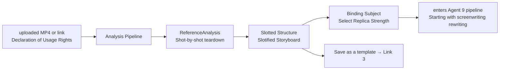

### 6.3 Analysis Pipeline

| Steps | Technology | output |
|---|---|---|
| 1 Shot Segmentation | Shot Boundary Detection (A Class of Methods in PySceneDetect / TransNetV2) | Shot List and Timecode |
| 2 Shot-by-Shot Understanding | keyframes + VLM structured description; camera movement determined by optical flow. | Shot type, angle, camera movement, subject, action, whether the product appears, and text on the screen. |
| 3 Voice and Text | ASR (voiceover) + OCR (subtitles and overlays) | Script and Subtitle Timeline |
| 4 Audio Analysis | features vocal/music separation, BPM and beat detection, and SFX event detection. | beat grid, sound effects events |
| 5 Rhythm Curve | Shot duration sequence, editing frequency, emotional intensity | Rhythm Chart |
| 6 Narrative Recognition | The LLM maps camera feeds to beat functions (hook/problem/demo/proof/CTA) and identifies the hook type. | Narrative Structure |

### 6.4 Output: Slotted Structure

Specific elements in each reference shot are abstracted into slots:`[Character A]`, `[Product]`, `[Scene 1]`, `[Selling Point Copywriting 2]`, `[CTA]`. What's retained are the camera parameters (duration, shot size, camera movement, transitions, action type), but the content has been replaced.

| Replica Strength | Reserved | replacement |
|---|---|---|
| structural replica (default) | Number of shots, duration, shot type, camera movement, transitions, narrative structure | Roles, Scenarios, Products, Copywriting |
| Style Reissue | Structure + Tone, Light and Shadow, Compositional Tendency | Role, Product, Copywriting |
| Rhythm Reissue | editing rhythm and background music style | All the rest were re-planned by the creative director. |

### 6.5 Integration into the Production Pipeline

- After binding the Subject, will automatically populate the following slots: ProductBible ← ProductBible, SellingPoints ← SellingPoints, CTA ← BrandKit.
- Character slot: Selected from the character library, or generated by the character design agent. Scene slot is generated similarly.
- , the creative director, skipped the angle selection and instead chose "Infer angle from reference and verify the match with the target".
- The scriptwriter rewrote the original narrative structure as a new selling point; the storyboard agent uses reference shot parameters as **Strong Constraints**

### 6.6 Page `/clone/[id]`

- Left column: Original footage shot-by-shot timeline (thumbnail + annotation).
- Right column: New structure table (slots and replacement content for each lens).
- Bottom: Rhythm curve comparison; after generation, the original/new video can be played side by side synchronously.
- Operation: Bind target, select replication strength, generate new advertisement (→ `/project/[id]`), Save as template (→ Publish Wizard).

### 6.7 Compliance

- Reuse only the **structure**, never the original video's pixels or audio.
- Characters and logos from the original video will not be included in the new video; a similarity check will be performed on the new video to prevent plagiarism.
- When uploading , users need to declare their usage rights to the reference video; imported links are only for analysis and do not cache the original video for download.

---

## 7. Asset Module: Unified Asset Library

### 7.1 Classification

| Library | Content | Source: |
|---|---|---|
| Character Library | CharacterSheet (Three-view drawing, facial expressions, clothing) | Character Design Agent / Upload / Purchase |
| Scene Library | SceneBible (Settings, Camera Positions) | Scenario Design Agent / Upload |
| Product Catalog | ProductBible (Image cutout, multi-view, hero shot) | Product Visual Agent, bound to the Subject |
| Shot Library | Single-lens video clip (including margins) | Video Director Agent, reusable across projects. |
| Images/Videos/Audio | General-purpose materials; audio including timbres, BGM, and SFX. | Generate/Upload/Purchase |
| My Template | Template that has been published or purchased | Link 3 |

### 7.2 Asset Capabilities

| Ability | Description |
|---|---|
| Version History | Each piece of material has a version tree, which allows for comparison and rollback. |
| Source Tracking (Lineage) | was generated from which project, node, model, prompt, and references? Upload and purchase records are also available. |
| Citation Tracking | Which projects or templates reference an asset; display the scope of impact before modification. |
| Cross-project reuse | Reuse by **reference**, without copying; after the source material is updated, the referrer will receive a notification that "a new version is available for updating". |
| target binding | Each asset can link to one primary Subject; unbound materials enter the "pending matching" pool (link two). |
| Authorization Status | Owned/Purchased License (within scope)/Restricted (including third-party brand elements)/Exclusively Sold |
| Search | Category filtering + tag + semantic search (based on ContentProfile vector) |
| Spatial Isolation | Individual/Team/Client (Not visible between Clients in a proxy scenario) |

### 7.3 Page

- `/assets`: Category tab + filter (target, type, source, license, time) + grid; supports dragging to the canvas (as...) `asset_ref` node).
- `/assets/[id]`: Preview, version tree, source chain (allows navigation to the project and node that generated it), reference list, license certificate, operation area (**Content Matching**, **(Bound Target)**, **Authorized for Sale**, **Film Analysis**, **Download**).

---

## 8. Platform: Multi-Model Provider Integration

### 8.1 Capability Enumeration

`text.llm` · `vision.vlm` · `image.t2i` · `image.edit` · `image.ref` · `video.t2v` · `video.i2v` · `video.first_last` · `video.ref2v` · `audio.tts` · `audio.music` · `audio.sfx` · `video.lipsync` (V2)

### 8.2 Registration Center

`ProviderAdapterRegistry` (`provider_adapter_registry.py`) `(model_ref, capability)` is used to register adapters for the key. Each adapter implements:

```python
class ProviderAdapter(Protocol):
    capability: Capability
    model_ref: str                       # as "volc/seedance-2.0"
    def validate(self, params) -> list[str]: ...        # Parameter validity (duration, scale, number of reference images)
    def compile_prompt(self, shot_spec) -> str: ...     # Structured Description → Model Dialect
    async def submit(self, req) -> ExternalTask: ...
    async def poll(self, task_id) -> TaskResult: ...
    async def cancel(self, task_id) -> None: ...
    def normalize(self, raw) -> NormalizedResult: ...   # Unified Return Structure
    def estimate_cost(self, req) -> Cost: ...
    def classify_error(self, err) -> ErrorClass: ...    # content_policy/quota/timeout/invalid_param/provider_down
```

### 8.3 Supported Model Platforms

Provide unified configuration for image, video, and audio models from various companies including Seedream, Seedance, Tongyi Wanxiang, Tencent Hunyuan, MiniMax (Hailuo Video/Speech/Music), Kling, and Vidu.

**Current Studio Integration**: Text, images, and videos use independent server-side configurations. `SPARKLE_TEXT_*`, `SPARKLE_IMAGE_*`, `SPARKLE_VIDEO_*` These configurations support JSON request/response mapping and video polling according to document conventions. Each media type requires all three settings: `BASE_URL`, `API_KEY`, `MODEL`; Optional `MODELS` is a model whitelist. `.env.local` is stored locally, and `.env.example` can be distributed with the code; keys must never use `NEXT_PUBLIC_*` variables. Explicitly reports an error when configuration is missing or the provider fails, without reverting to previous settings. `src/lib/moyu.ts` never fabricates successful results. Audio generation and automatic fallback fall under planning capabilities; see detailed contract. [generation-providers.md](generation-providers.md).

### 8.4 Default configuration by stage + fallback (example, subject to internal evaluation)

| stage | capability | Default | Fallback |
|---|---|---|---|
| Strategy/Script/Storyboard | text.llm | Doubao | Tongyi/Hunyuan |
| Understanding/Quality Inspection | vision.vlm | Doubao Vision | Tongyi Vision |
| Anchor Point Diagram / Keyframe | image.ref | Seedream | Hunyuan/Wanxiang |
| Shot (Character Performance) | video.i2v | Kling | Seedance / Hailuo |
| Shot (Product Close-up) | video.i2v | Seedance | Vidu |
| First and Last Frame Relay | video.first_last | Kling | Vidu |
| (voiceover) | audio.tts | MiniMax Speech | Doubao Voice |
| BGM | audio.music | MiniMax Music | Music Library |

### 8.5 Conformance Verification and Governance

- **Access Verification**: The new adapter must pass the standard test suite (parameter mapping, return structure, error codes, duration and scale support, cost estimation error) before it can be enabled.
- **Regular Inspection**: Runs a small sample once a day to detect quality and latency degradation; automatically reduces routing weight when degradation occurs.
- **Circuit Breaker**: Circuit breaker when the continuous failure rate exceeds the threshold, switching to fallback mode.
- **Billing Mapping**: Provider cost price × markup factor → points; estimated and actual deductions are recorded separately for calibration purposes.
- **Management Page** `/settings/providers`: Start/Stop, Phase Default/Backup, Concurrency Quota, Price Coefficient, Inspection Report.

---

## 9. Commerce Module (I): Marketing Subject Center

### 9.1 Four Subject Creation Methods

| method | is suitable | implementation |
|---|---|---|
| Form Filling | All | is currently available. `/api/subjects` POST, Extended Fields |
| Import Product URL | e-commerce | scrapes landing page title, image, price, and details → LLM extracts selling points and target audience → User confirmation. |
| Brief Document Analysis | Agency | Upload PDF / Word / PPT → LLM extracts type, target, selling points, audience, tone, and taboos → Generates Subject and BrandKit drafts |
| Reverse creation from source material | Link 2 | When no suitable target can be found for the material, a new target will be pre-filled based on the ContentProfile. |

### 9.2 Fields and Agent Consumption Matrix

| field | (Required) | Creative Director | Scriptwriter | Product Visuals | character | Scene | Storyboard | Video | sound effects | Final cut | Match |
|---|---|---|---|---|---|---|---|---|---|---|---|
| type | ✓ | ✓ | ✓ | ✓ | ✓ |  |  |  |  |  | ✓ |
| name | ✓ | ✓ | ✓ |  |  |  |  |  |  | ✓ | ✓ |
| brief |  | ✓ | ✓ |  |  |  |  |  |  |  | ✓ |
| category | ✓ | ✓ | ✓ |  |  |  |  |  |  | ✓ | ✓ |
| sellingPoints | ✓ | ✓ | ✓ |  |  |  |  |  |  | ✓ | ✓ |
| referenceAssets | product (Required) |  |  | ✓ | ✓ |  | ✓ | ✓ |  |  | ✓ |
| targetAudience |  | ✓ | ✓ |  | ✓ | ✓ |  |  | ✓ |  | ✓ |
| brandKit |  | ✓ | ✓ | ✓ | ✓ | ✓ |  |  | ✓ | ✓ | ✓ |
| landingUrl |  |  |  |  |  |  |  |  |  | ✓ (CTA) |  |

### 9.3 BrandKit

- is an independent entity; a single brand can have multiple targets.
- Edit Page `/commercial/brand-kits`: Logo, color palette, font, tone of voice, disabled elements, timbre, end credits template, sample materials.
- **Force Lock**: Fields constrained by BrandKit. If violated in the Agent output, this will be directly generated. `block` QualityNote.

### 9.4 Target Details Page `/commercial/subjects/[id]`

| Tab | Content |
|---|---|
| Overview | Target Information, BrandKit, ROI Card (Cost, GMV, ROAS, Best Material) |
| Project | List of projects driven by this target → Jump to canvas |
| material | includes the finished product, shots, and anchor points linked to this target; including materials from Link 2 (source indicated). |
| Template | is the template used for this target; popular items on this target can be "templated with one click". |
| Delivery Data | Reflow data displayed by material and variant dimensions |
| Settings | Visibility (Private/Team/Public Solicitation), Initiate Bounty, Archive |

Main Button:**One-click canvas generation** → Generate configuration pop-up (platform, duration, scale, number of variations, mode, budget, optional templates) → `POST /api/subjects/:id/generate-project` → Jump to `/project/[id]` and run automatically.

### 9.5 Multi-Client Isolation (Agency Scenario)

`Workspace → Client → Subject`. Members are authorized by Client; media libraries, targets, and projects are filtered by Client; reusing media across Clients requires an explicit "share" operation and must be logged.

---

## 10. Commerce Module (II): Transactions and Monetization

### 10.1 Revenue Structure

| Revenue Sources | Payer | Billing Method | stage |
|---|---|---|---|
| SaaS Subscription | Brand, Team, Agent | Pay monthly or yearly per seat/per space; includes monthly points, concurrent users, workspace/client count, and advanced model. | P0 |
| Generation Credits | All users | Charges based on actual usage; tops up beyond the subscription limit based on usage. | P0 |
| Template Transaction Commission | Template Buyer | Platform commission | P1 |
| Material licensing commission | Material Buyer | Platform commission | P1 |
| Creative Bounty Service Fee | Brand posting the bounty | A certain percentage of the reward amount  | P2 |
| Enhanced Effect | brand | Direct Ad Streaming, Performance Attribution Reports, and Creator Incentives Based on Performance | P2 |

### 10.2 Dual Account Design

| account | Applications | Source: | Can withdraw money? | Reason |
|---|---|---|---|---|
| **Points Account** | Pay for generation compute | Recharge, Subscription Bonuses, Events | **No** | points are prepaid service vouchers and cannot be exchanged for cash, thus mitigating the compliance risks associated with virtual currencies. |
| **Cash Account** | Creator Revenue | Templates, materials, and bounty income | Yes | Earnings are denominated in RMB, with applicable tax withholding during settlement (subject to legal confirmation). |

The buyer pays for the transaction items (template usage fee, authorization fee) in RMB; the computing power consumed when running the template is paid in points. The two are priced and displayed separately.

### 10.3 Four types of trading goods

| Trading Item | Seller | Buyer | Deliverables | Pricing Method |
|---|---|---|---|---|
| ① **Material Authorization** Asset License | Creator | Brand/Growth Team | License for use of finished film/camera shots/characters + source files | Standard License (Non-Exclusive) / Exclusive Buyout / Customized Modification |
| ② **Workflow Template** Workflow Template | Template Author | Anyone | Instantiable template usage rights | Pay-per-use/Subscription/Buyout (White Box) |
| ③ **Creative Bounty** Brief Bounty | brand initiative, creator submissions | brand | - Selected finished product + Licensing | Brand: Set Bounty and Selection Quantity |
| ④ **Effect Incentive** (P2) | Platform/Brand | Creator | Additional rewards when performance reaches the target | calculated according to CTR/ROAS compliance tiers |

### 10.4 Link Two: Content-Based Product Matching Engine

#### 10.4.1 Matching Pipeline

```mermaid
flowchart LR
    A[Material Accept / User Click to Find Products] --> P[ContentProfile generated]
    P --> R[Recall<br/>Vector ANN + Category Mapping]
    R --> F[Rule Filtering]
    F --> K[LLM (Detailed Ranking)<br/>Score + Reason + Suggested Improvements]
    K --> O[Matching Suggested Cards]
    O --> X{User Actions}
    X -->|Bind| Bind[is bound to its own target.]
    X -->|Submit| Sub[Submission of Public Solicitation/Reward]
    X -->|Template| Tpl[Release Template]
    X -->|(Ignore)| Fb[Negative Feedback]
    Bind & Sub & Tpl & Fb --> L[Feedback Sample → Optimize Sorting]
```

| Steps | Description |
|---|---|
| ContentProfile | Prompt Text + Keyframe VLM Description + Structured Tags (Objects, Scenes, Actions, Emotions, Styles, Possible Groups, Possible Categories) + Multimodal Vectors |
| Candidate Pool | My Targets → Team Targets → Public Target Solicitation → Ongoing Bounties → (V2) External Product Library, requires business coordination, pending confirmation |
| Recall | uses pgvector to perform an ANN on the Subject vector (name + brief + selling point + category); at the same time, it navigates to the category mapping table ("dog" → pet supplies, "sneakers" → sports shoes and apparel). |
| Rule Filtering | Check category compliance (qualification is required for categories such as medical and financial); the target's BrandKit disabled elements;**Content displaying an existing brand can only match that same brand.**, its competitors have been excluded. |
| LLM Detailed Ranking | Output `{score 0–100, reasons[], adaptation: "as_is" / "light_edit" / "templatize", editPlan[]}` |
| Results Display | The material card shows "May be suitable for: Nike Air Max (92)"; in `/commercial/match` Summary |

**Three-level adaptation method**

| adaptation | Meaning | follow-up actions |
|---|---|---|
| `as_is` is usable as is. | The content already encompasses the product's form, emotional appeal, and target audience alignment. | After replacing the product image with a genuine one (partially re-rendered from the original product image), it can be used. |
| `light_edit` Light Modification | is a good fit but lacks product exposure. | The storyboard agent suggests inserting 1–2 product shots + selling point stickers. |
| `templatize` Template | The content has a good structure, but its main body is unrelated to the product. | is abstracted into a product slot template, and then enters link three. |

**Example**: Prompt "A Corgi wearing Nike sneakers running down the street" → Tags {dog, sneakers, running, street, energetic, cute} →
- Nike Air Max Spring New Arrival: 92,`as_is`. Reason: Running shoes have already appeared in the content and have a sporty feel; Modification suggestion: Replace the shoe with an official product image and add a CTA at the end of the video.
- A pet supplies brand: 78`light_edit`. Reason: The subject is a pet, and the emotions resonate with the character; Modification suggestion: Remove the Nike shoes and insert a close-up of the product in use.

#### 10.4.2 Brand Side: Creative Radar

- After the brand sets the target as "public solicitation", it will push notifications to the target based on subscription (internal message + daily summary).
- The brand only displays a low-resolution preview with a watermark and cannot be downloaded; however, users can perform actions such as "purchasing a license," "commissioning customization," and "adding to favorites."
- "Customized Commission" = Initiate a private bounty that only invites the creator in question.

### 10.5 Link 3: Template Market

#### 10.5.1 Template Definition

```ts
interface Template {
  id: string;
  authorId: string;
  title: string;
  category: string[];                 // Applicable Categories
  subjectTypes: Subject["type"][];    // Applicable target form
  dag: { nodes: TemplateNode[]; edges: Edge[] }; // Pipeline after removing specific content
  slots: TemplateSlot[];              // Variable Slot
  locked: string[];                   // Locked parameter paths (lens structure, camera movement, duration, model, seed, etc.)
  visibility: "blackbox" | "whitebox";
  samples: string[];                  // Example assetId (at least 1 record)
  pricing: { mode: "free" | "per_use" | "subscription" | "buyout"; price: number };
  estimatedPoints: number;            // Estimated Points per Run
  stats: { uses: number; rating: number; medianCtr?: number };
  version: string;
}

interface TemplateSlot {
  key: string;                        // such as product.image/sellingPoint[0]/character.main/scene.1/cta
  type: "image" | "text" | "character" | "scene" | "brandKit" | "audio";
  bindTo?: string;                    // Default mapping: subject.referenceAssets[role=product_main] etc.
  required: boolean;
  constraints?: string;               // For example, "Product images with a white background, at least 1024px".
}
```

#### 10.5.2 Release Process

1. Click "Publish as Template" in the top bar of the canvas → Publish Wizard.
2. **Automatically Identify Variable Slots**: All inputs from Subject, anchor points (roles, scenes, products), and copy are identified as candidate slots; the author confirms which are open and which are locked.
3. sets example finished product, pricing, visibility (black box/white box), and applicable categories.
4. **Platform Operability Audit**: The platform uses two standard test Subjects for automatic trial runs, and only videos that are successfully produced can be uploaded; at the same time, content review and infringement detection are carried out.
5. is now available. `/commercial/market`.

#### 10.5.3 Black Box and White Box

| | Black Box (Default) | White Box |
|---|---|---|
| Shape in the Buyer's Canvas | (one) `template_group` Node + Slot Form | expands to a complete node, which can be edited. |
| Prompt and parameters | executes on the server side and is not distributed to the front end. | (See) |
| Applicable Pricing | (Click/Subscribe) | Buyout |
| Anti-plagiarism | Strong | depends on the license terms. |

#### 10.5.4 Purchase and Operation

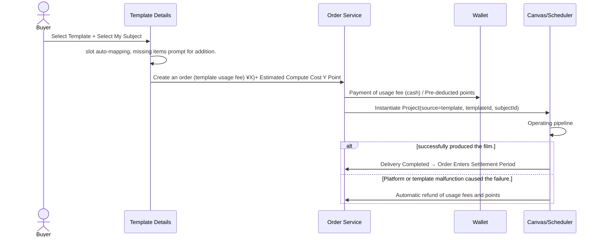

#### 10.5.5 Ranking and Quality

- Ranking Factors: Usage frequency in the last 30 days, paid user ratings, **Median CTR / ROAS (performance endorsement) of the repatriation campaign**, film output success rate.
- Only users who have paid and run the service can rate it; detects self-buying and self-selling fraudulent activities.
- The author will update the template to create a new version, and purchased users can choose whether to upgrade.

### 10.6 Creative Bounty: Matching demand in link one with supply in link two

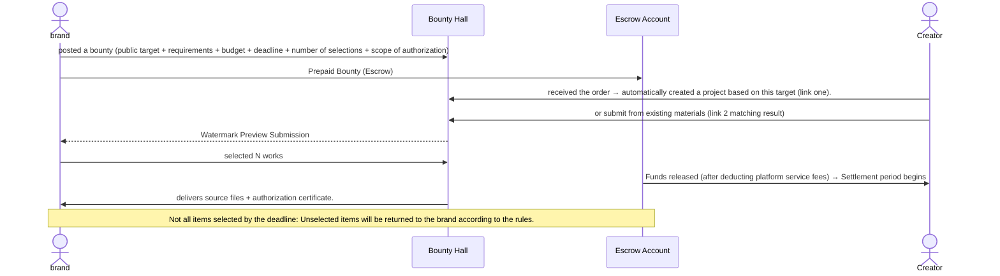

**Rules**
- Submissions that were not selected belong to their creators, but **contains this brand's products or logo. **cannot be sold to others as is; it can be debranded and made into a template.
- The brand can set up "participation awards" (e.g., the top N qualified submissions each receive a small reward) to increase the enthusiasm for submissions.
- Disputes involving (such as claims that the product does not meet requirements after selection) will be subject to arbitration by the platform, with escrow funds frozen until the arbitration concludes.

### 10.7 Licensing System

**License Certificate**: Issue one certificate per license with a unique number and content hash, downloadable from `/commercial/orders`.

| field | Description |
|---|---|
| licenseNo / contentHash | ID and Hash of Completed File |
| licensor / licensee | Authorizer, Licensee |
| subjectId | is authorized for use in the subject matter. |
| scope.channels | Distribution Channels: All Channels / Designated Platforms |
| scope.territory | Region |
| scope.term | Term: 1 year / Permanent |
| exclusive | Is exclusive? |
| derivative | Is allowed to be adapted (secondary editing, multiple aspect ratios)? |
| aigcDeclaration | AIGC declaration, and a list of models used. |

| Authorization Level | Description | Suggested price range for (to be verified) |
|---|---|---|
| Standard Authorization | Non-exclusive, designated channel, 1 year | ¥99–499 / item |
| Extended License | Non-exclusive, available across all channels, permanent, adaptable. | ¥499–1999 / piece |
| Exclusive Purchase | Exclusive, permanent; automatically removed from sale after purchase, author cannot resell. | Starting from ¥2000, author's price. |
| Customized Revision | is a revised version based on the original work, adapted to the brand's requirements, and is being offered through a private bounty. | Negotiation |

### 10.8 Pricing, Revenue Sharing and Settlement

**Revenue sharing proposal for (subject to business confirmation)**

| Trading Item | Author/Creator | platform | Remarks |
|---|---|---|---|
| Template Usage Fee | 70% | 30% | Official template is free and can be used for traffic generation. |
| Material Authorization | 80% | 20% | — |
| Bounty | 85% | 15% | Platform service fees will be deducted from the reward. |
| Computing Points | — | 100% | The computing power required to run the template is borne by the buyer; the author does not participate in revenue sharing. |

**Fund Flow**

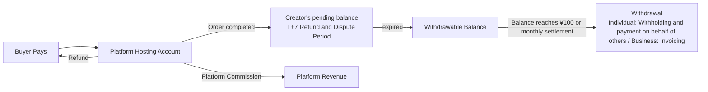

**Refund Policy**

| Scene | processing |
|---|---|
| Template failed to run (platform or template issue). | Automatic full refund of usage fee and points |
| The template ran successfully, but the buyer is not satisfied. | No refund for usage fees; points already used are non-refundable. |
| Material Authorization Before Delivery | can be refunded. |
| After material authorization and delivery | No refund; full refund upon discovery of infringement, and legal action will be taken against the seller. |
| Bounty expired before all spots were filled | Unused bounty will be returned to the brand (excluding participation rewards already distributed). |

### 10.9 Order State Machine

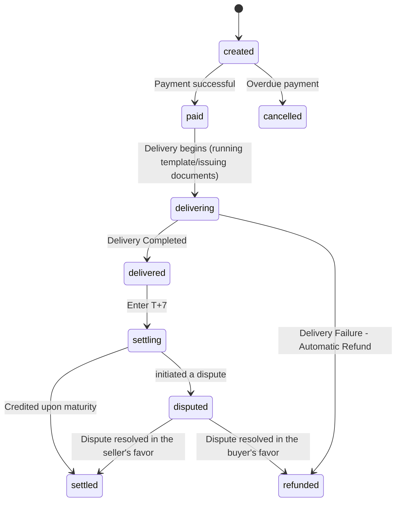

**Listing Status**: `draft → reviewing → listed → delisted / sold_out(exclusive)`.

**Accounting Implementation**: Double-entry bookkeeping `ledger_entries`(Each transaction records balanced debit and credit entries), the balance is calculated from the transaction history, and the balance field is not directly modified; payment callback is idempotent.

### 10.10 Campaign Integration and Results Feedback

| Ability | Description | stage |
|---|---|---|
| Export Deployment Package | Multi-scale finished product + Cover + Title text + Authorization certificate + Variation tags | P0 |
| Direct connection for deployment | OAuth connects to the advertising account, and the creative materials are directly pushed to the creative library (specific platform to be confirmed by business and API permissions). | P2 |
| Performance Feedback | Retrieves impressions, clicks, conversions, spend, and GMV by creative ID/variant tag; supports CSV import when API is unavailable. | P1 (CSV)/ P2 (API) |
| Attribution Display | Comparison of ROI cards and variant dimensions on the details page of target (which hook and which character performed better). | P1 |
| Feedback to Creation | Updates the creative director's hook/angle prior weights based on the reflow results; updates the template's performance ranking. | P2 |

### 10.11 Risk Control and Compliance

| Risk | Measures |
|---|---|
| AIGC identifier | finished product includes explicit identifiers and implicit metadata identifiers; the license certificate specifies the model list. |
| Trademark and third-party brands | When a brand logo or image is detected in generated content, the authorization status is marked as "Restricted," meaning it can only be authorized to that brand or de-branded. |
| Portrait rights | Live-action footage must be uploaded with authorization; the character database must indicate the source of the portrait. |
| Advertising Law | Two checks were conducted during the scriptwriting and final editing stages: checking for extreme wording, efficacy promises, and category qualifications. |
| Reposting and plagiarism | underwent similarity testing before being uploaded (compared with existing works and original films on the platform). |
| Fraudulent Transactions | Related account detection, scoring only counts paid users, abnormal transaction freeze. |
| Content Security | Provider-side interception + Platform-side listing review |

---

## 11. Page Features and Navigation

The table below contains future product plans. Current routing behavior follows Section 3.2; details, billing, deployment pages, or automatic executions in the plan should not be considered as already implemented.

| Page | Core Components | Key Interactions | Entry | Export (Redirect) |
|---|---|---|---|---|
| `/` Homepage | Location copy, feature navigation, recent projects | Click "Start Creating" and a pop-up will display three options (template creation, basic creation, free creation). | Top Navigation "Creative" | Three-level selection pop-up window → `/project/[id]`, `/clone/new`, `/commercial/market` |
| Three-level selection pop-up window | Template Creation, Basic Creation, and Free Creation cards | Select one level to enter | Homepage "Start Creating" | `/project/[id]`, `/clone/new`, `/commercial/market` |
| Target Selection Pop-up | List of Targets + "Create New Target" | Select target → Generate configuration | Homepage "Generate from Target" | Configuration pop-up window → `/project/[id]` |
| Generate configuration pop-up window | Platform, Duration, Aspect Ratio, Variations, Mode, Budget, Available Templates | displays the estimated number of points. | Target Selection, Target Details | `/project/[id]`(Automatic Operation) |
| `/project/[id]` Canvas | features a free canvas, editable cards (text, images, videos, audio, graphics), a collapsible left sidebar, a collapsible right Agent panel (with dropdown selection for Agent and Skill), top bar for runtime controls, and a bottom timeline for final cuts. | Add cards; each card can be edited locally, with added materials and AI queries; select Agent on the right for processing; double-click to edit the final cut timeline. | Three-tier selection, target details, template, film breakdown, reward | `/project/[id]/edit`, `/assets/[id]`, Template Publishing Wizard`/commercial/match`, `/commercial/subjects/[id]` |
| `/project/[id]/edit` Timeline | Multitrack timeline, preview player, subtitle editor, overlay editor, export panel | Drag editing points, change subtitles, change background music, preview in multiple aspect ratios, export. | Final cut node "Open Timeline" | Return to canvas, exported `/assets/[id]`, `/commercial/performance` |
| `/clone/new` | Upload Area, Link Input, Rights Statement Checkbox | uploaded and the parsing progress is now displayed. | Homepage, Asset Details "Film Analysis" | `/clone/[id]` |
| `/clone/[id]` | Original Footage Timeline, New Structure Table, Tempo Curve, Side-by-Side Playback | Bind target, select replica strength, replace slot. | `/clone/new` | `/project/[id]`, Template Publishing Wizard |
| `/ideas` Inspiration Plaza | Excellent finished product images and template waterfall layouts (sorted by category and effect) | "Making the same style" | Homepage | Template Details`/clone/new`(Same style as film analysis) |
| `/assets` | Category tabs, filters, grids, batch operations | Drag to the canvas, batch bind targets, batch search for goods. | Top Navigation "Materials" | `/assets/[id]` |
| `/assets/[id]` | Preview, Version Tree, Source Chain, Citation List, Authorization Information, Operation Area | Rollback version, content-to-subject matching, product binding, product listing, product selection. | Asset Library, Canvas | Source Project `/project/[id]`, `/commercial/match`, Listing Guide,`/clone/new` |
| `/commercial/subjects` | target card (colored according to 5 forms), statistics | Create and Filter | Top Navigation: "Business" | `/commercial/subjects/[id]`, `/commercial/subjects/new` |
| `/commercial/subjects/new` | Three tabs: Form/URL Import/Brief Upload | Analysis results confirmed | List of Targets, Target Selection Pop-up, Search for Goods "Create New Target" | `/commercial/subjects/[id]` |
| `/commercial/subjects/[id]` | 6 tabs (see 9.4) | One-click generation, initiation of a bounty, and setting to public solicitation. | List of targets, subject node in the canvas | Generate Configuration → `/project/[id]`, `/commercial/bounties/[id]` |
| `/commercial/brand-kits` | Brand Asset Editor | Upload Logo, Color Picker, Font | target form, settings | Return to source page |
| `/commercial/match` | - Old entry point, no separate page. | Redirect | already has an old link. | `/commercial/market?view=own` |
| `/commercial/market` | Templates Shop and My Templates Personal View | Search/Category, Details Pop-up, Reuse, Save Draft, Publish/Cancel Publish, Single Content Matching | Sidebar Templates, Template Creation | `/project/[id]`; The matching pop-up window can be used to create a new project from the target. |
| `/commercial/market/[tid]` | Sample video, workflow summary, slot description, price, rating, and performance data. | Select target → Slot mapping → Purchase and use | Template Market | `/project/[id]`, `/commercial/orders` |
| Template Release Wizard | Slot identification, lock settings, examples, pricing, visibility | Submitted for review | Canvas, Sheet Slicing, Sourcing Goods | `/commercial/market/[tid]`(After approval) |
| Listing Authorization Guide | Authorization level, price, channels, and duration | Submitted for review | Asset Details | `/assets/[id]`(Shown as available) |
| `/commercial/bounties` | - Old entry point, no separate page. | Redirect | already has an old link. | `/commercial/subjects` |
| `/commercial/bounties/[id]` | Requirements Details, Submission Area, Review Area (Brand Perspective) | accepts orders (automatically creates projects), submits existing materials, and selects materials. | Bounty Hall, Item Details, Find Goods | `/project/[id]`, `/commercial/orders` |
| `/commercial/orders` | Buy/Sell Orders, Authorization Certificates | Download certificate and apply for after-sales service | Purchase process for | Order Details |
| `/commercial/earnings` | Pending settlement, available for withdrawal, transaction history, withdrawal records | Cash withdrawal, invoicing | Business Center | — |
| `/commercial/performance` | Ad Account Connection, CSV Import, Performance Dashboard | Connect account and import data | Timeline Export, Target Details | `/commercial/subjects/[id]`, `/assets/[id]` |
| `/me/wallet` | Points Balance, Recharge, and Consumption Details | Recharge | Top bar avatar, insufficient balance notification | Return to source page |
| `/settings/providers` | Provider list, phase configuration, inspection report | Start/Stop, Adjust Default/Backup Plan | Admin Login | — |

**Navigation Conventions**
- All "Generate B from A" redirects include the source parameter (for example, `?from=subject:{id}`), used for analytics attribution and breadcrumb navigation.
- In the canvas, the subject, asset_ref, and template_group nodes can all be clicked to jump to the corresponding details page and open in a new tab, avoiding interruption of canvas editing.
- Leaving the canvas does not interrupt a running task; SSE restores its state when the user returns.

---

## 12. Technical Solution

### 12.1 Current Status Inventory (AS-IS) and Gaps

| Domain | Current State (Code Location) | Gaps/Risks | v2 processing |
|---|---|---|---|
| Front-end Framework | Next.js 16.3.5 App Router, React 19.2, Tailwind 4, `@xyflow/react` 12 (`package.json`) | Version is newer and contains breaking changes; please read it before development. `node_modules/next/dist/docs/` | Keep |
| Canvas | `src/components/studio/CanvasWorkspace.tsx` and `GenerationNode.tsx`; Connectable DAG, Node Prompts and Options, and Manual Candidate Applications | Canvas integration and overall verification are in progress; no complete artifact version chain and nine-agent scheduling are yet available. | retains free layout and partial editing as per version 5.11. |
| Task Status | `/api/studio/generations` Project list recovery and single task status polling | only restores the most recent 100 tasks; no SSE, cancellation, or global scheduling. | Further push notifications and historical updates will be added as needed. |
| Generation Scheduling | `src/lib/studio` Independent SQLite task table; Next `after` Commit and Persistent Polling Lease | Non-persistent external queue; interrupted task failures are not automatically retried with payment. | Subsequent migration of reliable workers |
| Reference Media Transmission | Current graph snapshot's topological upstream context and structured image/video references | The provider/adapter must support the corresponding media protocol; the remote URL may be outdated. | extends according to the Provider contract. |
| Data Layer | Sequelize + SQLite (`src/lib/db/index.ts`), and there are also unused items. `prisma/schema.prisma` | Two ORMs coexist; SQLite does not support multiple instances and vector retrieval. | uses PostgreSQL + pgvector; only one ORM is retained. |
| target | `Subject` model+ `/api/subjects` GET/POST; Bounties reads a Brief from physical storage and creates a new associated target item. | Incomplete brand information, reward system, and automated advertising pipeline not implemented. | Extended Subject/BrandKit |
| Project Limit | `MAX_PROJECTS = 10` (`src/lib/projects.ts:8`) | Prototype Limitations | changed to subscription package quota |
| Business Page | `CommerceWorkspace.tsx`: Local template publishing/drafts, sample catalogs, vendor briefs, keyword matching for artwork, and demo orders. | lacks genuine payments, cross-account marketplace, and semantic matching. | Implemented step by step according to Chapter 10 |
| Materials/Inspiration | `/assets` supports local media uploading/reusing and browser indexing; the complete Inspiration Square has not yet been delivered. | lacks full license, version tree, and cross-device asset management. | Expand on Chapters 7 and 11 |
| User | lacks authentication; in Prisma, the User field only has a points field. | Unable to trade | Supplementary authentication, Workspace, Wallet |
| Agent Engine | is in the AdCraft repository (Python):`specialist_agents.py`, `ad_workflow.py`, `workflow_graph.py`, `workflow_parallel_graph_runner.py`, `provider_adapter_registry.py`, `tools/ffmpeg.py` et al. | Not yet integrated with Sparkle. | is accessed as a standalone service (12.2) |

### 12.2 Target Architecture (to-be)

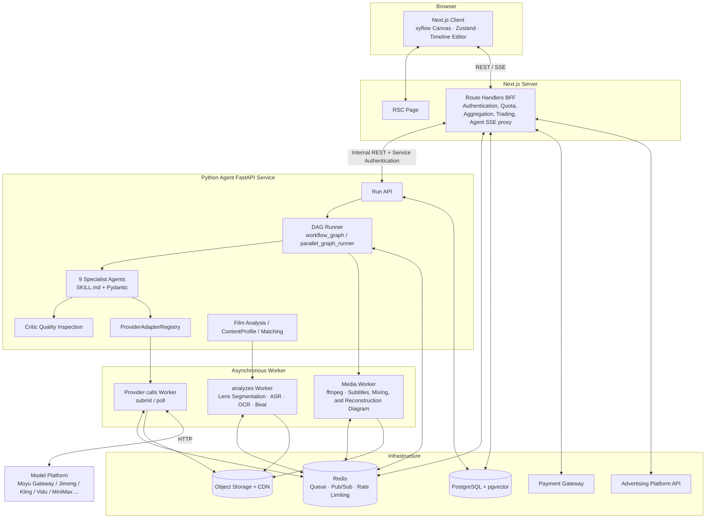

**Responsibility Boundaries**

| Service | is responsible | Data owned by |
|---|---|---|
| Next.js BFF | User and Authentication, Workspace, Subject, BrandKit, Project/Canvas, Material Metadata, Transactions, Wallet, Distribution; SSE Push | Business Table |
| Python Agent Service | WorkflowRun / NodeRun / Artifact, Agent Execution, Provider Invocation, Media Processing, Clip Extraction, Matching | Execution Table |
| Shared | PostgreSQL (ownership divided by schema, cross-domain read-only); object storage | — |

**'s reasons for choosing Python as the agent service**: Directly reuses the existing AdCraft engine; the media and ML ecosystem (ffmpeg, shot segmentation, ASR, beat detection) are all in Python; Pydantic is naturally suited for strongly typed contracts. Next.js is only responsible for interaction and business orchestration.

### 12.3 Technology Selection

| layer | Selection | Description |
|---|---|---|
| Frontend | Next.js 16 / React 19 / `@xyflow/react` 12 / Tailwind 4 / Zustand / Zod | is a self-developed timeline editor (based on Canvas or DOM), previewing using low-resolution proxy video. |
| BFF | Next.js Route Handlers | is currently available. `src/app/api/*` Continue to expand |
| ORM | Drizzle or Prisma (choose one, replacing Sequelize) | needs to support Postgres and jsonb. |
| Agent Service | FastAPI + Pydantic v2 + SQLAlchemy | Reusing AdCraft |
| queue | Redis + Arq / Celery | Provider tasks, media tasks, and analytics tasks are queued separately. |
| Database | PostgreSQL 16 + pgvector | jsonb stores the output, vector stores the matching vector. |
| Storage | S3 Compatible Object Storage (OSS / TOS / COS) + CDN | Original video, proxy video, and thumbnail are stored separately. |
| Media | ffmpeg | Transcoding, splicing, overlaying, subtitle burning, audio mixing, loudness normalization. |
| MG rendering | Self-developed parametric rendering / Remotion / HyperFrames | Editable animated graphics of charts, data, and text; output = project file + MP4. |
| Payment | WeChat Pay/Alipay; Corporate bank transfer | platform hosting and revenue-sharing capabilities are yet to be confirmed. |
| Observability | OpenTelemetry + Structured Logging; each NodeRun records the trace. | facilitates cost and quality attribution. |

### 12.4 Data Model (Core Tables)

| Table | Key Fields | Owner |
|---|---|---|
| users | id, name, phone, role | BFF |
| workspaces / workspace_members / clients | id, plan, quota; member.role; client.workspace_id | BFF |
| brand_kits | id, workspace_id, logos jsonb, colors jsonb, fonts jsonb, tone, forbidden jsonb, voice_id, end_card_template_id | BFF |
| subjects | id, workspace_id, client_id, owner_id, type, name, brief, category, selling_points jsonb, reference_assets jsonb, target_audience jsonb, brand_kit_id, landing_url, visibility, status, embedding vector | BFF |
| projects | id, workspace_id, subject_id, source, template_id, clone_id, bounty_id, name, industry, mode, basic_type | BFF |
| canvases | project_id, nodes jsonb, edges jsonb, version | BFF |
| workflow_runs | id, project_id, mode, status, budget_points, reserved_points, spent_points, started_at, finished_at | Agent |
| node_runs | id, run_id, node_id, node_type, state(queued/running/completed/failed), attempt, input_hash, error_class, started_at, finished_at | Agent |
| artifacts | id, project_id, node_id, node_run_id, version, status(candidate/accepted/rejected/superseded/stale), payload jsonb, quality_notes jsonb, confidence, parent_version_id | Agent |
| generation_jobs | id, node_run_id, provider, model_ref, capability, request jsonb, external_task_id, status, result jsonb, cost_points, latency_ms | Agent |
| assets | id, workspace_id, client_id, library(character/scene/product/shot/image/video/audio), subject_id, current_version_id, license_status, tags jsonb | BFF |
| asset_versions | id, asset_id, version, url, proxy_url, meta jsonb, lineage jsonb(project/node/model/prompt/refs) | BFF |
| asset_references | asset_id, ref_type(project/template), ref_id | BFF |
| reference_analyses | id, source_asset_id, shots jsonb, transcript jsonb, beat_grid jsonb, structure jsonb, slotified jsonb, status | Agent |
| content_profiles | asset_id, tags jsonb, caption, embedding vector | Agent |
| subject_matches | id, asset_id, subject_id, score, reasons jsonb, adaptation, edit_plan jsonb, status(suggested/accepted/dismissed/submitted) | Agent write, BFF read/write status |
| templates / template_versions | id, author_id, title, dag jsonb, slots jsonb, locked jsonb, visibility, pricing jsonb, review_status, stats jsonb | BFF |
| listings | id, item_type(asset/template), item_id, seller_id, license_options jsonb, status | BFF |
| orders / order_items | id, buyer_id, status, amount_cny, points_reserved; item.listing_id, license_option | BFF |
| licenses | id, license_no, order_item_id, asset_id, licensee_id, scope jsonb, exclusive, content_hash | BFF |
| bounties / bounty_submissions | id, subject_id, budget, deadline, pick_count, license_scope, status; submission.asset_id, creator_id, status | BFF |
| wallets / ledger_entries / payouts | wallet(user_id, kind: points/cash); ledger(debit_account, credit_account, amount, ref_type, ref_id); payout(status, tax) | BFF |
| ad_accounts / performance_metrics | platform, token; metric(asset_id, variant_tags, date, impressions, clicks, conversions, spend, gmv) | BFF |
| provider_models / stage_routing | model_ref, capability, enabled, price_factor, conformance_status; stage, default_ref, fallback_refs | Agent |

### 12.5 API Design

**BFF (`/api/*`, called by the frontend)**

| domain | Interface |
|---|---|
| target | `GET/POST /api/subjects` · `GET/PATCH/DELETE /api/subjects/:id` · `POST /api/subjects/import-url` · `POST /api/subjects/parse-brief` · `POST /api/subjects/:id/generate-project` |
| brand | `GET/POST /api/brand-kits` · `PATCH /api/brand-kits/:id` |
| Project | `GET/POST /api/projects` · `GET/DELETE /api/projects/:id` · `PUT /api/projects/:id/canvas`(Already exists)|
| running | `POST /api/projects/:id/runs` `{mode, scope: all/from_node/nodes[], budget}` · `GET /api/runs/:id` · `POST /api/runs/:id/{pause,resume,cancel}` · `POST /api/runs/:id/checkpoint` `{gate, decision}` · `GET /api/runs/:id/events` (SSE) |
| Node Version | `GET /api/projects/:id/nodes/:nodeId/versions` · `POST /api/artifacts/:id/{accept,reject}` · `POST /api/projects/:id/nodes/:nodeId/rollback` `{versionId}` · `POST /api/projects/:id/nodes/:nodeId/regenerate` `{instruction}` |
| Timeline | `GET/PUT /api/projects/:id/timeline` · `POST /api/projects/:id/export` `{aspects[]}` |
| Film Analysis | `POST /api/clones` · `GET /api/clones/:id` · `POST /api/clones/:id/instantiate` `{subjectId, strength}` |
| material | `GET /api/assets?library&subjectId&q` · `GET /api/assets/:id` · `POST /api/assets/:id/bind-subject` · `POST /api/assets/:id/match` |
| Content Matching | `GET /api/match/suggestions` · `POST /api/match/:id/{accept,dismiss,submit}` |
| Template | `POST /api/templates` (from projectId)· `GET /api/templates` · `GET /api/templates/:id` · `POST /api/templates/:id/instantiate` `{subjectId, slotOverrides}` |
| transaction | `POST /api/listings` · `POST /api/orders` · `POST /api/orders/:id/pay` · `POST /api/payments/webhook` · `GET /api/orders` · `GET /api/licenses/:id` |
| Bounty | `GET/POST /api/bounties` · `GET /api/bounties/:id` · `POST /api/bounties/:id/submissions` · `POST /api/bounties/:id/select` |
| Wallet | `GET /api/wallet` · `POST /api/wallet/topup` · `POST /api/payouts` |
| deployment | `POST /api/ad-accounts/connect` · `POST /api/performance/import` · `GET /api/performance?subjectId&assetId` |
| Compatible | `POST /api/tasks/generate` · `GET /api/tasks/:id`(Reserved for single generation by free nodes; internally, it will be forwarded to the Agent service) |

**Agent Service (`/v1/*`, internal network only, authenticated with a service token)**

`POST /v1/runs` · `GET /v1/runs/:id` · `POST /v1/runs/:id/signal` (checkpoint / accept / cancel)· `POST /v1/nodes/:id/regenerate` · `POST /v1/analysis/clone` · `POST /v1/profiles/content` · `POST /v1/match` · `POST /v1/templates/:id/instantiate` · `GET /v1/providers/capabilities`

**SSE Events**

```ts
type RunEvent =
  | { type: "node.state"; nodeId: string; state: "queued" | "running" | "completed" | "failed"; error?: string }
  | { type: "artifact.candidate"; nodeId: string; artifactId: string; preview: string; qa?: object }
  | { type: "artifact.accepted"; nodeId: string; artifactId: string }
  | { type: "node.stale"; nodeIds: string[]; reason: string }
  | { type: "run.checkpoint"; gate: "G1" | "G2" | "G3" | "G4"; estimate?: number }
  | { type: "run.budget"; reserved: number; spent: number }
  | { type: "run.finished"; status: "completed" | "failed" | "cancelled" };
```

### 12.6 DAG Execution Engine

| Ability | implementation |
|---|---|
| State Modeling | `NodeState = Literal["queued","running","completed","failed"]`, each state transition is persisted to node_runs |
| Scheduling | features topological sorting and ready sets; concurrency is controlled by Redis semaphores based on provider quotas. |
| Dynamic Fanout | After the storyboard is accepted, the Runner uses `shots[]` to expand the shot_video subgraph; incremental adjustments are made when adding or deleting shots. |
| gate | In Checkpoint mode, the Run waits after node completion and resumes when a `signal` arrives |
| External Long Task | Submit and persist `external_task_id`. A Provider Worker polls or receives webhooks; the web process does not poll. |
| Failure Recovery | Handles errors by type: timeout / provider_down → retry + fallback model; content_policy → rewrite retry; invalid_param → direct failure. |
| Resume running after interruption | On restart, completed nodes are skipped; running nodes resume polling using `external_task_id` |
| Idempotency and Caching | `input_hash = hash(Upstream accepted product ID + parameter + seed + model)`; Direct reuse of the product upon hit. |
| Invalidation Propagation | When the upstream accepted version changes, the downstream `input_hash` is calculated along the edge; inconsistencies are marked as stale, and the event is pushed. |
| Budget | Pre-deducts fees upon startup; checks balance before each use; settles accounts after completion. |

### 12.7 Media Processing Pipeline

- **Storage Tiered**: Original file / 1080p deliverable file / 480p preview proxy file / thumbnails and sprites. The canvas and timeline only load the proxy file.
- **Synthesis**: Timeline JSON → ffmpeg filter graph (splicing, xfade transitions, overlay patches, ASS subtitle burning, amix + sidechaincompress to reduce BGM, loudnorm loudness normalization).
- **Parameter track**: MG motion graphics are a parameter track, not a pixel track, on the timeline; during compositing, they are rendered using Remotion/parameter rendering and expanded into a visual during the export stage. Modifying text, values, colors, positions, and rhythm only changes the parameters; the video model is not re-run.
- **Multi-scale**: Detects subject frame by frame → smooths → crop/scale; when image information is insufficient, calls up the image to expand and fill in the background.
- **AIGC identifier**: drawtext explicit watermark + file metadata writing.

### 12.8 Matching and Retrieval

- Vector: Multimodal embedding - Write `content_profiles.embedding` and `subjects.embedding`; pgvector HNSW index.
- Recall Top 50 → Rule Filtering → LLM Rank Top 5.
- The category mapping table is maintained by the operations team and supports synonyms.
- Feedback: accept / dismiss / purchase as training samples, which can be used to train a lightweight rearrangement model later.

### 12.9 Non-functional requirements

| Category | Indicator (Target Value) |
|---|---|
| Canvas Performance | Drag and drop within 200 nodes ≥ 50fps; First screen ≤ 2s |
| Event Delay | The time from the node's state change to its display on the front end is ≤ 1 second. |
| Availability | BFF 99.9%; Automatic switching in case of a single provider failure, without affecting the overall system. |
| Task Reliability | Zero task loss after service restart |
| Security | Client-level data isolation; black-box template prompts are not sent to the front end; object storage uses signed URLs. |
| Compliance | AIGC identification coverage is 100%; transaction audit logs are retained for ≥ 3 years (subject to legal requirements). |

### 12.10 Migration Steps

1. **Data Layer**: SQLite + Sequelize → PostgreSQL + Single ORM; Migrate existing Projects / Canvas / Generation Jobs / Subjects;`projects` added `subject_id`, `source`.
2. **Generation Scheduling**: `src/lib/generation.ts` In , the in-process Moyu scheduling is moved to the Agent service;`/api/tasks/*` is reserved as a compatibility layer.
3. **Contract**: Establishing a code generation workflow from Pydantic → JSON Schema → Zod, replacing handwritten code. `schemas/task.ts` Node type.
4. **Canvas**: Node Registry + Inspector + SSE;`CustomNode` The is broken down into various node components.
5. **Agent Service**: Integrates with the AdCraft engine, expanding to 9 node types; encapsulates the Moyu gateway as the first ProviderAdapter.
6. **Business**: First, launch the wallet and order (template), then launch material authorization and content-to-subject matching, and finally launch the bounty and advertising.

---

## 13. Metrics

**North Star Metric: Weekly Commercially Used Videos** Count deduplicated finished videos that are exported for campaigns, commercially licensed, or selected for bounties.

| Level | indicator | Description / Objective (Calibration after baseline determination) |
|---|---|---|
| Creation Efficiency | TTFV (Target → First candidate for finished film) | Autopilot mode, P50 ≤ 15 minutes |
| Creation Efficiency | Gate throughput (G1–G4) | measures the proportion of Agent output that is accepted in a single pass. |
| Creation Quality | shot first-pass rate | The percentage of shots that passed Critic quality control on the first generation. |
| Creation Quality | Identity Consistency Score / Product Authenticity Score | Critic output mean |
| Creation Quality | Candidate acceptance rate, average number of regenerations per shot | — |
| Cost | Average points per finished video; cache hit rate | Is the cost funnel effective?  |
| Film Analysis | parsing success rate; conversion rate from film analysis to finished film. | — |
| Link 1 | Percentage of projects with targets; Average number of completed films per target. | Does become an anchor point? |
| Link 2 | Content-to-subject matching suggestions: click-through rate and acceptance rate; distribution of linking/delivery/templates. | Core Indicators of Differentiation Capability |
| Link 3 | Template upload count, reuse count, paid conversion rate, repurchase rate | — |
| transaction | GMV, take rate, creator's monthly income distribution, bounty completion rate, controversy rate | — |
| Closed Loop | Percentage of finished videos with playback effects; Percentage of templates with proven performance. | Data Moat |

---

## 14. Release Roadmap

| stage | Cycle (Estimated) | Range | Acceptance Mark |
|---|---|---|---|
| **P0 · MVP: Link One Runs Successfully** | 0–8 weeks | Postgres migration; Subject and BrandKit complete fields; 9 Agent pipeline (Checkpoint mode); Candidates and rollback; ProviderRegistry (Moyu: Seedream/Seedance + 1 fallback); Final cut 9:16; Exporting delivery packages; Points wallet | demonstrated a successful end-to-end process from target to finished product using the Nike example, and the compliance report was approved. |
| **P1 · Content and Template** | 9–16 weeks | Reference Breakdown and Recreation; Batch Variations; Autopilot; Asset Library (Versions, Sources, References); Product Sourcing (Owned Items Only); Template Publishing and Marketplace (Free + Pay-Per-Use); Orders and Settlement; CSV Performance Feedback; Multi-Scale Export | The first paid templates have been sold; the acceptance rate of content-to-subject matching has established a baseline. |
| **P2 · Trading Network** | 17–28 weeks | is publicly soliciting proposals for a creative radar service; creative bounties; material licensing and exclusive buyouts; direct connection to advertising platforms; performance feedback to creative directors; performance incentives; multi-client isolation and improvement; informational video project (document → MG → editable motion graphics). | First order completed with reward; Template rankings incorporate performance data. |

---

## 15. Risks and Pending Issues

### 15.1 Risk

| Risk | Impact | Response |
|---|---|---|
| Model Capability and Price Volatility | Quality and cost are unstable. | Multi-Provider + Daily Inspection + Dynamic Routing |
| Cross-shot consistency falls below commercial standards | users need to repeatedly regenerate. | Three-layer anchoring + Critic + manual gate backup; high-risk shots were rewritten during the storyboard stage. |
| Third-party trademark, portrait, and IP infringement. | Legal Risks | Authorization status "Restricted", Listing review, Similarity detection, Rights statement. |
| Cold Start in Both Side Markets | Templates and bounties lack liquidity. | Official Template Free Traffic Generation + Early Partner Creators + Brand Beta Testing Bounty Subsidy |
| Settlement Compliance (Personal Income, Escrow Funds) | cannot be listed for trading. | Pre-confirm payment splitting plan and direct debit/payment process |
| Platform API Permissions | cannot receive performance data. | will first support CSV import, then platform-specific applications will be available. |
| Finished-video production cost is too high. | Negative gross margin | Cost funnel, caching, re-rendering only differentiated shots, and cost-effectiveness model for routing by shot type. |

### 15.2 Pending Items

| # | Matters | Responsible party |
|---|---|---|
| 1 | License Terms and AIGC Declaration Template | Legal Department |
| 2 | Revenue sharing ratio, authorized price range, and bounty service fee rate | Business |
| 3 | Payment splitting, escrow account, and direct debit/payment solutions | Finance/Legal |
| 4 | First batch of directly connected delivery platforms and API permissions. | Business |
| 5 | Default/backup models for each stage (subject to internal evaluation) | Algorithm |
| 6 | Critic Threshold Calibration (Identity Consistency, Product Authenticity) | Algorithm |
| 7 | ORM Selection (Drizzle / Prisma) | Frontend/Backend |
| 8 | Is the external product database (alliance products) connected to Link 2? | Business |
| 9 | Competitor Information Review (Section 1.3) | Product |

---

## Appendix

### A. Glossary

| Terminology | Meaning |
|---|---|
| Subject / Marketing Subject | The objects for which it generates materials: products, activities, services, IP, brands. |
| BrandKit | Brand Assets: Logo, color swatches, fonts, tone, prohibited elements, sound, end credits template |
| Production Bible | Project-level shared context, which is the collection of all accepted artifacts. |
| Anchor point | ensures consistent references across shots: text anchors, image anchors, and frame anchors. |
| First-Frame Locking Method | first generated and reviewed the keyframe images, then generated the video. |
| Gate G1–G4 | Manual confirmation point in Checkpoint mode  |
| animatic | Low-cost dynamic preview consisting of keyframes and temporary voiceover. |
| Handle | generates a portion of the video that is longer than the edit duration, which is then used to select a stable range for the final cut. |
| stale | After the upstream component accepted the version change, the downstream product was marked as invalid. |
| ContentProfile | content profile (tags + vectors) is used for content-to-subject matching. |
| Black Box/White Box Template | Prompt: Invisible, can only run / Can be expanded and edited after purchase. |

### B. Agent Instruction Template

```markdown
# {Agent Name}

## Role
You are the {Role} in an advertising video team, responsible for {Responsibilities}.

## Input
- {Upstream Contract Name} (read accepted versions only)
- Subject / BrandKit {field}

## Output
Return only JSON conforming to `{OutputSchema}`.

## Working Method
1. ...
2. ...

## Hard Constraint
- Follow CreativeBrief.mustHave and CreativeBrief.mustNot.
- {Role-specific constraints, such as one action per shot and no generated text within images.}

## Self-Inspection Checklist (Corresponding Quality Gate)
- [ ] ...
- [ ] ...

## Example
One complete high-quality input/output example.
```

### C. Correspondence with v1 PRD

| v1 module | v2 corresponding |
|---|---|
| 3.1 Creative Generation: Generating Text-based Images, Videos, and Reference Images | Chapter 5 Free Nodes + 9 Agent Pipeline |
| 3.1 Batch Variants | 5.10 |
| 3.1 Brand Style Locked In | 9.3 BrandKit + 5.4 Quality gates for each agent |
| 3.1 Multi-model access | Chapter 8 |
| 3.2 Infinite Canvas, Node-based Workflow, Side-by-Side Contrast | 5.11, 5.7 |
| 3.2 Layout and Templates, Multi-Size Adaptation | Agent 9 Final Cut + 10.5 Template Market |
| 3.2 Team Collaboration | 9.5 Multi-client isolation (comments and collaborative editing remain in P2) |
| 3.3 Commercial licensing, material trading, revenue sharing | 10.7, 10.3, 10.8 |
| 3.3 Campaign Integration and Results Feedback | 10.10 |
| 3.4 Ecosystem | 4.4 Three-Workflow Flywheel |
