# Sparkle 产品需求文档（PRD v2.0）

> **创意无界，增长有形。From Prompt to Profit.**
> 以「营销标的」为商业锚点、以「多 Agent 广告视频生产」为核心引擎、以「内容找货 + 模板流通」为变现飞轮的 AI 原生广告创作画布。

| 项 | 内容 |
|---|---|
| 文档版本 | v2.0（评审稿） |
| 更新日期 | 2026-10-05 |
| 适用范围 | 产品、设计、前端、后端、算法、商业化、法务 |
| 变更说明 | 在 v1「生成 → 编排 → 商业化」主模块不变的前提下，融合三部分：① AdCraft 9 Agent 广告视频引擎；② 以「营销标的 Subject」为中心的三条商业链路；③ 交易与结算体系。补充前后端技术方案和页面跳转链路 |

### 当前修订与实现边界（2026-10-05）

本次修订以用户最新要求为准：**自由布局 + 可编辑连线 DAG + 节点级生成**，取代此前「用户不需要画连线」的设计。用户可连接、断开节点并局部编辑内容；连线决定上游上下文，不强制线性排版，也不表示自动执行整张图。

- 文本、图片、视频节点有独立 Prompt、模型及适用的比例、分辨率、时长、候选数选项，通过服务端独立配置的 Provider 生成候选；用户手动选择后才应用到节点。允许不调用模型的本地编辑、素材替换与自由布局。音频仅上传/播放，不提供音频生成。
- **Marketspace** 为单词导航分组：Templates -> `/commercial/market`，Bounties -> `/commercial/subjects`，Orders -> `/commercial/orders`。My templates 包含已发布模板、未发布草稿和未存为模板的项目，每项作品提供 Content matching 操作，不另设找货导航页。
- 模板保存和复用保留节点、连线、节点 Prompt 与选项。草稿不进入公开浏览视图；取消发布保留草稿。这里的「发布」仅指当前浏览器内可见，不是跨账号公开市场，也没有真实支付、分成或提现。
- Bounties 使用 `/api/subjects` 中已有或用户新增的商家 Brief，不填充虚构商单、预算或奖励。内容匹配仅按用户编辑的上下文关键词检索这些标的，按命中数排序，不做语义分析、媒体扫描或效果预测。
- 已存在的 `/commercial/match` 重定向至 `/commercial/market?view=own`，`/commercial/bounties` 重定向至 `/commercial/subjects`。这两条旧入口不再承载独立页面；其余未实现的规划路由不因此新增兼容层。
- 时间轴保存编排元数据并提供预览，尚不渲染 MP4、混音或输出完整投放包。九 Agent 自动流水线、语义匹配、授权交易、结算和下文完整成片能力仍是产品目标，不是本地 MVP 已交付能力。
- Provider 从服务端 `.env.local` 的 `SPARKLE_TEXT_*`、`SPARKLE_IMAGE_*`、`SPARKLE_VIDEO_*` 读取配置，便携模板为 `.env.example`；不回退旧 Moyu 配置、不读取前端密钥、不以假素材代替错误。请求/响应、DAG 校验、任务恢复和候选契约以 [generation-providers.md](generation-providers.md) 为准。

后续章节保留完整产品规划；与当前修订冲突时以上述规则为准。当前实现说明见 [studio-implementation.md](studio-implementation.md)。本轮 Canvas 集成与整体验证由主任务负责，本文不声称最新构建或测试已通过。

---

## 目录

- [0. 摘要](#0-摘要)
- [1. 产品定位](#1-产品定位)
- [2. 核心概念与领域模型](#2-核心概念与领域模型)
- [3. 产品架构、信息架构与跳转链路](#3-产品架构信息架构与跳转链路)
- [4. 三条商业链路](#4-三条商业链路)
- [5. 创意模块：多 Agent 广告视频生产引擎（核心）](#5-创意模块多-agent-广告视频生产引擎核心)
- [5A. 创意模块：可编辑工程与信息型视频](#5a-创意模块可编辑工程与信息型视频)
- [6. 创意模块：拉片复刻 Video Cloning](#6-创意模块拉片复刻-video-cloning)
- [7. 素材模块：统一素材库](#7-素材模块统一素材库)
- [8. 底座：多模型 Provider 接入](#8-底座多模型-provider-接入)
- [9. 商业模块（一）：营销标的中心](#9-商业模块一营销标的中心)
- [10. 商业模块（二）：交易与变现体系](#10-商业模块二交易与变现体系)
- [11. 页面功能清单与跳转明细](#11-页面功能清单与跳转明细)
- [12. 技术方案](#12-技术方案)
- [13. 指标体系](#13-指标体系)
- [14. 版本规划](#14-版本规划)
- [15. 风险与待决事项](#15-风险与待决事项)
- [附录](#附录)

---

## 0. 摘要

1. **定位**：Sparkle 是一张 AI 原生的无限画布。用户从一个「营销标的」或一个灵感出发，由 9 个专业 Agent 协作完成「策略 → 脚本 → 视觉资产 → 分镜 → 镜头 → 声音 → 成片」，产出**可投放、可交易**的广告视频。
2. **核心实体**：`Subject（营销标的）`。商品、活动、服务、IP、品牌都抽象成「要为它生产素材的东西」。项目、素材、模板、订单、投放数据都挂在 Subject 上，ROI 也按 Subject 计算。
3. **核心引擎**：9 个专业 Agent，加一个确定性的 DAG 调度器。Agent 之间传递强类型的**结构化产物**（创意策略、脚本、产品圣经、角色三视图、场景设定、分镜表、渲染计划、音频计划、时间轴），不传纯文本。每次生成先出**候选版本**，用户可以接受、拒绝、切换或回滚。
4. **三条商业链路**：
   - **链路一 需求驱动**：Subject → 一键生成画布 → 素材自动绑定到标的。这条最刚需，竞品也已经覆盖。
   - **链路二 内容先行**：好内容 → 语义匹配 → Subject。这是 **Sparkle 的差异化核心**，目前主流产品还没有完整做出来。
   - **链路三 模板流通**：跑通的画布 → 带变量槽的模板 → 别人用自己的 Subject 实例化 → 作者拿分成。
5. **变现**：SaaS 订阅 + 生成点数 + 交易佣金（模板、素材授权、创意悬赏）+ 效果增值。点数账户和现金账户分开记账，创作者收益走现金账户，T+7 结算。
6. **交付物**：交付「成片 + 可编辑工程」，不是一条死 MP4。成片可直接投放，工程可随时回来精准局部修改，不必整条重做。

---

## 1. 产品定位

### 1.1 一句话定位

**Sparkle：以营销标的为锚、由多 Agent 协作生产广告视频，并让好内容自己找到生意的 AI 创意画布。**

| 维度 | 说明 |
|---|---|
| 目标用户 | 品牌广告主、电商与增长团队、代理公司与创意工作室、独立创作者与素材生产者 |
| 核心价值 | 更快产出、跨镜头一致、产品保真、素材直接可商用、内容可变现 |
| 关键差异 | ① 广告导向的 9 Agent 专业分工（不是一个 Prompt 生成一个视频）；② 拉片复刻；③ **内容 → 标的反向匹配**；④ 工作流模板即商品；⑤ **可编辑工程 + 信息型视频**（文档/数据 → 可参数化 MG） |

### 1.2 要解决的四个断层

| 断层 | 现状 | Sparkle 的解法 |
|---|---|---|
| **生成 ≠ 广告** | 视频模型一次只能生成 5–10 秒的单镜头，没有策略、没有分镜，角色和产品跨镜头会变形，画面里的文字是乱码 | 9 Agent 流水线 + 身份锚点体系 + 文字/Logo 后期合成，见第 5 章 |
| **素材 ≠ 生意** | 素材散落在各工具里，不知道为哪个商品而做，投放数据回不来 | 营销标的中心：所有产物和数据挂在 Subject 上，见第 9 章 |
| **好内容 ≠ 收入** | 创作者做出了爆款创意，却找不到买家；好的工作流沉淀不下来 | 内容找货 + 模板市场 + 创意悬赏，见第 10 章 |
| **成片 ≠ 可编辑工程** | AI 工具交付一条死 MP4，改一处字幕、一个数字、一处节奏都要整条重渲染，或反复碰运气抽卡 | 原生多轨时间轴 + 参数化图形 + 局部修改落点，交付「成片 + 工程」，见第 5A 章 |

### 1.3 竞争格局与差异化

> 竞品信息来自前期调研，发布前需要复核。

| 产品 | 主链路 | 强项 | 与 Sparkle 的关系 |
|---|---|---|---|
| Higgsfield | Product Profile / Brand Kit → Template → Product Shots / Ads / UGC / Motion；支持网页导入产品；Ads Studio 可用一个 Product + Brand Kit 按 selling angle 一次生成多个广告变体 | 链路一做得成熟 | 链路一是行业的基本配置，Sparkle 必须做到同等水平，但不靠它取胜 |
| Creatify | Product URL → Ad，带竞品创意分析、Remix、批量变体、A/B、CTR/ROAS | 「素材 → 商业结果」做得深 | 效果回流和变体测试需要追平 |
| 通用视频模型（即梦 / 可灵 / Vidu / 海螺等） | Prompt → 单段视频 | 单镜头画质 | 作为 Sparkle 的 Provider 接入，不构成直接竞争 |
| Fotor（Agent） | 需求规划 → 4K MG 生成 → 多轨编辑；主打「可编辑工程 + 文档/数据转 MG 动画」 | 原生多轨、MG 参数可编辑、自然语言局部改稿 | 方向一致，须补齐「交付工程」能力；Sparkle 差异仍在「标的锚 + 三条商业链路」 |
| **Sparkle** | 链路一 + **链路二 `Content → Semantic Matching → Subject`** + 链路三模板交易 | 多 Agent 广告结构化生产、拉片复刻、内容找货、模板分成 | **差异化集中在链路二和链路三** |

结论：链路一保证可用，链路二建立心智，链路三形成网络效应。Fotor 验证了「交付工程而不是死成片」是行业共同进化方向，属必补能力而非差异化；Sparkle 的差异仍落在标的锚和三条商业链路上。

### 1.4 目标用户与 JTBD

| 角色 | 标的形态 | 核心任务（JTBD） | 痛点 | Sparkle 的关键能力 |
|---|---|---|---|---|
| 品牌广告主 | Campaign / Brand | 「让所有素材长得像我的品牌」 | 调性不一致、审核成本高 | BrandKit 强制锁定、Checkpoint 审核、合规报告 |
| 电商与增长团队 | Product | 「一个商品一天出几十条可测试的素材」 | 批量产出、转化 | 变体矩阵（angle × hook × 比例）、只重渲染差异镜头、效果回流 |
| 代理公司 / 创意工作室 | 甲方 Brief | 「把 Brief 喂进去，直接出提案画布」 | 交付效率、多客户隔离 | Brief 解析成 Subject、Workspace/Client 隔离、拉片复刻、模板沉淀 |
| 独立创作者 / 素材生产者 | 别人的需求 | 「我的好内容和好流程能卖钱」 | 找不到买家 | 内容找货、模板上架、悬赏接单、收益结算 |

### 1.5 产品原则

1. **标的是锚**：每一个可商用产物都必须能追溯到某个 Subject，或者被匹配到某个 Subject。
2. **结构化优先于文本**：Agent 之间只传结构化契约。文本只是契约里的一个字段。
3. **先便宜后贵**：先审文本和关键帧，确认后再渲染视频（成本漏斗）。
4. **候选不覆盖**：任何重新生成都只产生候选版本，不覆盖已接受的版本。
5. **人在回路，但可以放手**：同时支持全自动、关键节点确认、专家手动三种模式。
6. **能复用就能交易**：凡是能复用的东西（成片、镜头、角色、模板），都可以授权和交易。

---

## 2. 核心概念与领域模型

### 2.1 营销标的 Subject：五种形态

| 形态 | type | 举例 | 典型用户 | 生成侧差异 |
|---|---|---|---|---|
| 实物商品 | `product` | 耐克球鞋、咖啡 | 电商与增长团队 | 产品视觉 Agent 以「产品保真」为第一约束 |
| 品牌活动 | `campaign` | 新品发布会、618 大促、品牌联名 | 品牌广告主 | 时效性强，利益点前置，倒计时类 hook |
| 服务 | `service` | 教育课程、SaaS 订阅、到店服务、产品说明 / 知识讲解 / 报告解读（信息型视频） | 增长团队、代理公司、知识创作者 | 没有实物，视觉锚点改为 UI 截图、门店、讲师形象；信息型视频走 MG 动态图形，数据可编辑 |
| 内容 / IP | `ip` | 游戏买量、App 拉新、影视宣发 | 增长团队 | 角色设计 Agent 必须以官方立绘为参考，不允许改设定 |
| 品牌本身 | `brand` | 品牌形象片、价值观传播 | 品牌广告主 | 情绪和叙事型 angle 优先，弱化促销 |

### 2.2 四类受众的视角

| 受众 | 标的 | 关注点 | 产品必须提供 |
|---|---|---|---|
| 品牌广告主 | Campaign / Brand | 品牌调性一致 | 品牌资产（Logo、标准色、字体、Tone of Voice、禁用元素），生成时强制锁定风格 |
| 电商与增长团队 | Product | 批量产出 + 转化 | 一个商品裂变出几十条变体，支持 A/B |
| 代理与工作室 | 甲方 Brief | 交付效率 | Brief 文档一键生成提案画布，多客户之间隔离 |
| 独立创作者 | 别人的需求 | 变现 | 内容匹配标的、模板复用分成 |

### 2.3 Subject 数据结构

```ts
interface Subject {
  id: string;
  workspaceId: string;          // 归属空间（个人 / 团队）
  clientId?: string;            // 代理公司场景：甲方客户隔离
  ownerId: string;
  type: "product" | "campaign" | "service" | "ip" | "brand";
  name: string;                 // 标的名称，如"Nike Air Max 春季上新"
  brief: string;                // 标的描述 / 甲方需求原文
  category: string;             // 类目，如"运动鞋服/跑鞋"，用于匹配与合规
  sellingPoints: { id: string; text: string; priority: number }[]; // 卖点 / 传播点
  referenceAssets: { assetId: string; role: "product_main" | "product_angle" | "logo" | "ui" | "ip_art" | "mood" }[];
  targetAudience: { summary: string; ageRange?: string; scenarios?: string[]; painPoints?: string[] };
  brandKitId?: string;          // 品牌调性，跨标的复用
  landingUrl?: string;          // 商品或活动落地页
  visibility: "private" | "workspace" | "public_open_call"; // 公开征集后进入匹配池 / 悬赏
  status: "active" | "archived";
  embedding?: number[];         // 语义向量（链路二匹配）
}

interface BrandKit {
  id: string;
  name: string;
  logos: { assetId: string; variant: "primary" | "mono" | "icon" }[];
  colors: { hex: string; role: "primary" | "secondary" | "accent" }[];
  fonts: { family: string; usage: "title" | "body" }[];
  toneOfVoice: string;          // 如"热血、年轻、街头"
  forbidden: string[];          // 禁用元素：竞品 Logo、特定颜色、敏感词等
  voiceId?: string;             // 品牌配音音色
  musicPreference?: string;     // 音乐偏好
  endCardTemplateId?: string;   // 片尾 CTA 模板
  exemplarAssetIds: string[];   // 品牌认可的示例素材（风格参考）
}
```

> 现有代码 `src/lib/db/index.ts` 已经实现了 Subject 的雏形（name / type / brief / sellingPoints / referenceAssets / targetAudience / brandKit），v2 需要把 brandKit 拆成独立实体，并补充 workspace、category、visibility、embedding 等字段。

### 2.4 其他核心实体

| 实体 | 说明 |
|---|---|
| Workspace / Client | 空间与客户隔离；代理公司一个 Workspace 下可以有多个 Client，Client 之间数据互不可见 |
| Project | 一次创作；`source ∈ {subject, clone, template, free, bounty}`，可选关联 `subjectId` / `templateId` / `cloneId` / `bountyId` |
| Canvas | 画布快照，包含 nodes 和 edges；画布本身也有版本 |
| WorkflowRun | 一次执行，包含模式（autopilot / checkpoint / manual）、预算、状态 |
| NodeRun | 某个节点的一次执行，执行态为 `queued / running / completed / failed` |
| Artifact | 节点产物（结构化 JSON + 媒体引用），有版本链和产品态：`candidate / accepted / rejected / stale` |
| ProductionBible | 一个项目的「创作圣经」：Brief、脚本、产品圣经、角色、场景等当前已接受版本的集合，是所有 Agent 的共享上下文 |
| Asset | 统一素材，带版本、来源（lineage）、引用关系、授权状态 |
| ContentProfile | 内容画像（标签 + 向量），供链路二匹配使用 |
| SubjectMatch | 素材与标的的匹配记录（分数、理由、改造建议、状态） |
| Template | 带变量槽的工作流模板（链路三） |
| Listing / Order / License | 上架商品、订单、授权证书 |
| Bounty / Submission | 创意悬赏与投稿 |
| Wallet / LedgerEntry / Payout | 点数和现金双账户、复式记账流水、提现 |
| PerformanceMetric | 投放回流数据 |

### 2.5 实体关系图

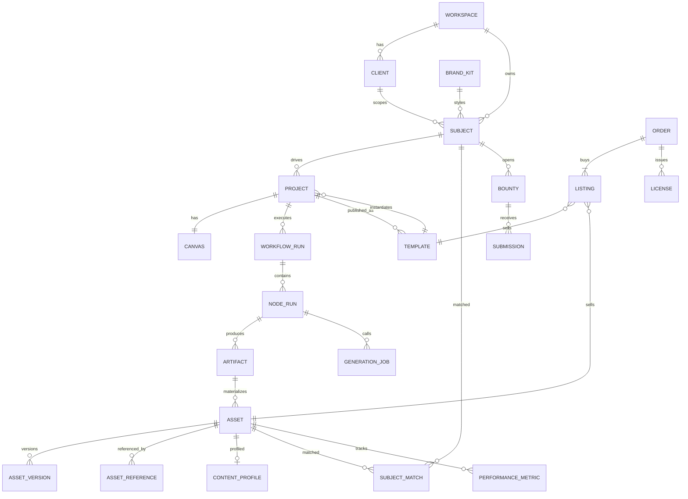

---

## 3. 产品架构、信息架构与跳转链路

### 3.1 模块总览（主模块不变）

产品能力仍分为创意、素材、商业。当前界面由 `src/components/studio/StudioShell.tsx` 提供 Workspace 与 **Marketspace** 侧栏；Marketspace 仅包含 Templates、Bounties、Orders，内容匹配位于 My templates 的单项作品操作中。下图为完整产品能力规划，而非当前已交付导航清单。

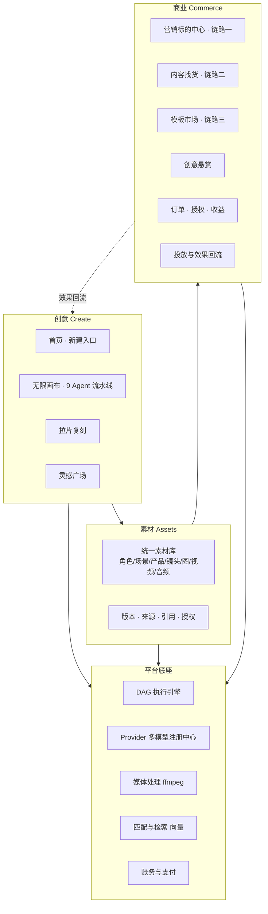

### 3.2 站点地图与路由表

表中标为「规划」或「新增」的页面不代表当前已实现；当前入口及旧路由重定向如下。

| 一级 | 路由 | 页面 | 现状 |
|---|---|---|---|
| 创意 | `/` | 首页：创意输入、新建项目、最近项目 | 已有 |
| 创意 | `/project/[id]` | 自由画布（可编辑卡片 + 右侧 Agent 面板 + 底部终剪时间轴） | 已有雏形 |
| 创意 | `/project/[id]/edit` | 终剪时间轴编辑器 | 新增 |
| 创意 | `/clone/new` | 拉片上传 | 新增 |
| 创意 | `/clone/[id]` | 拉片拆解结果，以及结构替换页 | 新增 |
| 创意 | `/ideas` | 灵感广场：优秀作品、做同款 | 占位，需重做 |
| 素材 | `/assets` | 素材库（分类 tab：角色、场景、产品、镜头、图片、视频、音频、我的模板） | 占位，需重做 |
| 素材 | `/assets/[id]` | 素材详情：版本树、来源链、引用、授权、找货、上架 | 新增 |
| Marketspace | `/commercial` | 默认入口 | 重定向到 `/commercial/market` |
| Marketspace | `/commercial/subjects` | Bounties：商家标的 Brief 列表与新建弹窗 | 本地服务端存储，无付费悬赏 |
| 商业 | `/commercial/subjects/new` | 新建标的（表单 / URL 导入 / Brief 解析） | 已有弹窗，需扩展 |
| 商业 | `/commercial/subjects/[id]` | 标的详情：项目、素材、模板、投放、ROI | 新增 |
| 商业 | `/commercial/brand-kits` | 品牌资产管理 | 新增 |
| Marketspace | `/commercial/match` | 旧找货入口 | 重定向到 `/commercial/market?view=own`，不再独立展示 |
| Marketspace | `/commercial/market` | Templates / My templates；每项作品可 Content matching | 示例目录与浏览器本地模板，支持草稿/发布/取消发布、搜索和分类筛选 |
| 商业 | `/commercial/market/[templateId]` | 模板详情与购买 | 新增 |
| Marketspace | `/commercial/bounties` | 旧悬赏入口 | 重定向到 `/commercial/subjects`，不再展示虚构 Brief |
| 商业 | `/commercial/bounties/[id]` | 悬赏详情、投稿、评审 | 新增 |
| Marketspace | `/commercial/orders` | 本地演示订单 | 无真实收费或授权证书 |
| 商业 | `/commercial/earnings` | 创作者收益、结算、提现 | 新增 |
| 商业 | `/commercial/performance` | 投放账户连接与效果看板 | 新增 |
| 个人 | `/me/wallet` | 点数充值、现金余额 | 新增 |
| 设置 | `/settings/workspace` | 空间、成员、客户隔离 | 新增 |
| 设置 | `/settings/providers` | 模型 Provider 配置（管理员） | 新增 |

### 3.3 全局跳转链路

以下为完整产品目标链路；详情、授权和投放等未实现页面不在当前导航中。当前 Content matching 在个人模板视图内按作品打开。

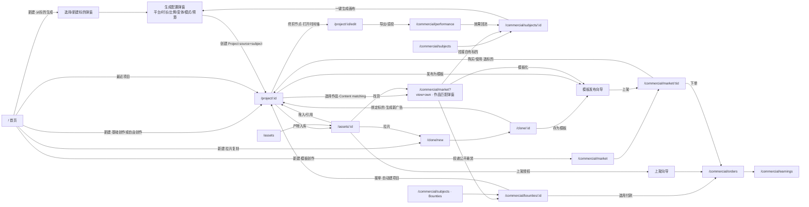

### 3.4 开始创作的三档入口（重构 `CreateProjectModal`）

点击「开始创作」后，先在三档里选一个起点。三档层次平行：**拉片复刻收进「模板创作」，剪辑不在入口层，而是在画布里完成**。

| 入口 | 说明 | 初始画布 | 下一步 |
|---|---|---|---|
| **模板创作** | 从参考或模板出发：上传一条参考广告做拉片复刻，或挑一个现成模板 | 跳到模板市场，或 `/clone/new` | 拆解 → 或槽位映射 → 进入画布 |
| **基础创作** | 一句话生成视频、上传图片让它动起来，或编辑已有视频 | 进入画布，预置简单流程（文生视频、图生视频、编辑） | 直接生成 |
| **自由创作** | 进空白画布，自己加文本、图片、视频、音频 | 进入空白画布 | 自由创作；剪辑在画布内完成，成片后可触发找货 |

> 「从标的生成」仍保留在营销标的中心（见 9.4 一键生成）：它本质是给画布指定一个 `subject` 来源，属于绕开三档、直接从标的发起的入口，不与上面三档并列。

---

## 4. 三条商业链路

### 4.1 链路一：需求驱动（先有标的 → 再生成素材）

**用户故事**：我是品牌方，手里有一款「耐克球鞋」要投放，需要它的广告素材。

**流程**

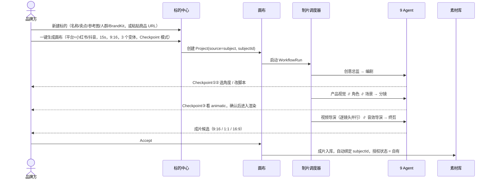

**商业价值**：最刚需。商品档案就是商业化的锚点，后续的投放、数据回流、ROI 计算都挂在标的上，而不是挂在孤立的素材上。

**验收要点**
- 从新建标的到第一个成片候选：Autopilot 模式下 P50 ≤ 15 分钟（目标值，待基线校准）。
- 产出的所有 Artifact 和 Asset 都带 `subjectId`，可以在标的详情页查到。
- BrandKit 的颜色、字体、Logo、禁用元素在终剪合规报告中逐项校验。

### 4.2 链路二：内容先行（先有好内容 → 反向匹配标的）

**用户故事**：我随手生成了一个「穿耐克的狗」的视频，效果很好。平台提醒我：这个内容和「球鞋 / 宠物用品」很契合。

**流程**

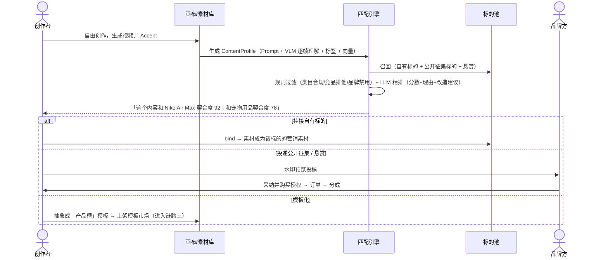

**商业价值**：这是 Sparkle 最有想象力的一条链路。好内容本身是稀缺品，「内容找货」让创意不被浪费，还能带动模板交易市场。

**关键规则**
- 内容里出现了第三方品牌（例如狗穿着「耐克」），只能 ① 授权给该品牌本身，或 ② 去品牌化后做成模板。**不能**把含有 A 品牌形象的成片卖给 B 品牌。
- 匹配被采纳后，成片需要经过一次「产品保真替换」：用标的的正版产品图替换 AI 臆造的产品外观，由产品视觉 Agent 和视频导演 Agent 局部重渲染。

### 4.3 链路三：模板流通（工作流即商品）

**用户故事**：我把自己跑通的一整条画布（脚本 + 生图 + 视频节点的连接关系和参数）打包成模板上架。别人付费使用，只需要换成自己的标的信息，就能批量产出同等质量的素材。我作为模板作者拿分成。

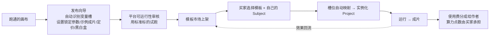

**与 Subject 的关系**：模板实例化时，填进变量槽的就是 Subject 的信息（name、sellingPoints、referenceAssets、BrandKit、targetAudience）。

### 4.4 三链路飞轮

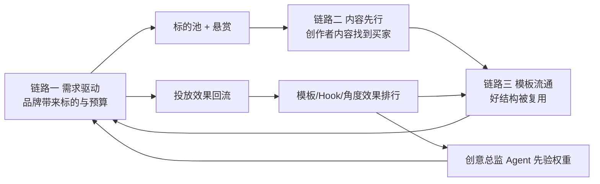

- 品牌越多 → 标的池越大 → 创作者内容越容易变现 → 创作者越多 → 模板越多 → 品牌生产成本越低 → 品牌越多。
- 效果数据是护城河：模板排行按**真实投放效果**排序，而不是按点赞数。

---

## 5. 创意模块：多 Agent 广告视频生产引擎（核心）

### 5.1 对视频生成的判断：为什么必须拆成多个 Agent

这一节是整个引擎的设计前提。每一条判断都对应一个 Agent 或一项机制。

| # | 视频生成的现实约束 | 设计结论 | 落地位置 |
|---|---|---|---|
| 1 | **视频模型是「单镜头渲染器」，不是「导演」**。单次生成 5–10 秒，一般只能稳定完成一个主体动作；广告需要 15–60 秒、6–15 个镜头 | 必须先有脚本和分镜，再逐镜头生成；每个镜头只给一个主动作 | 编剧、分镜、视频导演 |
| 2 | **跨镜头身份漂移**：同一个角色、同一个产品，在不同镜头里脸会变、鞋会变 | 先锁定「身份锚点」（角色三视图、产品多角度、场景机位图），所有镜头都从锚点出发 | 产品视觉、角色设计、场景设计 + 5.6 |
| 3 | **文生视频不可控，图生视频可控**。首帧决定构图、主体和光线 | 采用「首帧锁定法」：先生成并审核关键帧图（便宜、可控），再图生视频 | 分镜（关键帧）+ 视频导演（i2v） |
| 4 | **模型画不好字**：画面里的文字、Logo、价格经常变成乱码或形变 | 所有文字、Logo、价格、CTA 一律**后期叠加**，禁止让视频模型生成；场景设计阶段就避免出现可读文字 | 场景设计、分镜 overlay 字段、终剪 |
| 5 | **Prompt 是模型方言**：不同模型对运镜词、时长、首尾帧、参考图数量的支持各不相同 | Agent 输出与模型无关的结构化镜头描述，由 Provider Adapter 编译成各模型的方言 | 视频导演 + 第 8 章 |
| 6 | **生成是概率性的**：同样的输入会抽出好坏不一的结果 | 多候选 + 自动质检 + 人工确认；候选不覆盖已接受版本 | 5.7 |
| 7 | **广告有转化约束**：3 秒钩子、产品露出时长、卖点和画面对应、CTA、平台安全区、广告法 | 由创意总监把约束编译成「宪法」，每个 Agent 都在质量门里校验，终剪做最后的合规把关 | 创意总监、终剪 |
| 8 | **视频生成很贵**：一个 5 秒镜头的成本是一张图的十倍以上 | 成本漏斗：文本 → 关键帧 → animatic → 视频，每一层确认后才进入下一层 | 5.9 |
| 9 | **声音决定节奏感**：剪辑点要卡 BGM 节拍，SFX 要对上动作，口播不能溢出画面 | 音效导演产出 beat grid，反向给终剪提供剪辑点建议；口播时长反向约束编剧 | 音效导演、终剪 |
| 10 | **控制流不应交给 LLM**：让 LLM 决定「下一步调谁」会不稳定、不可复现、难以计费 | 调度器是确定性的 DAG，LLM 只在节点内部做创作决策 | 制片调度器 |

### 5.2 总体架构

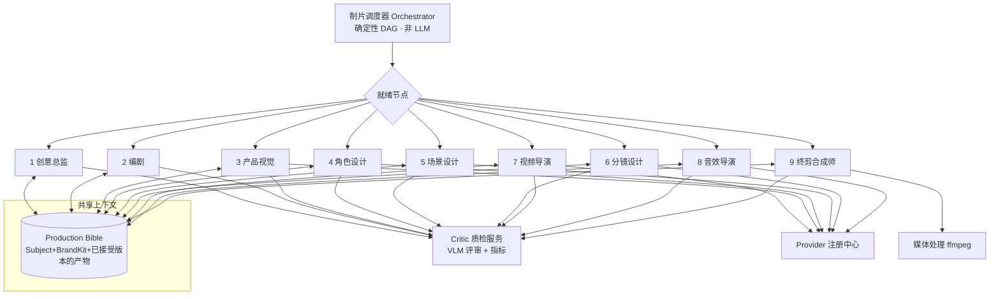

**角色划分**

| 组件 | 是否 LLM | 职责 |
|---|---|---|
| 制片调度器 | 否 | 依赖解析、并行调度、预算控制、Checkpoint 闸门、失效传播、重试与断点续跑 |
| 9 个 Specialist Agent | 是（LLM/VLM + 生成模型工具） | 节点内的专业创作决策，输出强类型契约 |
| Critic 质检服务 | 是（VLM）+ 规则与指标 | 被各 Agent 的质量门调用，返回结构化评分和问题清单，不单独成为节点 |
| Production Bible | 否（数据） | 所有 Agent 共享的事实来源；Agent 只读取「已接受」版本 |

**与 AdCraft 现有实现的对应**
- `app/services/specialist_agents.py:22` 中的 `SPECIALIST_BY_NODE_TYPE` 目前把 script / character / scene / storyboard / video / bgm 六种节点路由到不同 Agent。v2 扩展为 9 种：新增 `creative_brief`、`product_visual`、`final_cut`，`bgm` 升级为 `audio`。
- 每个 Agent 有独立的 `SKILL.md` 系统提示词（`agent/skills/video_agent_*`），统一输出 Pydantic 契约 `SpecialistResult`。
- `ad_workflow.py` 定义 9 阶段流水线；`workflow_graph.py` 和 `workflow_parallel_graph_runner.py` 负责持久化 DAG 执行。

### 5.3 流水线 DAG 与阶段闸门

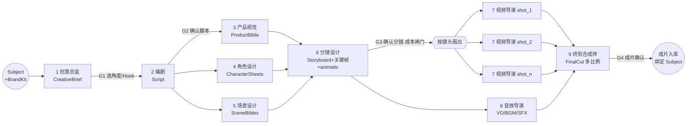

| 闸门 | 位置 | 用户在这里决定什么 | 为什么设在这里 |
|---|---|---|---|
| G1 | 创意总监之后 | 选择 1 个或多个 angle × hook（多选会生成变体） | 方向错了，后面全白做 |
| G2 | 编剧之后 | 逐段编辑、锁定或重写脚本 | 角色、场景、产品需求都从脚本派生 |
| G3 | 分镜之后 | 看 animatic（关键帧 + 临时配音的动态预览），调整镜头 | **最重要的成本闸门**：之后进入视频渲染，成本占全流程 70% 以上 |
| G4 | 终剪之后 | 选择成片候选，进时间轴微调 | 交付前最后确认 |

**并行规则**
- 产品视觉、角色设计、场景设计三者只依赖脚本，可以并行。
- 分镜依赖三者的「已接受」版本。
- 分镜确认后动态扇出 N 个镜头节点，按 Provider 并发配额并行渲染。
- 音效导演在分镜确认后即可开始（BGM 和 VO 不依赖视频成片），与视频渲染并行；SFX 精细对位在视频完成后补一轮。

### 5.4 九大 Agent 详解

每个 Agent 按同一结构说明：**定位 / 输入 / 输出契约 / 工作逻辑 / 质量门 / 用户干预 / 模型能力**。

#### Agent 1 · 创意总监 Creative Director

- **定位**：把「卖什么」翻译成「怎么打」。它是唯一对商业目标负责的 Agent，输出是所有下游必须遵守的「宪法」。
- **输入**：Subject（卖点、人群、brief、类目），BrandKit，投放目标（平台、KPI 类型：拉新 / 转化 / 品牌认知），时长与比例；可选：拉片分析结果、该类目历史效果数据。
- **输出契约 `CreativeBrief`**

| 字段 | 说明 |
|---|---|
| `objective` | conversion / acquisition / awareness |
| `platformSpec` | 比例、时长、安全区、字幕区、平台规范 ID |
| `coreMessage` | 一句话核心信息 |
| `angles[]` | `{id, type, sellingPointIds, insight, rationale, priority}`；type ∈ 痛点解决 / 场景代入 / 对比测评 / 开箱展示 / UGC 证言 / 剧情反转 / 数据权威 / 情绪共鸣 |
| `hooks[]` | `{id, angleId, type, line, visualIdea}`；type ∈ 视觉冲击 / 反常识提问 / 结果前置 / 冲突 / 悬念 / 痛点直击 |
| `toneKeywords` | 继承 BrandKit 后细化 |
| `mustHave` | 产品露出 ≥ N 秒、首次露出 ≤ T 秒、片尾 Logo、CTA 文案 |
| `mustNot` | 禁用元素、竞品、广告法禁用词、类目特殊限制 |
| `variantPlan` | angle × hook 的组合矩阵和建议的变体数 |

- **工作逻辑**
  1. **FAB 拆解**：特性 → 优势 → 利益 → 情绪。例如「全掌气垫（F）→ 缓震（A）→ 通勤久站不累（B）→ 轻松（情绪）」。
  2. **人群洞察**：把 targetAudience 展开成具体场景和痛点。
  3. **选择角度**：按 KPI 类型选（转化型优先痛点 / 对比 / 证言；认知型优先情绪 / 剧情），叠加类目先验，再叠加效果回流权重（某类目下 CTR 高的 hook 类型权重上调）。
  4. **生成 Hook**：遵守「前 3 秒法则」，每个 hook 都必须能在 3 秒内被画面表达。
  5. **编译约束**：把 BrandKit + 广告法 + 平台规范编译成 `mustHave / mustNot`，下游每个 Agent 都要校验。
- **质量门**：每个 angle 至少绑定 1 个卖点；hook 的 visualIdea 可视化；与 BrandKit tone 不冲突；mustNot 中没有和卖点自相矛盾的项。
- **用户干预**：G1 勾选角度和 hook，修改 coreMessage，调整变体数。
- **模型能力**：`text.llm`（强推理）；有参考图时使用 `vision.vlm`。

#### Agent 2 · 编剧 Scriptwriter

- **定位**：把策略写成「按秒计算」的广告脚本。广告编剧写的不是故事，而是时间。
- **输入**：CreativeBrief（已选的 angle + hook），Subject。
- **输出契约 `Script`**

| 字段 | 说明 |
|---|---|
| `durationTotal` | 总时长 |
| `structure` | PAS / Hook-Demo-CTA / Before-After / 三幕剧情 |
| `beats[]` | `{beatId, tStart, tEnd, function(hook/problem/solution/demo/proof/cta), visualDescription, voText, onScreenText, sellingPointIds, characterIds, sceneId, productMoment(bool), emotion(0–1)}` |
| `characterList[]` | 角色需求：`{id, role, appearanceNeeds, mirrorsAudience}` |
| `sceneList[]` | 场景需求：`{id, description, timeOfDay}` |
| `productMoments[]` | 产品露出时刻和展示方式（手持 / 上脚 / 特写 / 使用中） |
| `emotionCurve` | 情绪曲线，供音效导演匹配 BGM |

- **工作逻辑**
  1. 根据 angle 类型选择结构模板（痛点型用 PAS，开箱型用 Hook-Demo-CTA）。
  2. **字数预算**：中文口播约 4–5 字/秒，15 秒约 55–65 字；字幕可以比口播更短，但不能更长。
  3. **可拍性改写**：visualDescription 必须是摄像机能拍到的画面。「感受自由」要改写成「女孩在清晨街道小跑，鞋底落地回弹特写」。
  4. **卖点映射**：每个 beat 标注对应的卖点；转化型广告要求产品首次露出不晚于第 3–5 秒。
  5. **合规预检**：广告法极限词（「最」「第一」「国家级」）、功效承诺（美妆、保健品类目）、医疗金融等资质类目。
  6. 派生角色、场景、产品清单，驱动 Agent 3、4、5 并行执行。
- **质量门**：时长误差 ≤ 5%；已选卖点 100% 覆盖；口播字数不超预算；合规词零命中。
- **用户干预**：G2 逐 beat 编辑、锁定或重写单个 beat（锁定的 beat 在重新生成时保持不变）。
- **模型能力**：`text.llm`。

#### Agent 3 · 产品视觉 Product Visual

- **定位**：产品保真的守门人。广告里的产品可以换场景、换光线，但不能「长歪」。
- **输入**：Subject.referenceAssets（主图、多角度图），Script.productMoments，BrandKit。
- **输出契约 `ProductBible`**

| 字段 | 说明 |
|---|---|
| `cutout` | 抠图主体 PNG（透明底） |
| `angleViews` | `{front, side, threeQuarter, back, details[]}`；每张标记 `source: real / inferred` |
| `identityFeatures` | Logo 位置、配色 hex、材质、独特结构（如气垫窗） |
| `invariantMasks` | 不可变区域蒙版（Logo、关键结构） |
| `heroShots[]` | 对应每个 productMoment 的场景化主视觉图 |
| `descriptionToken` | 标准化的产品描述文本，供所有下游 Prompt 引用 |
| `fidelityScore` | 与原图的一致性得分 |

- **工作逻辑**
  1. **参考图质检**：检查分辨率、遮挡、背景杂乱程度；不达标时通过 `reference_requirements` 提示用户补图（如「缺少侧面图」）。
  2. **抠图 + 多视角补全**：AI 推断出的视角标记为 `inferred`，置信度低时需要用户确认。
  3. **场景化**：使用「产品图编辑 / 参考生图」，产品像素来自真实图片，**不使用纯文生图生成产品**。
  4. **保真校验**：视觉 embedding 相似度 + VLM 检查 Logo、颜色、结构；颜色偏差用 ΔE 衡量。
  5. **非实物标的**：service 输出 UI 截图和门店视觉锚点，ip 输出官方立绘锚点，brand 输出 Logo 和品牌符号锚点。
- **质量门**：fidelityScore ≥ 阈值（初始 0.85，上线后标定）；Logo 无畸变；主色 ΔE 不超阈值。
- **用户干预**：用画笔圈出不可变区域、选择主视觉、上传补充图。
- **模型能力**：`image.edit`、`image.ref`、`vision.vlm`、抠图工具。

#### Agent 4 · 角色设计 Character Designer

- **定位**：解决视频生成的头号难题：跨镜头「换脸」。
- **输入**：Script.characterList，Subject.targetAudience（人设应该像目标人群），BrandKit；可选：用户上传的真人或虚拟人、IP 官方立绘。
- **输出契约 `CharacterSheet[]`**

| 字段 | 说明 |
|---|---|
| `characterId / name / role` | 角色标识（宠物、动物同样是角色，例如「穿耐克的柯基」） |
| `persona` | 年龄、气质、职业，与目标人群对应 |
| `turnaround` | 三视图（正 / 侧 / 背），同一张 sheet |
| `expressionSet` | 按脚本情绪需求生成的表情集 |
| `outfits[]` | 服装（可以按场景准备多套） |
| `identityPrompt` | 标准化外观描述 token |
| `refImageIds / seed` | 参考图和种子 |
| `rights` | 来源：AI 生成 / 授权模特 / IP；肖像权状态 |

- **工作逻辑**
  1. 先写文字人设 → 生成 4 个候选定妆照 → 用户或 Critic 选定。
  2. 以选定图为参考生成三视图和表情集（同一参考链，保证一致）。
  3. 所有镜头的 Prompt 引用同一个 `identityPrompt` + 参考图。
  4. 真人上传必须提交授权声明；IP 角色只能以官方设定为准，不允许「再设计」。
- **质量门**：三视图之间面部和特征相似度 ≥ 阈值；服装、发型一致；手部和肢体异常检测。
- **用户干预**：选脸、换装、锁定角色；从角色库直接复用已有角色（跨项目）。
- **模型能力**：`image.t2i`、`image.ref`、`vision.vlm`。

#### Agent 5 · 场景设计 Scene Designer

- **定位**：搭建一个「世界」，而不是画一张「背景」。跨镜头的空间连续性靠它保证。
- **输入**：Script.sceneList，BrandKit（色调），CreativeBrief.toneKeywords，角色和产品的尺寸参考。
- **输出契约 `SceneBible[]`**

| 字段 | 说明 |
|---|---|
| `sceneId / description` | 场景标识与描述 |
| `timeOfDay / lighting` | 时间、主光方向、色温 |
| `colorPalette` | 与 BrandKit 对齐的环境色 |
| `establishingShot` | 全景设定图 |
| `coverage[]` | 由设定图派生的多机位视图：全景 / 中景 / 特写背景 / 反打 |
| `spatialLayout` | 关键道具位置、角色站位区、产品放置位（用于保持轴线一致） |
| `scenePrompt` | 标准化场景描述 token |

- **工作逻辑**
  1. 先生成 establishing shot，再从它派生多机位视图（光照和色调保持一致）。
  2. 每个分镜引用最接近的机位视图作为背景参考。
  3. 品牌色融入环境（灯光、道具、墙面），而不是简单叠加色块。
  4. **场景中避免可读文字**（招牌、海报、屏幕），这些会变成乱码；需要文字的地方留给后期贴片。
- **质量门**：机位之间光照和色调一致；无乱码文字；没有出现 BrandKit 禁用元素。
- **用户干预**：选择设定图、追加机位、从场景库复用。
- **模型能力**：`image.t2i`、`image.ref`、`vision.vlm`。

#### Agent 6 · 分镜设计 Storyboard Artist

- **定位**：把脚本翻译成镜头语言，并对「能不能生成出来」负责。它是创意和模型能力之间的翻译官。
- **输入**：Script，ProductBible，CharacterSheets，SceneBibles，platformSpec，**Provider 能力表**（各模型支持的时长、首尾帧、参考图数量）。
- **输出契约 `Storyboard`**

| 字段 | 说明 |
|---|---|
| `shots[].shotId / beatId` | 镜头与脚本段落对应 |
| `tStart / duration` | 剪辑时长 |
| `shotSize` | 远景 / 全景 / 中景 / 近景 / 特写 / 大特写 |
| `angle` | 平视 / 俯拍 / 仰拍 / POV / 过肩 |
| `cameraMove` | 枚举：static / push_in / pull_out / pan / tilt / track / orbit / crane / handheld |
| `subjectAction` | **单一**主动作描述 |
| `characters[]` | `{characterId, expression, outfit}` |
| `product` | `{present, angleView, screenRatio, isHero}` |
| `scene` | `{sceneId, coverageView}` |
| `keyframeImageId / endFrameImageId?` | 首帧（必需）和尾帧（可选） |
| `transitionIn` | cut / dissolve / match_cut / whip_pan / flash |
| `overlay` | `{onScreenText, logo, price, cta}`，由后期叠加 |
| `voSegment / sfxHint` | 对应的口播片段和音效提示 |
| `feasibilityScore / riskNotes` | 生成可行性评分和风险说明 |
| `animatic` | 关键帧 + 临时 TTS 的低成本动态预览 |

- **工作逻辑**
  1. **节奏**：15 秒广告通常 6–10 个镜头，平均 1.5–2.5 秒；hook 镜头不超过 1.5 秒，用快切。
  2. **景别交替**：相邻镜头避免同景别同机位，否则会有跳切感。
  3. **对齐模型时长**：剪辑时长向上取整到模型支持的生成时长（例如 2 秒的镜头按 5 秒生成），**留出余量（handle）**给终剪挑选最稳定的区间。
  4. **连续动作接力**：跨镜头的连续动作，用上一镜头的尾帧作为下一镜头的首帧。
  5. **可行性评估**：多人复杂交互、手指精细操作、快速大幅运动、画面内文字都属于高风险，需要改写成可生成的方案（换景别、改为插入特写、文字改成 overlay）。
  6. **生成关键帧**：首帧 = 场景机位 + 角色参考 + 产品参考，通过多主体参考生图合成。这是「首帧锁定法」的核心步骤。
  7. **统计产品露出**：累计露出时长、首次露出时间，与 Brief 要求比对。
  8. **轴线规则**：同一场景内的对话或对视镜头遵守 180 度规则。
- **质量门**：总时长和 Brief 一致；产品露出达标；每个镜头的 feasibility 高于阈值，或者已标记风险并由用户确认；关键帧通过身份和保真校验。
- **用户干预**：G3 拖拽排序、改景别和运镜、重生关键帧、播放 animatic、查看本阶段之后的**预估渲染成本**。
- **模型能力**：`text.llm`、`image.ref`（多主体）、`vision.vlm`、`audio.tts`（animatic 临时配音）。

#### Agent 7 · 视频导演 Video Director

- **定位**：逐镜头「开机」：选模型、写模型方言、抽卡、质检、挑片。
- **输入**：单个 Storyboard shot、关键帧 / 尾帧、身份锚点、Provider 能力和价格表、剩余预算。
- **输出契约 `ShotRender`**

| 字段 | 说明 |
|---|---|
| `generationMode` | i2v / first_last_frame / reference_to_video / t2v |
| `modelRef / routingReason` | 路由结果和原因 |
| `compiledPrompt` | 编译后的模型方言 Prompt |
| `params` | duration、resolution、aspect、motionStrength、cameraControl、seed、negative |
| `candidates[]` | `{videoUrl, qa: {identity, productFidelity, motionQuality, temporalStability, promptAdherence, artifactFlags[]}, rank}` |
| `selectedCandidateId / attempts / cost` | 选中的候选、尝试次数、成本 |

- **工作逻辑**
  1. **选择模式**：默认首帧 i2v；起止状态明确时用首尾帧；多主体同框时用 reference-to-video；纯氛围空镜可以用 t2v。
  2. **模型路由**：按 capability 过滤 → 按镜头特征打分（人物表演、运镜复杂度、产品特写、性价比、时延、当前可用性）→ 默认模型 + 兜底模型。
  3. **编译 Prompt**：把结构化镜头编译为「主体 + 动作 + 运镜 + 氛围 + 约束」；cameraMove 枚举映射到各模型的镜头控制参数或关键词；**一个镜头只写一个动作**。
  4. **抽卡**：默认 2 个候选，hook 镜头 3 个，产品特写镜头 3 个。
  5. **自动质检（Critic）**：与 CharacterSheet 比对身份一致性，与 ProductBible 比对产品保真，检测形变、闪烁、穿模、动作是否符合描述、时长是否正确。
  6. **自修复**：不合格时先诊断原因 → 生成 prompt patch（降低运动强度、简化动作、换模型）→ 最多重试 2 次 → 仍不合格则标记人工审核，并给出修改分镜的建议。
  7. **内容安全拦截**：被 Provider 拦截时改写敏感描述后重试；仍被拦截则上报。
- **质量门**：综合分 ≥ 阈值的候选才推送给用户；不合格的候选也保留，但排在后面并标注原因。
- **用户干预**：并排对比候选，Accept / Reject，用自然语言说「按这个改」，锁定 seed。
- **模型能力**：`video.i2v`、`video.first_last`、`video.ref2v`、`video.t2v`、`vision.vlm`。

#### Agent 8 · 音效导演 Sound Director

- **定位**：声音决定节奏感和「完成度」，广告一半的情绪在声音里。
- **输入**：Script（voText、emotionCurve），Storyboard（镜头时间、sfxHint、转场），BrandKit（品牌音色、音乐偏好），平台规范。
- **输出契约 `AudioPlan`**

| 字段 | 说明 |
|---|---|
| `voiceover` | `{voiceId, style, speed, segments[{text, tStart, tEnd, audioUrl}]}` |
| `bgm` | `{source(generated/library), genre, bpm, mood, url, beatGrid[], downbeats[], sections[]}` |
| `sfx[]` | `{shotId, t, type(whoosh/impact/click/ambience/foley), url}` |
| `mix` | ducking 规则、目标响度（按平台配置，常见为 -14 LUFS 左右） |
| `cutSuggestions[]` | 基于 beat grid 的剪辑点建议，回传给终剪 |

- **工作逻辑**
  1. 分镜确认后立刻开始，与视频渲染并行。
  2. 根据 emotionCurve 选 BGM 的曲风和 BPM，情绪高点对齐 BGM 的 drop 或副歌。
  3. TTS 生成口播后**反向校验**：某段口播超出 beat 时长时，回传编剧压缩文案（自动触发编剧节点局部重写）。
  4. 转场处加 whoosh，产品特写加质感音（鞋底落地、开盖声），口播段 BGM 自动压低。
  5. 视频成片回来后，根据实际动作时间对 SFX 做精细对位。
- **质量门**：口播不溢出；响度达标；库音乐有商用授权，生成音乐标记来源。
- **用户干预**：换音色、换 BGM（从音频库或重新生成）、调整音量曲线。
- **模型能力**：`audio.tts`、`audio.music`、`audio.sfx`、节拍检测工具。

#### Agent 9 · 终剪合成师 Editor / Finisher

- **定位**：把所有零件组装成「可投放、可继续编辑」的成片，并对平台规格和合规做最后把关。交付的不是死 MP4，而是成片 + 多轨工程。
- **输入**：已选中的 ShotRender，AudioPlan，Storyboard overlay，BrandKit（Logo、字体、标准色、片尾模板），platformSpec。
- **输出契约 `FinalCut`**

| 字段 | 说明 |
|---|---|
| `timeline` | 类 OTIO 的 JSON：轨道 `[video, overlay_text, logo, subtitles, vo, bgm, sfx]`，片段 `{src, in, out, t}` |
| `renders[]` | `{aspect(9:16/1:1/16:9), resolution, url, duration, sizeBytes}` |
| `subtitles` | SRT / ASS |
| `cover` | 封面帧 + 标题 |
| `complianceReport` | AIGC 标识、广告法、BrandKit 一致性、平台规格（时长、码率、文件大小、安全区） |

- **工作逻辑**
  1. 从每个镜头候选的余量中选出最佳区间（避开首尾不稳定的帧）。
  2. **卡点**：剪辑点吸附到 beat（±2 帧以内）。
  3. 按分镜指定的转场执行。
  4. **叠加层**：字幕放在平台安全区内并使用品牌字体；卖点和价格贴片；Logo 角标；片尾 CTA 卡（BrandKit 模板）。
  5. **多比例导出**：基于主体检测做智能重构图（smart reframe），而不是简单居中裁切；必要时对 1:1 或 16:9 单独补拍背景延展。
  6. **AIGC 标识**：画面显式标识 + 文件元数据隐式标识（遵循《人工智能生成合成内容标识办法》）。
  7. 调用 `app/tools/ffmpeg.py`、`media_composition.py`、`media_subtitles.py` 渲染。
- **质量门**：规格校验通过；合规报告没有阻断项。
- **用户干预**：终剪产出的是**随时可编辑的工程**。在时间轴编辑器（`/project/[id]/edit`）里，视频、图形、字幕、配音、音乐各自成轨，每一轨都能双击就地改——改文字、改数字、拖拽对齐、替换片段。这些编辑只重新合成，**不会触发镜头重新渲染**，改完也不用整条重做。
- **模型能力**：主体检测、ASR 校对字幕、`vision.vlm` 做合规检查，其余为确定性的 ffmpeg 处理。

### 5.5 Agent 间的结构化契约

所有 Agent 统一返回 `SpecialistResult`。下游只读取上游「已接受版本」的 `artifact`。

```python
class QualityNote(BaseModel):
    level: Literal["info", "warn", "block"]
    code: str                 # 如 PRODUCT_LOGO_DISTORTED / VO_OVERFLOW / AD_LAW_SUPERLATIVE
    message: str
    target: str | None        # 指向具体 beatId / shotId

class ReferenceRequirement(BaseModel):
    kind: Literal["product_angle", "character_ref", "scene_ref", "logo", "voice"]
    reason: str
    blocking: bool            # 缺少时是否阻断后续节点

class SpecialistResult(BaseModel):
    node_type: Literal["creative_brief", "script", "product_visual", "character",
                       "scene", "storyboard", "shot_video", "audio", "final_cut"]
    artifact: CreativeBrief | Script | ProductBible | list[CharacterSheet] | list[SceneBible] \
              | Storyboard | ShotRender | AudioPlan | FinalCut
    revised_prompt: str       # 本次实际使用的、可复现的 Prompt
    quality_notes: list[QualityNote]
    reference_requirements: list[ReferenceRequirement]
    confidence: float         # 0~1，低于阈值时在 Checkpoint 模式下强制人工确认
    cost: CostBreakdown
    input_hash: str           # 输入指纹，用于缓存与失效判断
```

**类型同步**：Python 端以 Pydantic 为唯一来源，导出 JSON Schema，再生成前端的 Zod 和 TS 类型（延续现有 `schemas/*.ts` 的 Zod 风格），避免前后端契约漂移。

### 5.6 一致性工程：三层身份锚点

| 层 | 锚点 | 产生者 | 被谁使用 | 校验方式 |
|---|---|---|---|---|
| 文字锚 | `descriptionToken` / `identityPrompt` / `scenePrompt` | 3 / 4 / 5 | 6、7 的所有 Prompt | 一致性 lint：同一角色在不同镜头的描述必须引用同一 token |
| 图像锚 | 产品多角度、角色三视图、场景机位图 | 3 / 4 / 5 | 6 的关键帧合成、7 的参考输入 | embedding 相似度 |
| 帧锚 | 关键帧、尾帧接力 | 6 / 7 | 7 的 i2v 和首尾帧生成 | Critic 逐帧检测 |

额外规则：
- 锚点一旦被接受，就写入 Production Bible，并进入素材库（角色库 / 场景库 / 产品库），可以跨项目复用。
- 修改锚点（例如换了角色的脸），会触发 5.7 的失效传播。

### 5.7 候选版本、回滚与失效传播

**执行态与产品态分离**：DAG 引擎层的节点执行状态严格为 `Literal["queued","running","completed","failed"]`；用户可见的版本状态放在 Artifact 层，两者互不干扰。

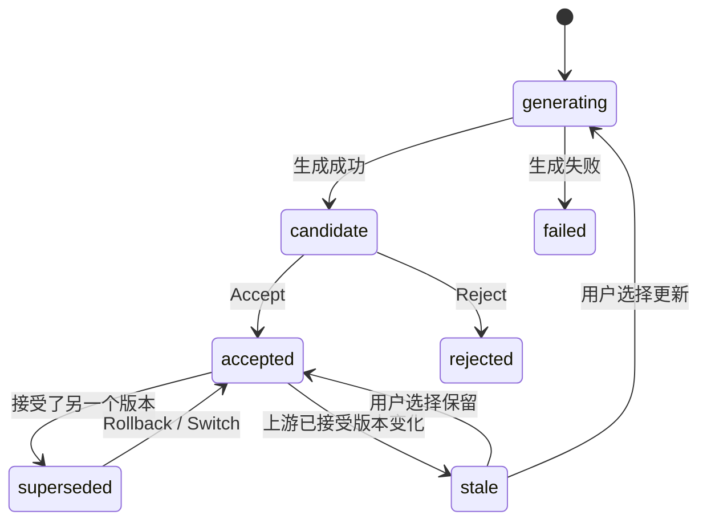

| 操作 | 行为 |
|---|---|
| 重新生成 | 新建 candidate，**不影响**当前 accepted 版本和下游 |
| Accept | candidate → accepted，原 accepted → superseded；触发下游失效检查 |
| Switch | 在同一批候选中切换 accepted |
| Rollback | 任意历史版本重新成为 accepted |
| 失效传播 | 下游节点的 `input_hash` 与新上游不一致时标记 stale（画布上显示黄色角标）；用户可以选「仅更新受影响的镜头」或「保留现状」 |
| 局部重生成 | 例如只换了角色 A 的服装，只有包含角色 A 的镜头会被标记为 stale |

### 5.8 三种协作模式

| 模式 | 适合人群 | 行为 |
|---|---|---|
| **Autopilot 全自动** | 增长团队批量生产 | 跳过 G1–G3，按 Critic 排名自动 Accept 第一名；只在 `block` 级问题或预算超限时暂停 |
| **Checkpoint 关键节点确认**（默认） | 品牌、代理 | 在 G1–G4 暂停等待用户 |
| **Manual 专家手动** | 资深创作者 | 每个节点都要手动运行；可以随时插入自由节点（任意文生图、图生视频），与 Agent 节点混用 |

### 5.9 成本漏斗与预算控制

| 阶段 | 产物 | 相对成本（示例，以实际计价为准） | 确认点 |
|---|---|---|---|
| 策略 + 脚本 | 文本 | 1 | G1 / G2 |
| 锚点 + 关键帧 | 15–30 张图 | 约 10 | G3 前 |
| animatic | 关键帧 + 临时 TTS | 约 1 | **G3** |
| 镜头渲染 | 8 镜头 × 2–3 候选 | 约 60–80 | — |
| 音频 + 终剪 | 音频 + 合成 | 约 5 | G4 |
| MG 动态图形（信息型） | 参数化渲染，4K 可编辑 | 约 3–5（远低于同秒数视频） | G3 前 / 局部改随时 |

- **预估**：每个节点运行前显示预估点数；G3 显示「确认后将消耗约 X 点」。
- **预扣**：WorkflowRun 启动时按预估预扣点数，完成后按实际结算，多退少补；失败的生成自动退还。
- **预算上限**：用户设定上限，调度器在下一次调用会超出上限时暂停。
- **缓存**：`input_hash` 相同的节点直接复用历史产物，不重复计费。
- **MG 例外**：动态图形是参数化渲染，不属于「视频渲染」，成本见 5A.8；改文字、数值、颜色、节奏都只改参数，不触发媒体模型重新生成。

### 5.10 批量变体与 A/B

- **变体矩阵**：G1 多选 angle × hook × 比例 × 角色，生成变体计划，例如 3 个 hook × 2 个角色 = 6 条。
- **共享锚点**：所有变体共享 ProductBible、场景和已接受的角色，只为有差异的部分生成新内容。
- **只重渲染差异镜头**：换 hook 只重做前 1–2 个镜头，其余镜头直接复用，成本约为整片的 1/5。
- **变体标签**：每条成片带 `{angleId, hookId, characterId, aspect}` 标签。投放回流后可以按维度归因（哪个 hook 的 CTR 最高）。

### 5.11 画布设计（前端）：自由画布 + 右侧 Agent 面板

画布不把 9 Agent 固定成一条线性流水线，而是**可连线的自由画布**：用户添加各类内容卡片，自由摆放并编辑有向依赖；Agent 和 Skill 放到右侧面板里按需调用。局部内容编辑与图结构编辑并存。

**画布卡片（都可编辑的内容块）**

| 卡片类型 | nodeType | 说明 |
|---|---|---|
| 文本 | `text` | 脚本、文案、字幕等可编辑文本块 |
| 图片 | `image` | 关键帧、主视觉、参考图 |
| 视频 | `video` | 镜头片段、候选 |
| 音频 | `audio` | 配音、背景音乐、音效 |
| 图形 | `motion_graphics` | 可参数化动态图形（第 5A 章） |
| 引用 | `subject` `asset_ref` `reference_video` `document` | 标的、素材、参考视频、文档 |

**每张卡片底部三个操作**（保证处处可编辑）：
- **编辑**：就地改内容——文本改字、图片改构图、音频改音轨、图形改参数。
- **添加素材**：给这一段补充参考图、参考镜头，或替换素材。
- **问 AI**：把这段内容送进右侧对话，交给某个 Agent 或 Skill 处理，改完只更新这一处。

**右侧 Agent 面板（替代原 `?node=` 检查器）**：
- 顶部一个**下拉选择器**，选「交给哪个 Agent 或 Skill」：创意总监、编剧、产品视觉、角色设计、场景设计、分镜设计、视频导演、音效导演、终剪合成，以及动态图形、拉片复刻、字幕校对等 Skill。
- 消息流：Agent 的产物卡、候选卡、闸门确认卡、提问卡，都在对话流里呈现。
- 选中画布卡片时，对话自动聚焦到该卡片上下文；右键素材可「引用到 AI 对话」。

**显式可编辑 DAG**：节点通过输入/输出端口建立有向连线，支持添加和断开依赖；保存、恢复、导出和模板复用必须保留 `nodes` 与 `edges`。拒绝重复 ID、悬空边和环路。生成单个节点时，从当前快照（含未保存编辑）收集全部上游节点，按拓扑顺序提供文本与图片/视频引用，不引入无关节点。自由布局不改变依赖；用户仍可只改一处文字或替换素材，不必重新生成整张图。

**节点级生成与人工候选**：文本、图片、视频节点分别编辑 Prompt 和适用的模型/比例/分辨率/时长/候选数选项；显式调用配置好的 Provider，显示真实排队、运行、失败或成功状态。返回候选后必须由用户选择才应用，不能自动覆盖已有内容。音频节点只支持上传和播放。当前是单节点生成及 DAG 上下文解析，不是九 Agent 自动调度；Provider 的完整校验与协议见 [generation-providers.md](generation-providers.md)。

**画布顶栏**：生成、暂停、模式切换、预算进度条、发布为模板。左侧侧栏和右侧 Agent 面板都可折叠收起。

### 5.12 异常与降级

| 异常 | 处理 |
|---|---|
| Provider 超时或宕机 | 熔断后切换到兜底模型；记录 routingReason |
| 内容安全拦截 | 改写 Prompt 重试 1 次；仍失败则标 failed，提示用户修改 |
| 质检连续不合格 | 最多重试 2 次 → 人工审核 + 分镜修改建议 |
| 缺参考图 | `reference_requirements.blocking=true` 时阻断下游，画布上提示补图 |
| 服务重启 | 从持久化状态恢复；外部异步任务通过 `external_task_id` 继续轮询（替代现有进程内 `setInterval`，见 12.1） |
| 余额不足 | 暂停 Run，提示充值后断点续跑 |

### 5.13 端到端示例：Nike Air Max 15 秒信息流广告

| 步骤 | 关键产物 |
|---|---|
| 标的 | Nike Air Max 春季上新；卖点：全掌气垫缓震 / 透气网面 / 轻量化；人群：18–30 岁城市运动人群；BrandKit：#FF2D55 + #111111，热血、年轻、街头，禁用竞品 Logo |
| 1 创意总监 | 目标 = 转化；angle A「通勤久站不累」（痛点型）、angle B「城市夜跑」（场景型）；hook A1「上班第 10 个小时，你的脚还好吗？」（痛点直击）；mustHave：产品首次露出 ≤ 3s，露出 ≥ 6s，片尾 Logo + 「立即抢购」 |
| 2 编剧 | 结构 PAS，5 个 beat：0–2s 疲惫的脚特写 → 2–5s 换上 Air Max → 5–10s 地铁站轻快奔跑，气垫特写 → 10–13s 夜晚街头跳跃落地 → 13–15s Logo + CTA；口播 58 字 |
| 3 产品视觉 | 抠图 + 4 个视角（侧面为 inferred，用户确认）；圈定 Swoosh 和气垫窗为不可变区域；3 张 hero shot |
| 4 角色设计 | 25 岁都市女性白领，4 张候选定妆照 → 选定 → 三视图 + 疲惫 / 轻松两种表情 |
| 5 场景设计 | 写字楼工位（傍晚暖光）、地铁站（冷白光）、夜晚街头（品牌粉霓虹）；每个场景 3 个机位 |
| 6 分镜设计 | 8 个镜头；hook 镜头 1.2s 特写；地铁奔跑用 track 运镜；「系鞋带」镜头可行性低 → 改为「鞋落地」插入特写；8 张关键帧 + animatic |
| 7 视频导演 | 8 镜头并行，19 个候选；镜头 5 气垫窗变形，自修复：降低运动强度后重试通过 |
| 8 音效导演 | 都市电子，BPM 120；落地 impact 音、转场 whoosh；口播第 4 段溢出 0.4s → 回传编剧删掉 3 个字 |
| 9 终剪 | 卡点剪辑；字幕放在 9:16 安全区；片尾 CTA 卡；导出 9:16 / 1:1 / 16:9；合规报告：通过 |
| 入库 | 成片绑定该标的；角色「都市白领 Lina」进入角色库，可以复用 |

---

## 5A. 创意模块：可编辑工程与信息型视频

### 5A.1 痛点与定位

用户已经跨过「生成一个惊艳镜头」的阶段，追求「完成一条可以交付、可以持续修改的视频」。传统 AI 视频是单轨黑盒输出：交付一条死 MP4，改一处字幕、一个数字、一处节奏，都要整条重渲染，或者反复抽卡。

Sparkle 的答案是：**交付「成片 + 可编辑工程」**。画面生成之后，声音、字幕、图表、节奏被解耦到独立轨道；内容更新时，能定位到对应元素，在正确位置精准下刀。

### 5A.2 交付物：成片 + 工程

| 交付物 | 说明 |
|---|---|
| 成片 MP4 | 可直接投放，9:16 / 1:1 / 16:9 多比例 |
| 可编辑工程 | 多轨时间轴 + 参数化图形 + 独立元素，收回来可以随时局部修改 |

工程里的每类内容都作为**独立元素**保留：文字、数值、图表、音轨、字幕、片段。改稿时「找到对应元素、在正确位置精准下刀」，而不是整条重做。

### 5A.3 新的创作起点：文档与数据

在 Subject、拉片、模板、自由 Prompt 之外，新增「文档 / 数据」入口：PDF / Word / Excel / CSV / URL / 已有报告。

信息编排（前置，复用创意总监 + 编剧能力）三步：

1. **解析**：抽取文字、数值、表格和图表结构。
2. **提炼**：识别高价值信息——哪些是结论、哪些是观众爱看的；柱状图呈现「能力差距」，价格保留「计费单位」，模型升级突出「前后变化」。
3. **成片规划**：把信息映射成图 / 表 / 文字动画，确定画面布局和分镜。

适应形态：报告解读、数据可视化、产品说明、知识讲解。对应 `service`（SaaS、教育、知识型）与知识类 `ip` 标的。

### 5A.4 MG 动态图形（专项 Agent：动态图形设计师）

新增节点类型 `motion_graphics`，新增专项 Agent「动态图形设计师」。

- **本质区别**：MG 不是烘焙像素，是**可参数化的动态图形**。文字、颜色、数值、图表、位置、动效方向、动画节奏、出现时长，全部是参数。
- **输出契约 `MotionGraphic`**：`segments[]`、`props{text, value, color, layout, animDir, duration}`、`dataBinding`。
- **4K 原生可编辑**：改数值只改参数，不触发媒体模型重新生成。参考同行 $0.06/秒 量级（待我方实测标定），远低于同秒数视频。
- **数据绑定 `dataBinding`**：图表数值可以绑定到文档表格的某个单元格；文档更新后重跑信息编排，MG 参数随之替换，不用重做动画。

### 5A.5 原生多轨 + 三个改稿入口

多轨：视频 / MG 图形（参数轨）/ 文字字幕 / Logo 贴片 / 配音 / BGM / SFX。

| 入口 | 改什么 |
|---|---|
| 画布节点 | 文字内容、颜色、数值、样式（双击进入编辑，弹出字号 / 颜色工具栏） |
| 时间轴 | 节奏、对齐、片段先后、停留时长 |
| 对话栏 | 描述指定素材的修改要求；右键素材「引用到 AI 对话」，聊天框自动带上该素材 |

三个入口配合使用：画布改样式、时间轴排节奏、对话里说要求。

### 5A.6 局部修改不重做（编辑闭环）

| 改稿类型 | 只改什么 |
|---|---|
| 产品名称 / 价格 / 数值更新 | 改 MG 或文字参数 |
| 配音某句微调 | 只重灌该音轨（TTS 局部重生成） |
| 某重点多停 2 秒 | 时间轴拖动 |
| 背景 / 音效不合拍 | 调对齐，或只替换该片段 |
| 画面片段替换 | 只重渲染对应镜头（衔接 5.10） |

原则：内容以独立元素保留，修改有具体落点；不为一个局部问题整条重来。

### 5A.7 与既有 9 Agent 的关系

- 主打 9 Agent 负责「广告 / 商品导向的叙事视频」，保持不变。
- 信息型视频是**专项扩展**：复用信息编排（前置）、脚本、分镜、终剪多轨；新增 `motion_graphics` 节点 + 「动态图形设计师」专项 Agent。
- MG 产物进入统一素材库（新增「动态图形库」），可复用、可匹配标的（链路二）、可上架交易（链路三）。

### 5A.8 技术实现

- MG 渲染层：自研参数化渲染，或基于 Remotion / HyperFrames；产物 = 工程文件 + MP4 导出。
- 文档解析管线：PDF / 表格抽取 → LLM 信息提炼 → 结构化 chart spec（柱状图 / 折线 / 流程 / 数值变化 / 高亮）。
- 时间轴参数轨：MG 片段在时间轴上表现为可编辑参数，不是像素轨道。
- 合成：MG 轨与视频轨、字幕、音轨在终剪统一合成（ffmpeg / Remotion compositing）。
- 成本：MG 位于成本漏斗的「便宜层」，见 5.9。

---

## 6. 创意模块：拉片复刻 Video Cloning

### 6.1 价值

上传一条参考广告或短视频，系统像专业创作者一样逐镜头「读」它：怎么抓注意力、镜头怎么转、每个镜头的景别和运镜、人物动作、产品怎么出现、字幕和音效怎么卡点、节奏在哪里加速或停顿。然后把它转换成**可编辑的广告结构**：保留原片的节奏、镜头结构和叙事，换上**你自己的产品、角色、场景、风格和文案**，做出一条「结构相似、内容全新」的广告。

### 6.2 流程


### 6.3 解析管线

| 步骤 | 技术 | 产出 |
|---|---|---|
| 1 镜头切分 | 镜头边界检测（PySceneDetect / TransNetV2 一类方法） | 镜头列表与时间码 |
| 2 逐镜头理解 | 关键帧 + VLM 结构化描述；结合光流判断运镜 | 景别、角度、运镜、主体、动作、产品是否出现、画面文字 |
| 3 语音与文字 | ASR（口播）+ OCR（字幕和贴片） | 口播稿、字幕时间轴 |
| 4 音频分析 | 人声 / 音乐分离、BPM 和节拍检测、SFX 事件检测 | beat grid、音效事件 |
| 5 节奏曲线 | 镜头时长序列、剪辑频率、情绪强度 | 节奏图 |
| 6 叙事识别 | LLM 把镜头映射到 beat 功能（hook / problem / demo / proof / cta）并识别 hook 类型 | 叙事结构 |

### 6.4 输出：槽位化结构

每个镜头里的具体元素被抽象成槽位：`[角色A]`、`[产品]`、`[场景1]`、`[卖点文案2]`、`[CTA]`。保留的是镜头参数（时长、景别、运镜、转场、动作类型），替换的是内容。

| 复刻强度 | 保留 | 替换 |
|---|---|---|
| 结构复刻（默认） | 镜头数、时长、景别、运镜、转场、叙事结构 | 角色、场景、产品、文案 |
| 风格复刻 | 结构 + 色调、光影、构图倾向 | 角色、产品、文案 |
| 节奏复刻 | 剪辑节奏和 BGM 风格 | 其余全部，由创意总监重新策划 |

### 6.5 进入流水线

- 绑定 Subject 后自动填充：产品槽 ← ProductBible，卖点槽 ← sellingPoints，CTA ← BrandKit。
- 角色槽：从角色库选择，或交给角色设计 Agent 生成。场景槽同理。
- 创意总监跳过 angle 选择，改为「从参考推断 angle 并校验与标的的匹配度」。
- 编剧基于原叙事结构改写为新卖点；分镜 Agent 把参考镜头参数作为**强约束**。

### 6.6 页面 `/clone/[id]`

- 左栏：原片逐镜头时间轴（缩略图 + 标注）。
- 右栏：新结构表（每个镜头的槽位与替换内容）。
- 底部：节奏曲线对比；生成后可以「原片 / 新片」并排同步播放。
- 操作：绑定标的、选复刻强度、生成新广告（→ `/project/[id]`）、存为模板（→ 发布向导）。

### 6.7 合规

- 只复用**结构**，不复用原视频的像素和音频。
- 原片中的人物、Logo 不进入新片；对新片做相似度检测，防止「洗稿」。
- 上传时用户需要声明对参考视频的使用权限；链接导入只做分析，不缓存原片供下载。

---

## 7. 素材模块：统一素材库

### 7.1 分类

| 库 | 内容 | 来源 |
|---|---|---|
| 角色库 | CharacterSheet（三视图、表情、服装） | 角色设计 Agent / 上传 / 购买 |
| 场景库 | SceneBible（设定图、机位） | 场景设计 Agent / 上传 |
| 产品库 | ProductBible（抠图、多视角、hero shot） | 产品视觉 Agent，与 Subject 绑定 |
| 镜头库 | 单镜头视频片段（含余量） | 视频导演 Agent，可以跨项目复用 |
| 图片 / 视频 / 音频 | 通用素材；音频含音色、BGM、SFX | 生成 / 上传 / 购买 |
| 我的模板 | 已发布或已购买的模板 | 链路三 |

### 7.2 素材能力

| 能力 | 说明 |
|---|---|
| 版本历史 | 每个素材都有版本树，可以对比和回滚 |
| 来源追踪（lineage） | 由哪个项目、哪个节点、哪个模型、什么 Prompt、哪些参考生成；上传和购买也有来源记录 |
| 引用追踪 | 被哪些项目或模板引用；修改前显示影响范围 |
| 跨项目复用 | 以**引用**方式复用，不复制；源素材更新后，引用方提示「有新版本可更新」 |
| 标的绑定 | 一个素材可以绑定一个主标的；未绑定的素材进入「待匹配」池（链路二） |
| 授权状态 | 自有 / 购买授权（含范围）/ 受限（含第三方品牌元素）/ 已独家售出 |
| 检索 | 分类筛选 + 标签 + 语义搜索（基于 ContentProfile 向量） |
| 空间隔离 | 个人 / 团队 / 客户（代理场景下 Client 之间不可见） |

### 7.3 页面

- `/assets`：分类 tab + 筛选（标的、类型、来源、授权、时间）+ 网格；支持拖到画布（作为 `asset_ref` 节点）。
- `/assets/[id]`：预览、版本树、来源链（可以跳转到生成它的项目和节点）、引用列表、授权证书、操作区（**找货**、**绑定标的**、**上架授权**、**拉片**、**下载**）。

---

## 8. 底座：多模型 Provider 接入

### 8.1 能力枚举（capability）

`text.llm` · `vision.vlm` · `image.t2i` · `image.edit` · `image.ref` · `video.t2v` · `video.i2v` · `video.first_last` · `video.ref2v` · `audio.tts` · `audio.music` · `audio.sfx` · `video.lipsync`（V2）

### 8.2 注册中心

`ProviderAdapterRegistry`（`provider_adapter_registry.py`）以 `(model_ref, capability)` 为键注册适配器。每个适配器实现：

```python
class ProviderAdapter(Protocol):
    capability: Capability
    model_ref: str                       # 如 "volc/seedance-2.0"
    def validate(self, params) -> list[str]: ...        # 参数合法性（时长、比例、参考图数量）
    def compile_prompt(self, shot_spec) -> str: ...     # 结构化描述 → 模型方言
    async def submit(self, req) -> ExternalTask: ...
    async def poll(self, task_id) -> TaskResult: ...
    async def cancel(self, task_id) -> None: ...
    def normalize(self, raw) -> NormalizedResult: ...   # 统一返回结构
    def estimate_cost(self, req) -> Cost: ...
    def classify_error(self, err) -> ErrorClass: ...    # content_policy/quota/timeout/invalid_param/provider_down
```

### 8.3 接入的模型平台

即梦、豆包 Seedream / Seedance、通义万相、腾讯混元、MiniMax（海螺视频 / Speech / Music）、Kling、Vidu 等图像、视频、音频模型统一配置。

**当前 Studio 接入**：文本、图片、视频使用相互独立的服务端 `SPARKLE_TEXT_*`、`SPARKLE_IMAGE_*`、`SPARKLE_VIDEO_*` 配置，支持文档约定的 JSON 请求/响应映射和视频轮询。每类至少配置 `BASE_URL`、`API_KEY`、`MODEL`；可选 `MODELS` 白名单。`.env.local` 保留在本地，`.env.example` 可随代码分发，密钥不得使用 `NEXT_PUBLIC_*`。配置缺失或 Provider 失败时明确报错，不回退到历史 `src/lib/moyu.ts`，不生成假结果。音频生成和自动兜底属于规划能力；详细契约见 [generation-providers.md](generation-providers.md)。

### 8.4 按阶段配置默认 + 兜底（示例，以内部评测为准）

| 阶段 | capability | 默认 | 兜底 |
|---|---|---|---|
| 策略 / 脚本 / 分镜 | text.llm | 豆包 | 通义 / 混元 |
| 理解 / 质检 | vision.vlm | 豆包视觉 | 通义视觉 |
| 锚点图 / 关键帧 | image.ref | Seedream | 混元 / 万相 |
| 镜头（人物表演） | video.i2v | Kling | Seedance / 海螺 |
| 镜头（产品特写） | video.i2v | Seedance | Vidu |
| 首尾帧接力 | video.first_last | Kling | Vidu |
| 口播 | audio.tts | MiniMax Speech | 豆包语音 |
| BGM | audio.music | MiniMax Music | 曲库 |

### 8.5 Conformance 校验与治理

- **接入校验**：新适配器必须通过标准测试集（参数映射、返回结构、错误码、时长和比例支持、成本估算误差），通过后才能启用。
- **定期巡检**：每天跑一次小样本，检测质量和时延退化；退化时自动降低路由权重。
- **熔断**：连续失败率超过阈值时熔断，切换到兜底模型。
- **计费映射**：Provider 成本价 × 加价系数 → 点数；预估与实扣分开记录，用于校准。
- **管理页** `/settings/providers`：启停、阶段默认 / 兜底、并发配额、价格系数、巡检报告。

---

## 9. 商业模块（一）：营销标的中心

### 9.1 创建标的的四种方式

| 方式 | 适合 | 实现 |
|---|---|---|
| 表单填写 | 所有人 | 现有 `/api/subjects` POST，扩展字段 |
| 商品 URL 导入 | 电商 | 抓取落地页标题、图片、价格、详情 → LLM 抽取卖点和人群 → 用户确认 |
| Brief 文档解析 | 代理公司 | 上传 PDF / Word / PPT → LLM 抽取 type、目标、卖点、人群、调性、禁忌 → 生成 Subject 和 BrandKit 草稿 |
| 从素材反向创建 | 链路二 | 素材匹配不到合适标的时，基于 ContentProfile 预填一个新标的 |

### 9.2 字段与 Agent 消费矩阵

| 字段 | 必填 | 创意总监 | 编剧 | 产品视觉 | 角色 | 场景 | 分镜 | 视频 | 音效 | 终剪 | 匹配 |
|---|---|---|---|---|---|---|---|---|---|---|---|
| type | ✓ | ✓ | ✓ | ✓ | ✓ |  |  |  |  |  | ✓ |
| name | ✓ | ✓ | ✓ |  |  |  |  |  |  | ✓ | ✓ |
| brief |  | ✓ | ✓ |  |  |  |  |  |  |  | ✓ |
| category | ✓ | ✓ | ✓ |  |  |  |  |  |  | ✓ | ✓ |
| sellingPoints | ✓ | ✓ | ✓ |  |  |  |  |  |  | ✓ | ✓ |
| referenceAssets | product 必填 |  |  | ✓ | ✓ |  | ✓ | ✓ |  |  | ✓ |
| targetAudience |  | ✓ | ✓ |  | ✓ | ✓ |  |  | ✓ |  | ✓ |
| brandKit |  | ✓ | ✓ | ✓ | ✓ | ✓ |  |  | ✓ | ✓ | ✓ |
| landingUrl |  |  |  |  |  |  |  |  |  | ✓（CTA） |  |

### 9.3 BrandKit

- 独立实体，一个品牌下可以有多个标的。
- 编辑页 `/commercial/brand-kits`：Logo、色板、字体、Tone of Voice、禁用元素、音色、片尾模板、示例素材。
- **强制锁定**：被 BrandKit 约束的字段，在 Agent 输出中如果违反，会直接生成 `block` 级 QualityNote。

### 9.4 标的详情页 `/commercial/subjects/[id]`

| Tab | 内容 |
|---|---|
| 概览 | 标的信息、BrandKit、ROI 卡片（花费、GMV、ROAS、最佳素材） |
| 项目 | 由该标的驱动的项目列表 → 跳转画布 |
| 素材 | 绑定到该标的的成片、镜头、锚点；含链路二挂接来的素材（标注来源） |
| 模板 | 用于该标的的模板；该标的上的爆款可以「一键模板化」 |
| 投放数据 | 按素材和变体维度展示的回流数据 |
| 设置 | 可见性（私有 / 团队 / 公开征集）、发起悬赏、归档 |

主按钮：**一键生成画布** → 生成配置弹窗（平台、时长、比例、变体数、模式、预算、可选模板）→ `POST /api/subjects/:id/generate-project` → 跳转 `/project/[id]` 并自动运行。

### 9.5 多客户隔离（代理场景）

`Workspace → Client → Subject`。成员按 Client 授权；素材库、标的、项目按 Client 过滤；跨 Client 复用素材需要显式「共享」操作并留痕。

---

## 10. 商业模块（二）：交易与变现体系

### 10.1 收入结构

| 收入来源 | 付费方 | 计费方式 | 阶段 |
|---|---|---|---|
| SaaS 订阅 | 品牌、团队、代理 | 按席位 / 按空间月付或年付；含每月点数、并发、Workspace/Client 数、高级模型 | P0 |
| 生成点数 | 所有用户 | 按实际调用消耗；订阅额度外按量充值 | P0 |
| 模板交易佣金 | 模板买家 | 平台抽成 | P1 |
| 素材授权佣金 | 素材买家 | 平台抽成 | P1 |
| 创意悬赏服务费 | 发起悬赏的品牌 | 悬赏金额的一定比例 | P2 |
| 效果增值 | 品牌 | 投放直连、效果归因报告、按效果的创作者激励 | P2 |

### 10.2 双账户设计

| 账户 | 用途 | 来源 | 能否提现 | 原因 |
|---|---|---|---|---|
| **点数账户** | 支付生成算力 | 充值、订阅赠送、活动 | **不能** | 点数是预付服务凭证，不可兑换成现金，规避虚拟货币合规风险 |
| **现金账户** | 创作者收益 | 模板、素材、悬赏收入 | 可以 | 收益以人民币计价，结算时代扣代缴（待法务确认） |

买家支付交易品（模板使用费、授权费）用人民币；运行模板时消耗的算力用点数。两者分开计价、分开展示。

### 10.3 四类交易品

| 交易品 | 卖方 | 买方 | 交付物 | 定价方式 |
|---|---|---|---|---|
| ① **素材授权** Asset License | 创作者 | 品牌 / 增长团队 | 成片 / 镜头 / 角色的使用授权 + 源文件 | 标准授权（非独家）/ 独家买断 / 定制改版 |
| ② **工作流模板** Workflow Template | 模板作者 | 任何人 | 可实例化的模板使用权 | 按次 / 订阅 / 买断（白盒） |
| ③ **创意悬赏** Brief Bounty | 品牌发起，创作者投稿 | 品牌 | 被选中的成片 + 授权 | 品牌设定悬赏金和选用数量 |
| ④ **效果激励**（P2） | 平台 / 品牌 | 创作者 | 达标后的额外奖励 | 按 CTR / ROAS 达标阶梯计算 |

### 10.4 链路二：内容找货匹配引擎

#### 10.4.1 匹配管线

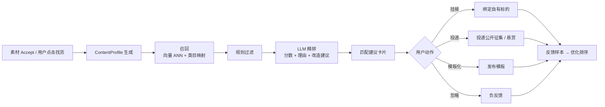

| 步骤 | 说明 |
|---|---|
| ContentProfile | Prompt 文本 + 关键帧 VLM 描述 + 结构化标签（物体、场景、动作、情绪、风格、可能的人群、可能的类目）+ 多模态向量 |
| 候选池 | 我的标的 → 团队标的 → 公开征集标的 → 进行中的悬赏 →（V2）外部商品库，需商务对接，待确认 |
| 召回 | pgvector 在 Subject 向量（name + brief + 卖点 + 类目）上做 ANN；同时走类目映射表（「狗」→ 宠物用品，「球鞋」→ 运动鞋服） |
| 规则过滤 | 类目合规（医疗、金融等资质类目需要资质）；标的的 BrandKit 禁用元素；**内容里已出现的品牌只能匹配该品牌本身**，其竞品被排除 |
| LLM 精排 | 输出 `{score 0–100, reasons[], adaptation: "as_is" / "light_edit" / "templatize", editPlan[]}` |
| 结果展示 | 素材卡上显示「可能适合：Nike Air Max（92）」；在 `/commercial/match` 汇总 |

**三档适配方式**

| adaptation | 含义 | 后续动作 |
|---|---|---|
| `as_is` 原样可用 | 内容已经包含该产品形态，情绪和人群契合 | 产品保真替换（正版产品图局部重渲染）后即可使用 |
| `light_edit` 轻改 | 契合但缺少产品露出 | 由分镜 Agent 建议插入 1–2 个产品镜头 + 卖点贴片 |
| `templatize` 模板化 | 结构好，但主体和产品无关 | 抽象成产品槽模板，进入链路三 |

**示例**：Prompt「一只穿着耐克球鞋的柯基在街头奔跑」→ 标签 {狗、球鞋、奔跑、街头、活力、可爱} →
- Nike Air Max 春季上新：92，`as_is`。理由：内容中已出现跑鞋并且有运动感；改造建议：用正版产品图替换鞋款，片尾加 CTA。
- 某宠物用品品牌：78，`light_edit`。理由：主体为宠物、情绪契合；改造建议：去掉耐克鞋，插入产品使用特写。

#### 10.4.2 品牌侧：创意雷达

- 品牌把标的设为「公开征集」后，按标的订阅匹配推送（站内信 + 每日摘要）。
- 品牌只能看到带水印的低清预览，不能下载；可以操作「购买授权」「委托定制」「加入收藏」。
- 「委托定制」= 发起一个只邀请该创作者的私有悬赏。

### 10.5 链路三：模板市场

#### 10.5.1 模板的定义

```ts
interface Template {
  id: string;
  authorId: string;
  title: string;
  category: string[];                 // 适用类目
  subjectTypes: Subject["type"][];    // 适用标的形态
  dag: { nodes: TemplateNode[]; edges: Edge[] }; // 去除具体内容后的流水线
  slots: TemplateSlot[];              // 变量槽
  locked: string[];                   // 锁定的参数路径（镜头结构、运镜、时长、模型、seed 等）
  visibility: "blackbox" | "whitebox";
  samples: string[];                  // 示例成片 assetId（至少 1 条）
  pricing: { mode: "free" | "per_use" | "subscription" | "buyout"; price: number };
  estimatedPoints: number;            // 单次运行预估算力
  stats: { uses: number; rating: number; medianCtr?: number };
  version: string;
}

interface TemplateSlot {
  key: string;                        // 如 product.image / sellingPoint[0] / character.main / scene.1 / cta
  type: "image" | "text" | "character" | "scene" | "brandKit" | "audio";
  bindTo?: string;                    // 默认映射：subject.referenceAssets[role=product_main] 等
  required: boolean;
  constraints?: string;               // 如"白底产品图，至少 1024px"
}
```

#### 10.5.2 发布流程

1. 在画布顶栏点击「发布为模板」→ 发布向导。
2. **自动识别变量槽**：凡是来自 Subject、锚点（角色、场景、产品）、文案的输入，都被识别为候选槽；作者确认哪些开放、哪些锁定。
3. 设置示例成片、定价、可见性（黑盒 / 白盒）、适用类目。
4. **平台可运行性审核**：平台用 2 个标准测试标的自动试跑，成功出片才能上架；同时进行内容审核和侵权检测。
5. 上架到 `/commercial/market`。

#### 10.5.3 黑盒与白盒

| | 黑盒（默认） | 白盒 |
|---|---|---|
| 买家画布中的形态 | 一个 `template_group` 节点 + 槽位表单 | 展开为完整节点，可以编辑 |
| Prompt 和参数 | 在服务端执行，不下发到前端 | 可见 |
| 适用定价 | 按次 / 订阅 | 买断 |
| 防抄袭 | 强 | 依赖授权条款 |

#### 10.5.4 购买与运行

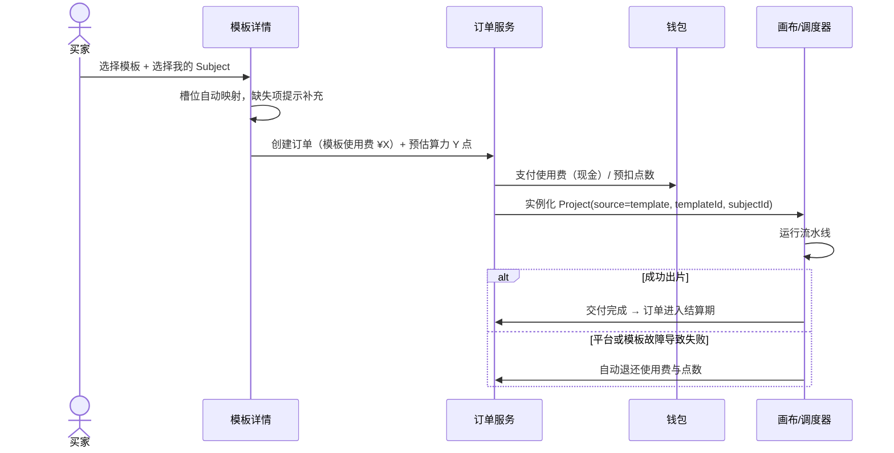

#### 10.5.5 排行与质量

- 排行因子：近 30 天使用次数、已付费用户评分、**投放回流的中位 CTR / ROAS（效果背书）**、出片成功率。
- 只有已付费并运行过的用户可以评分；检测自买自卖刷量。
- 作者更新模板会产生新版本，已购用户可以选择是否升级。

### 10.6 创意悬赏：撮合链路一的需求和链路二的供给

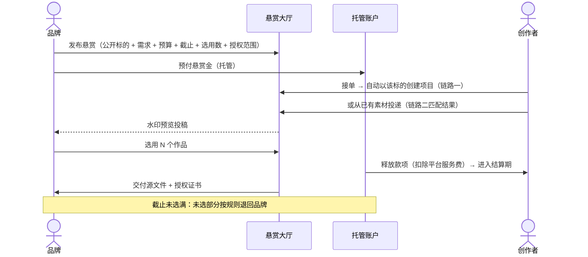

**规则**
- 未被选中的投稿归创作者所有，但**含有该品牌产品或标识**，不能作为原样素材卖给他人；可以去品牌化后做成模板。
- 品牌可以设置「参与奖」（例如前 N 名合格投稿各得少量奖励），提高投稿积极性。
- 争议（例如选用后声称不符合需求）走平台仲裁，托管款项在仲裁结束前冻结。

### 10.7 授权体系

**授权证书**（每笔授权生成一份，带唯一编号和内容哈希，可以在 `/commercial/orders` 下载）：

| 字段 | 说明 |
|---|---|
| licenseNo / contentHash | 编号和成片文件哈希 |
| licensor / licensee | 授权方、被授权方 |
| subjectId | 被授权用于的标的 |
| scope.channels | 投放渠道：全渠道 / 指定平台 |
| scope.territory | 地域 |
| scope.term | 期限：1 年 / 永久 |
| exclusive | 是否独家 |
| derivative | 是否允许改编（二次剪辑、多比例） |
| aigcDeclaration | AIGC 声明，以及使用到的模型清单 |

| 授权等级 | 说明 | 建议价格区间（待验证） |
|---|---|---|
| 标准授权 | 非独家，指定渠道，1 年 | ¥99–499 / 条 |
| 扩展授权 | 非独家，全渠道，永久，可改编 | ¥499–1999 / 条 |
| 独家买断 | 独家，永久；卖出后自动下架，作者不能再售 | ¥2000 起，作者定价 |
| 定制改版 | 基于原作按品牌要求改版，通过私有悬赏承接 | 协商 |

### 10.8 定价、分成与结算

**分成建议（待商务确认）**

| 交易品 | 作者 / 创作者 | 平台 | 备注 |
|---|---|---|---|
| 模板使用费 | 70% | 30% | 官方模板免费，用来引流 |
| 素材授权 | 80% | 20% | — |
| 悬赏 | 85% | 15% | 平台服务费从悬赏金中扣除 |
| 算力点数 | — | 100% | 模板运行的算力由买家承担，作者不参与分成 |

**资金流**

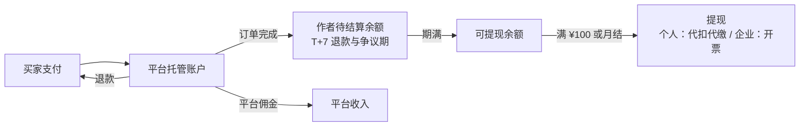

**退款规则**

| 场景 | 处理 |
|---|---|
| 模板运行失败（平台或模板原因） | 自动全额退还使用费和点数 |
| 模板运行成功但买家不满意 | 不退使用费；点数已消耗，不退 |
| 素材授权交付前 | 可以退 |
| 素材授权交付后 | 不退；发现侵权时全额退款，并向卖方追责 |
| 悬赏截止未选满 | 未使用的悬赏金退回品牌（扣除已发放的参与奖） |

### 10.9 订单状态机

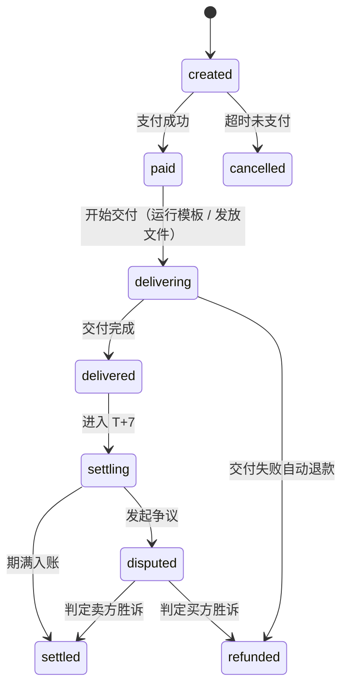

**Listing 状态**：`draft → reviewing → listed → delisted / sold_out(独家)`。

**账务实现**：复式记账 `ledger_entries`（每笔资金变动有借贷两条），余额由流水计算，不直接修改余额字段；支付回调幂等。

### 10.10 投放对接与效果回流

| 能力 | 说明 | 阶段 |
|---|---|---|
| 导出投放包 | 多比例成片 + 封面 + 标题文案 + 授权证书 + 变体标签 | P0 |
| 投放直连 | OAuth 连接广告账户，素材直接推到素材库（具体平台待商务和 API 权限确认） | P2 |
| 效果回流 | 按素材 ID / 变体标签拉取曝光、点击、转化、花费、GMV；没有 API 时支持 CSV 导入 | P1（CSV）/ P2（API） |
| 归因展示 | 标的详情页的 ROI 卡、变体维度对比（哪个 hook、哪个角色表现更好） | P1 |
| 反哺创作 | 回流结果更新创意总监的 hook / angle 先验权重；更新模板的效果排行 | P2 |

### 10.11 风控与合规

| 风险 | 措施 |
|---|---|
| AIGC 标识 | 成片带显式标识 + 元数据隐式标识；授权证书写明模型清单 |
| 商标与第三方品牌 | 生成内容中检测到品牌 Logo 或形象时，授权状态标为「受限」，只能授权给该品牌或去品牌化 |
| 肖像权 | 真人素材必须上传授权；角色库标注肖像来源 |
| 广告法 | 编剧和终剪两道检查：极限词、功效承诺、类目资质 |
| 搬运和洗稿 | 上架前做相似度检测（与平台内已有作品和拉片原片比对） |
| 刷单 | 关联账户检测、评分只计已付费用户、异常交易冻结 |
| 内容安全 | Provider 侧拦截 + 平台侧上架审核 |

---

## 11. 页面功能清单与跳转明细

下表包含后续产品规划。当前路由行为以第 3.2 节和开篇修订为准，不能把规划中的详情、结算、投放页或自动执行视作已实现。

| 页面 | 核心组件 | 关键交互 | 入口 | 出口（跳转） |
|---|---|---|---|---|
| `/` 首页 | 定位文案、功能导览、最近项目 | 点「开始创作」弹三档选择（模板创作、基础创作、自由创作） | 顶部导航「创意」 | 三档选择弹窗 → `/project/[id]`、`/clone/new`、`/commercial/market` |
| 三档选择弹窗 | 模板创作、基础创作、自由创作三张卡 | 选一档进入 | 首页「开始创作」 | `/project/[id]`、`/clone/new`、`/commercial/market` |
| 标的选择弹窗 | 标的列表 + 「新建标的」 | 选标的 → 生成配置 | 首页「从标的生成」 | 生成配置弹窗 → `/project/[id]` |
| 生成配置弹窗 | 平台、时长、比例、变体数、模式、预算、可选模板 | 显示预估点数 | 标的选择、标的详情 | `/project/[id]`（自动运行） |
| `/project/[id]` 画布 | 自由画布、可编辑卡片（文本、图片、视频、音频、图形）、左侧侧栏（可折叠）、右侧 Agent 面板（可折叠，下拉选 Agent 和 Skill）、顶栏运行控制、底部终剪时间轴 | 添加卡片；每卡可就地编辑、添加素材、问 AI；右侧选 Agent 处理；终剪时间轴双击改 | 三档选择、标的详情、模板、拉片、悬赏 | `/project/[id]/edit`、`/assets/[id]`、发布模板向导、`/commercial/match`、`/commercial/subjects/[id]` |
| `/project/[id]/edit` 时间轴 | 多轨时间轴、预览播放器、字幕编辑、贴片编辑、导出面板 | 拖动剪辑点、改字幕、换 BGM、多比例预览、导出 | 终剪节点「打开时间轴」 | 返回画布、导出后的 `/assets/[id]`、`/commercial/performance` |
| `/clone/new` | 上传区、链接输入、权利声明勾选 | 上传后显示解析进度 | 首页、素材详情「拉片」 | `/clone/[id]` |
| `/clone/[id]` | 原片镜头时间轴、新结构表、节奏曲线、并排播放 | 绑定标的、选复刻强度、替换槽位 | `/clone/new` | `/project/[id]`、发布模板向导 |
| `/ideas` 灵感广场 | 优秀成片和模板瀑布流（按类目、效果排序） | 「做同款」 | 首页 | 模板详情、`/clone/new`（拉片同款） |
| `/assets` | 分类 tab、筛选、网格、批量操作 | 拖到画布、批量绑定标的、批量找货 | 顶部导航「素材」 | `/assets/[id]` |
| `/assets/[id]` | 预览、版本树、来源链、引用列表、授权信息、操作区 | 回滚版本、找货、绑定、上架、拉片 | 素材库、画布 | 来源项目 `/project/[id]`、`/commercial/match`、上架向导、`/clone/new` |
| `/commercial/subjects` | 标的卡片（按 5 种形态着色）、统计 | 新建、筛选 | 顶部导航「商业」 | `/commercial/subjects/[id]`、`/commercial/subjects/new` |
| `/commercial/subjects/new` | 表单 / URL 导入 / Brief 上传三个 tab | 解析结果确认 | 标的列表、标的选择弹窗、找货「新建标的」 | `/commercial/subjects/[id]` |
| `/commercial/subjects/[id]` | 6 个 tab（见 9.4） | 一键生成、发起悬赏、设为公开征集 | 标的列表、画布中的 subject 节点 | 生成配置 → `/project/[id]`、`/commercial/bounties/[id]` |
| `/commercial/brand-kits` | 品牌资产编辑器 | 上传 Logo、取色、字体 | 标的表单、设置 | 返回来源页 |
| `/commercial/match` | 旧入口，无独立页面 | 重定向 | 已有旧链接 | `/commercial/market?view=own` |
| `/commercial/market` | Templates 商店与 My templates 个人视图 | 搜索/分类、详情弹窗、复用、保存草稿、发布/取消发布、单项 Content matching | 侧栏 Templates、模板创作 | `/project/[id]`；匹配弹窗可从标的新建项目 |
| `/commercial/market/[tid]` | 示例成片、流程缩略、槽位说明、价格、评分、效果数据 | 选标的 → 槽位映射 → 购买并使用 | 模板市场 | `/project/[id]`、`/commercial/orders` |
| 发布模板向导 | 槽位识别、锁定设置、示例、定价、可见性 | 提交审核 | 画布、拉片、找货 | `/commercial/market/[tid]`（审核通过后） |
| 上架授权向导 | 授权等级、价格、渠道、期限 | 提交审核 | 素材详情 | `/assets/[id]`（显示已上架） |
| `/commercial/bounties` | 旧入口，无独立页面 | 重定向 | 已有旧链接 | `/commercial/subjects` |
| `/commercial/bounties/[id]` | 需求详情、投稿区、评审区（品牌视角） | 接单（自动建项目）、投递已有素材、选用 | 悬赏大厅、标的详情、找货 | `/project/[id]`、`/commercial/orders` |
| `/commercial/orders` | 买入 / 卖出订单、授权证书 | 下载证书、申请售后 | 各购买流程 | 订单详情 |
| `/commercial/earnings` | 待结算、可提现、流水、提现记录 | 提现、开票 | 商业中心 | — |
| `/commercial/performance` | 广告账户连接、CSV 导入、效果看板 | 连接账户、导入数据 | 时间轴导出、标的详情 | `/commercial/subjects/[id]`、`/assets/[id]` |
| `/me/wallet` | 点数余额、充值、消耗明细 | 充值 | 顶栏头像、余额不足提示 | 返回来源页 |
| `/settings/providers` | Provider 列表、阶段配置、巡检报告 | 启停、调整默认 / 兜底 | 管理员入口 | — |

**跳转约定**
- 所有「从 A 生成 B」的跳转都带上来源参数（例如 `?from=subject:{id}`），用于埋点和面包屑导航。
- 画布中的 subject、asset_ref、template_group 节点都可以点击跳转到对应详情页，并在新标签页打开，避免中断画布编辑。
- 运行中离开画布不会中断任务；回来时通过 SSE 恢复状态。

---

## 12. 技术方案

### 12.1 现状盘点（as-is）与差距

| 领域 | 现状（代码位置） | 差距 / 风险 | v2 处理 |
|---|---|---|---|
| 前端框架 | Next.js 16.3.5 App Router、React 19.2、Tailwind 4、`@xyflow/react` 12（`package.json`） | 版本较新，有破坏性变更，开发前要阅读 `node_modules/next/dist/docs/` | 保持 |
| 画布 | `src/components/studio/CanvasWorkspace.tsx` 与 `GenerationNode.tsx`；可连线 DAG、节点 Prompt/选项、人工候选应用 | 本轮主任务集成与验证中；无完整产物版本链和九 Agent 调度 | 按 5.11 保留自由布局和局部编辑 |
| 任务状态 | `/api/studio/generations` 项目列表恢复与单任务状态轮询 | 仅恢复最近 100 条任务；无 SSE、取消和全局调度 | 后续按需要扩展推送与历史 |
| 生成调度 | `src/lib/studio` 独立 SQLite 任务表；Next `after` 提交与持久化轮询租约 | 非持久化外部队列；中断任务失败而非自动付费重试 | 后续迁移可靠 worker |
| 参考图传递 | 当前图快照的拓扑上游上下文与结构化图片/视频引用 | Provider/适配器必须支持相应媒体协议；远程 URL 可能过期 | 依照 Provider 契约扩展 |
| 数据层 | Sequelize + SQLite（`src/lib/db/index.ts`），同时存在未被使用的 `prisma/schema.prisma` | 两个 ORM 并存；SQLite 不支持多实例和向量检索 | 统一为 PostgreSQL + pgvector；只保留一套 ORM |
| 标的 | `Subject` 模型 + `/api/subjects` GET/POST；Bounties 从真实存储读取 Brief 并新建关联标的项目 | 未实现完整品牌资料、悬赏和自动广告流水线 | 扩展 Subject/BrandKit |
| 项目上限 | `MAX_PROJECTS = 10`（`src/lib/projects.ts:8`） | 原型限制 | 改为按订阅套餐配额 |
| 商业页 | `CommerceWorkspace.tsx`：本地模板发布/草稿、示例目录、商家 Brief、按作品关键词匹配与演示订单 | 无真实支付、跨账号市场和语义匹配 | 按第 10 章逐步实现 |
| 素材 / 灵感 | `/assets` 支持本地媒体上传/复用与浏览器索引；完整灵感广场未交付 | 无完整授权、版本树和跨设备资产管理 | 按第 7 章、第 11 章扩展 |
| 用户 | 没有鉴权；Prisma 中 User 只有 points 字段 | 无法做交易 | 补充鉴权、Workspace、钱包 |
| Agent 引擎 | 在 AdCraft 仓库（Python）中：`specialist_agents.py`、`ad_workflow.py`、`workflow_graph.py`、`workflow_parallel_graph_runner.py`、`provider_adapter_registry.py`、`tools/ffmpeg.py` 等 | 尚未与 Sparkle 集成 | 作为独立服务接入（12.2） |

### 12.2 目标架构（to-be）

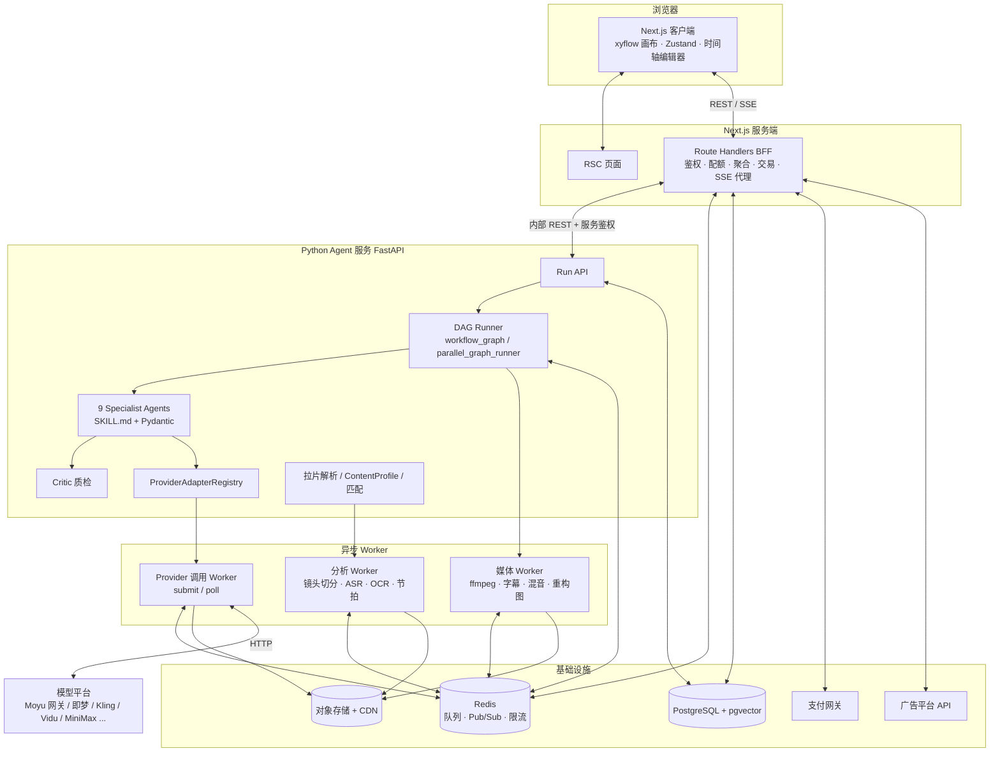

**职责边界**

| 服务 | 负责 | 拥有的数据 |
|---|---|---|
| Next.js BFF | 用户与鉴权、Workspace、Subject、BrandKit、Project/Canvas、素材元数据、交易、钱包、投放；SSE 推送 | 业务表 |
| Python Agent 服务 | WorkflowRun / NodeRun / Artifact、Agent 执行、Provider 调用、媒体处理、拉片、匹配 | 执行表 |
| 共享 | PostgreSQL（按 schema 划分所有权，跨域只读）；对象存储 | — |

**选择 Python 做 Agent 服务的原因**：直接复用 AdCraft 现有引擎；媒体和 ML 生态（ffmpeg、镜头切分、ASR、节拍检测）都在 Python；Pydantic 天然适合强类型契约。Next.js 只负责交互和业务编排。

### 12.3 技术选型

| 层 | 选型 | 说明 |
|---|---|---|
| 前端 | Next.js 16 / React 19 / `@xyflow/react` 12 / Tailwind 4 / Zustand / Zod | 时间轴编辑器自研（基于 Canvas 或 DOM），预览使用低清代理视频 |
| BFF | Next.js Route Handlers | 现有 `src/app/api/*` 继续扩展 |
| ORM | Drizzle 或 Prisma（二选一，替换 Sequelize） | 需要支持 Postgres 和 jsonb |
| Agent 服务 | FastAPI + Pydantic v2 + SQLAlchemy | 复用 AdCraft |
| 队列 | Redis + Arq / Celery | Provider 任务、媒体任务、分析任务分队列 |
| 数据库 | PostgreSQL 16 + pgvector | jsonb 存产物，vector 存匹配向量 |
| 存储 | S3 兼容对象存储（OSS / TOS / COS）+ CDN | 原片、代理视频、缩略图分开存放 |
| 媒体 | ffmpeg | 转码、拼接、叠加、字幕烧录、混音、响度标准化 |
| MG 渲染 | 自研参数化渲染 / Remotion / HyperFrames | 图表、数据、文字的可编辑动态图形，产物 = 工程文件 + MP4 |
| 支付 | 微信支付 / 支付宝；企业对公转账 | 平台托管和分账能力待确认 |
| 可观测 | OpenTelemetry + 结构化日志；每个 NodeRun 记录 trace | 便于成本和质量归因 |

### 12.4 数据模型（核心表）

| 表 | 关键字段 | 所有者 |
|---|---|---|
| users | id, name, phone, role | BFF |
| workspaces / workspace_members / clients | id, plan, quota；member.role；client.workspace_id | BFF |
| brand_kits | id, workspace_id, logos jsonb, colors jsonb, fonts jsonb, tone, forbidden jsonb, voice_id, end_card_template_id | BFF |
| subjects | id, workspace_id, client_id, owner_id, type, name, brief, category, selling_points jsonb, reference_assets jsonb, target_audience jsonb, brand_kit_id, landing_url, visibility, status, embedding vector | BFF |
| projects | id, workspace_id, subject_id, source, template_id, clone_id, bounty_id, name, industry, mode, basic_type | BFF |
| canvases | project_id, nodes jsonb, edges jsonb, version | BFF |
| workflow_runs | id, project_id, mode, status, budget_points, reserved_points, spent_points, started_at, finished_at | Agent |
| node_runs | id, run_id, node_id, node_type, state(queued/running/completed/failed), attempt, input_hash, error_class, started_at, finished_at | Agent |
| artifacts | id, project_id, node_id, node_run_id, version, status(candidate/accepted/rejected/superseded/stale), payload jsonb, quality_notes jsonb, confidence, parent_version_id | Agent |
| generation_jobs | id, node_run_id, provider, model_ref, capability, request jsonb, external_task_id, status, result jsonb, cost_points, latency_ms | Agent |
| assets | id, workspace_id, client_id, library(character/scene/product/shot/image/video/audio), subject_id, current_version_id, license_status, tags jsonb | BFF |
| asset_versions | id, asset_id, version, url, proxy_url, meta jsonb, lineage jsonb(project/node/model/prompt/refs) | BFF |
| asset_references | asset_id, ref_type(project/template), ref_id | BFF |
| reference_analyses | id, source_asset_id, shots jsonb, transcript jsonb, beat_grid jsonb, structure jsonb, slotified jsonb, status | Agent |
| content_profiles | asset_id, tags jsonb, caption, embedding vector | Agent |
| subject_matches | id, asset_id, subject_id, score, reasons jsonb, adaptation, edit_plan jsonb, status(suggested/accepted/dismissed/submitted) | Agent 写，BFF 读写状态 |
| templates / template_versions | id, author_id, title, dag jsonb, slots jsonb, locked jsonb, visibility, pricing jsonb, review_status, stats jsonb | BFF |
| listings | id, item_type(asset/template), item_id, seller_id, license_options jsonb, status | BFF |
| orders / order_items | id, buyer_id, status, amount_cny, points_reserved；item.listing_id, license_option | BFF |
| licenses | id, license_no, order_item_id, asset_id, licensee_id, scope jsonb, exclusive, content_hash | BFF |
| bounties / bounty_submissions | id, subject_id, budget, deadline, pick_count, license_scope, status；submission.asset_id, creator_id, status | BFF |
| wallets / ledger_entries / payouts | wallet(user_id, kind: points/cash)；ledger(debit_account, credit_account, amount, ref_type, ref_id)；payout(status, tax) | BFF |
| ad_accounts / performance_metrics | 平台、token；metric(asset_id, variant_tags, date, impressions, clicks, conversions, spend, gmv) | BFF |
| provider_models / stage_routing | model_ref, capability, enabled, price_factor, conformance_status；stage, default_ref, fallback_refs | Agent |

### 12.5 API 设计

**BFF（`/api/*`，前端调用）**

| 域 | 接口 |
|---|---|
| 标的 | `GET/POST /api/subjects` · `GET/PATCH/DELETE /api/subjects/:id` · `POST /api/subjects/import-url` · `POST /api/subjects/parse-brief` · `POST /api/subjects/:id/generate-project` |
| 品牌 | `GET/POST /api/brand-kits` · `PATCH /api/brand-kits/:id` |
| 项目 | `GET/POST /api/projects` · `GET/DELETE /api/projects/:id` · `PUT /api/projects/:id/canvas`（已有）|
| 运行 | `POST /api/projects/:id/runs` `{mode, scope: all/from_node/nodes[], budget}` · `GET /api/runs/:id` · `POST /api/runs/:id/{pause,resume,cancel}` · `POST /api/runs/:id/checkpoint` `{gate, decision}` · `GET /api/runs/:id/events`（SSE） |
| 节点版本 | `GET /api/projects/:id/nodes/:nodeId/versions` · `POST /api/artifacts/:id/{accept,reject}` · `POST /api/projects/:id/nodes/:nodeId/rollback` `{versionId}` · `POST /api/projects/:id/nodes/:nodeId/regenerate` `{instruction}` |
| 时间轴 | `GET/PUT /api/projects/:id/timeline` · `POST /api/projects/:id/export` `{aspects[]}` |
| 拉片 | `POST /api/clones` · `GET /api/clones/:id` · `POST /api/clones/:id/instantiate` `{subjectId, strength}` |
| 素材 | `GET /api/assets?library&subjectId&q` · `GET /api/assets/:id` · `POST /api/assets/:id/bind-subject` · `POST /api/assets/:id/match` |
| 找货 | `GET /api/match/suggestions` · `POST /api/match/:id/{accept,dismiss,submit}` |
| 模板 | `POST /api/templates`（from projectId）· `GET /api/templates` · `GET /api/templates/:id` · `POST /api/templates/:id/instantiate` `{subjectId, slotOverrides}` |
| 交易 | `POST /api/listings` · `POST /api/orders` · `POST /api/orders/:id/pay` · `POST /api/payments/webhook` · `GET /api/orders` · `GET /api/licenses/:id` |
| 悬赏 | `GET/POST /api/bounties` · `GET /api/bounties/:id` · `POST /api/bounties/:id/submissions` · `POST /api/bounties/:id/select` |
| 钱包 | `GET /api/wallet` · `POST /api/wallet/topup` · `POST /api/payouts` |
| 投放 | `POST /api/ad-accounts/connect` · `POST /api/performance/import` · `GET /api/performance?subjectId&assetId` |
| 兼容 | `POST /api/tasks/generate` · `GET /api/tasks/:id`（保留，供自由节点单次生成使用，内部改为转发到 Agent 服务） |

**Agent 服务（`/v1/*`，仅内网 + 服务令牌）**

`POST /v1/runs` · `GET /v1/runs/:id` · `POST /v1/runs/:id/signal`（checkpoint / accept / cancel）· `POST /v1/nodes/:id/regenerate` · `POST /v1/analysis/clone` · `POST /v1/profiles/content` · `POST /v1/match` · `POST /v1/templates/:id/instantiate` · `GET /v1/providers/capabilities`

**SSE 事件**

```ts
type RunEvent =
  | { type: "node.state"; nodeId: string; state: "queued" | "running" | "completed" | "failed"; error?: string }
  | { type: "artifact.candidate"; nodeId: string; artifactId: string; preview: string; qa?: object }
  | { type: "artifact.accepted"; nodeId: string; artifactId: string }
  | { type: "node.stale"; nodeIds: string[]; reason: string }
  | { type: "run.checkpoint"; gate: "G1" | "G2" | "G3" | "G4"; estimate?: number }
  | { type: "run.budget"; reserved: number; spent: number }
  | { type: "run.finished"; status: "completed" | "failed" | "cancelled" };
```

### 12.6 DAG 执行引擎

| 能力 | 实现 |
|---|---|
| 状态建模 | `NodeState = Literal["queued","running","completed","failed"]`，每次状态迁移都持久化到 node_runs |
| 调度 | 拓扑排序 + 就绪集合；并发度按 Provider 配额用 Redis 信号量控制 |
| 动态扇出 | 分镜 Artifact 被接受后，Runner 按 `shots[]` 动态展开 shot_video 子图；镜头增删时做增量调整 |
| 闸门 | 在 Checkpoint 模式下，节点 completed 后 Run 进入等待态，收到 `signal` 后继续 |
| 外部长任务 | submit 后保存 `external_task_id`，由 Provider Worker 轮询或接收 webhook；**不在 Web 进程内轮询** |
| 失败恢复 | 按错误类型处理：timeout / provider_down → 重试 + 兜底模型；content_policy → 改写重试；invalid_param → 直接失败 |
| 断点续跑 | Run 重启时跳过 completed 节点；running 节点按 `external_task_id` 继续查询 |
| 幂等与缓存 | `input_hash = hash(上游已接受产物 ID + 参数 + seed + 模型)`；命中时直接复用产物 |
| 失效传播 | 上游 accepted 变化时，沿边计算下游 input_hash，不一致的标记 stale 并推送事件 |
| 预算 | 启动时预扣；每次调用前检查余额；结束后结算 |

### 12.7 媒体处理管线

- **存储分层**：原始文件 / 1080p 交付文件 / 480p 预览代理文件 / 缩略图和雪碧图。画布和时间轴只加载代理文件。
- **合成**：时间轴 JSON → ffmpeg filter graph（拼接、xfade 转场、overlay 贴片、ASS 字幕烧录、amix + sidechaincompress 压低 BGM、loudnorm 响度标准化）。
- **参数轨**：MG 动态图形在时间轴上是一条参数轨而非像素轨；合成时由 Remotion/参数渲染在导出阶段展开成画面。改文字、数值、颜色、位置、节奏都只改参数，不重跑视频模型。
- **多比例**：主体检测得到逐帧框 → 平滑 → crop/scale；画面信息不足时调用图像扩图补齐背景。
- **AIGC 标识**：drawtext 显式水印 + 文件元数据写入。

### 12.8 匹配与检索

- 向量：多模态 embedding 写入 `content_profiles.embedding` 和 `subjects.embedding`；pgvector HNSW 索引。
- 召回 Top 50 → 规则过滤 → LLM 精排 Top 5。
- 类目映射表由运营维护，支持同义词。
- 反馈：accept / dismiss / 购买作为训练样本，后续可以训练轻量重排模型。

### 12.9 非功能需求

| 类别 | 指标（目标值） |
|---|---|
| 画布性能 | 200 个节点内拖拽 ≥ 50fps；首屏 ≤ 2s |
| 事件时延 | 节点状态变化到前端展示 ≤ 1s |
| 可用性 | BFF 99.9%；单个 Provider 故障时自动切换，不影响整体 |
| 任务可靠性 | 服务重启后任务零丢失 |
| 安全 | Client 级数据隔离；黑盒模板的 Prompt 不下发前端；对象存储使用签名 URL |
| 合规 | AIGC 标识覆盖率 100%；交易审计日志保留 ≥ 3 年（以法务要求为准） |

### 12.10 迁移步骤

1. **数据层**：SQLite + Sequelize → PostgreSQL + 单一 ORM；把现有 Project / Canvas / GenerationJob / Subject 迁移过去；`projects` 增加 `subject_id`、`source`。
2. **生成调度**：`src/lib/generation.ts` 中进程内的 Moyu 调度迁到 Agent 服务；`/api/tasks/*` 保留为兼容层。
3. **契约**：建立 Pydantic → JSON Schema → Zod 的代码生成流程，替换手写的 `schemas/task.ts` 节点类型。
4. **画布**：节点注册表 + 检查器 + SSE；`CustomNode` 拆分为各类节点组件。
5. **Agent 服务**：接入 AdCraft 引擎，扩展到 9 种节点类型；把 Moyu 网关封装成第一个 ProviderAdapter。
6. **商业**：先上线钱包和订单（模板），再上线素材授权、找货，最后上线悬赏和投放。

---

## 13. 指标体系

**北极星指标：每周商业化成片数**。统计口径：被导出投放、被交易授权、被悬赏选用的成片数量（去重）。

| 层级 | 指标 | 说明 / 目标（基线确定后校准） |
|---|---|---|
| 创作效率 | TTFV（标的 → 首个成片候选） | Autopilot 模式下 P50 ≤ 15 分钟 |
| 创作效率 | 闸门通过率（G1–G4） | 衡量 Agent 输出被一次接受的比例 |
| 创作质量 | 镜头一次合格率 | 一次生成即通过 Critic 质检的镜头占比 |
| 创作质量 | 身份一致性分 / 产品保真分 | Critic 输出的均值 |
| 创作质量 | 候选接受率、平均每镜头重生成次数 | — |
| 成本 | 每条成片的平均点数；缓存命中率 | 成本漏斗是否生效 |
| 拉片 | 解析成功率；拉片 → 成片的转化率 | — |
| 链路一 | 有标的的项目占比；标的平均成片数 | 标的是否成为锚点 |
| 链路二 | 找货建议的点击率和接受率；挂接 / 投递 / 模板化的分布 | 差异化能力的核心指标 |
| 链路三 | 模板上架数、复用次数、付费转化、复购率 | — |
| 交易 | GMV、take rate、创作者月收入分布、悬赏完成率、争议率 | — |
| 闭环 | 接入效果回流的成片占比；有效果背书的模板占比 | 数据护城河 |

---

## 14. 版本规划

| 阶段 | 周期（预估） | 范围 | 验收标志 |
|---|---|---|---|
| **P0 · MVP：链路一跑通** | 0–8 周 | Postgres 迁移；Subject 和 BrandKit 完整字段；9 Agent 流水线（Checkpoint 模式）；候选和回滚；ProviderRegistry（Moyu：Seedream / Seedance + 1 个兜底）；终剪 9:16；导出投放包；点数钱包 | 用 Nike 示例从标的到成片端到端跑通，合规报告通过 |
| **P1 · 内容与模板** | 9–16 周 | 拉片复刻；批量变体；Autopilot；素材库（版本、来源、引用）；找货（仅自有标的）；模板发布和市场（免费 + 按次付费）；订单和结算；CSV 效果回流；多比例导出 | 第一批付费模板成交；找货接受率形成基线 |
| **P2 · 交易网络** | 17–28 周 | 公开征集标的 + 创意雷达；创意悬赏；素材授权和独家买断；投放平台直连；效果反哺创意总监；效果激励；多客户隔离完善；信息型视频专项（文档 → MG → 可编辑动态图形） | 悬赏首单完成；模板排行接入效果数据 |

---

## 15. 风险与待决事项

### 15.1 风险

| 风险 | 影响 | 应对 |
|---|---|---|
| 模型能力和价格波动 | 质量与成本不稳定 | 多 Provider + 每日巡检 + 动态路由 |
| 一致性仍然达不到商用标准 | 用户需要反复重生成 | 三层锚点 + Critic + 人工闸门兜底；高风险镜头在分镜阶段就改写 |
| 第三方商标、肖像、IP 侵权 | 法律风险 | 授权状态「受限」、上架审核、相似度检测、权利声明 |
| 双边市场冷启动 | 模板和悬赏没有流动性 | 官方模板免费引流 + 签约种子创作者 + 品牌内测悬赏补贴 |
| 结算合规（个人所得、托管资金） | 无法上线交易 | 提前确认支付分账方案和代扣代缴流程 |
| 投放平台 API 权限 | 回流数据接不进来 | 先支持 CSV 导入，再分平台申请 |
| 单条成片成本过高 | 毛利为负 | 成本漏斗、缓存、只重渲染差异镜头、按镜头类型路由性价比模型 |

### 15.2 待决事项

| # | 事项 | 负责方 |
|---|---|---|
| 1 | 授权条款文本、AIGC 声明模板 | 法务 |
| 2 | 分成比例、授权价格区间、悬赏服务费率 | 商务 |
| 3 | 支付分账、托管账户、代扣代缴方案 | 财务 / 法务 |
| 4 | 首批直连的投放平台和 API 权限 | 商务 |
| 5 | 各阶段默认 / 兜底模型（以内部评测为准） | 算法 |
| 6 | Critic 阈值标定（身份一致性、产品保真） | 算法 |
| 7 | ORM 选型（Drizzle / Prisma） | 前端 / 后端 |
| 8 | 外部商品库（联盟商品）是否接入链路二 | 商务 |
| 9 | 竞品信息复核（第 1.3 节） | 产品 |

---

## 附录

### A. 术语表

| 术语 | 含义 |
|---|---|
| Subject / 营销标的 | 要为它生产素材的对象：商品、活动、服务、IP、品牌 |
| BrandKit | 品牌资产：Logo、色板、字体、调性、禁用元素、音色、片尾模板 |
| Production Bible | 项目级共享上下文，即所有已接受产物的集合 |
| 锚点 | 保证跨镜头一致的参考：文字锚、图像锚、帧锚 |
| 首帧锁定法 | 先生成并审核关键帧图，再图生视频 |
| 闸门 G1–G4 | Checkpoint 模式下的人工确认点 |
| animatic | 关键帧 + 临时配音组成的低成本动态预览 |
| 余量（handle） | 生成时长多于剪辑时长的部分，供终剪挑选稳定区间 |
| stale | 上游已接受版本变化后，下游产物被标记为失效 |
| ContentProfile | 素材的内容画像（标签 + 向量），用于找货 |
| 黑盒 / 白盒模板 | Prompt 不可见只能运行 / 买断后可展开编辑 |

### B. Agent SKILL.md 结构模板

```markdown
# {Agent 名称}

## 角色
你是广告视频团队中的{角色}，对{职责}负责。

## 输入
- {上游契约名}（只读取 accepted 版本）
- Subject / BrandKit 中的{字段}

## 输出
严格按照 `{OutputSchema}` 输出 JSON，不输出其他内容。

## 工作方法
1. ...
2. ...

## 硬约束
- 必须遵守 CreativeBrief.mustHave / mustNot
- {本角色特有的约束，如"一个镜头只写一个动作""禁止在画面中生成文字"}

## 自检清单（对应质量门）
- [ ] ...
- [ ] ...

## 示例
（1 组高质量输入 / 输出示例）
```

### C. 与 v1 PRD 的对应关系

| v1 模块 | v2 对应 |
|---|---|
| 3.1 创意生成：文生图、文生视频、参考图生成 | 第 5 章自由节点 + 9 Agent 流水线 |
| 3.1 批量变体 | 5.10 |
| 3.1 品牌风格锁定 | 9.3 BrandKit + 5.4 各 Agent 的质量门 |
| 3.1 多模型接入 | 第 8 章 |
| 3.2 无限画布、节点式工作流、并排对比 | 5.11、5.7 |
| 3.2 版式与模板、多尺寸适配 | Agent 9 终剪 + 10.5 模板市场 |
| 3.2 团队协作 | 9.5 多客户隔离（评论、协同编辑留在 P2） |
| 3.3 商用授权、素材交易、收益分成 | 10.7、10.3、10.8 |
| 3.3 投放对接、效果回流 | 10.10 |
| 3.4 生态 | 4.4 三链路飞轮 |
